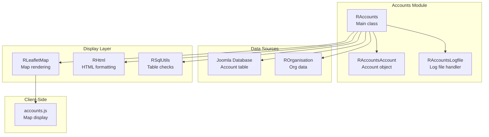
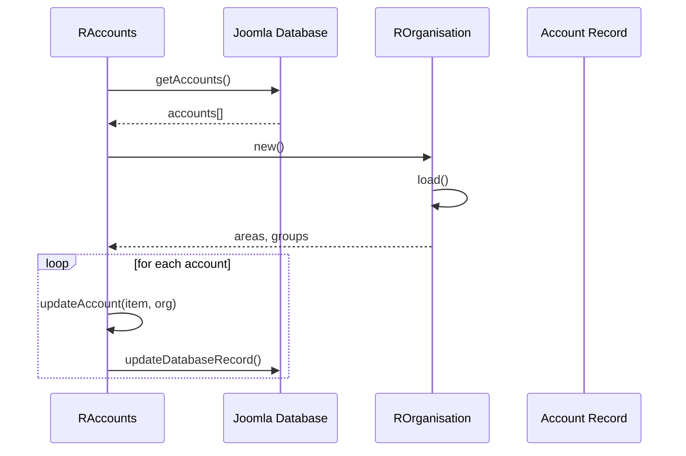

# accounts Module - High Level Design

## Overview

The `accounts` module manages hosted site account information, including domain management, status tracking, and log file analysis. It integrates with organisation data and provides map visualization of hosted sites.

**Purpose**: Account management, domain tracking, and hosted site visualization.

**Key Responsibilities**:
- Read account data from database
- Update accounts with organisation data
- Display account information in various formats
- Visualize hosted sites on maps
- Manage log file analysis

## Component Architecture



## Public Interface

### RAccounts

**Main account manager.**

#### Constructor
```php
public function __construct()
```
- **Behavior**: Automatically calls `readAccounts()` to load account data

#### Account Management Methods
```php
public function updateAccounts()
```
- **Behavior**: 
  - Gets accounts from database
  - Loads organisation data
  - Updates database with organisation information (area, group, codes)

```php
public function readAccounts()
```
- **Behavior**: Reads account data from database into `$dbresults`

```php
public function getResults()
```
- **Returns**: Database results array

#### Display Methods
```php
public function listLogDetails($format)
```
- **Parameters**: `$format` - Display format constant
- **Behavior**: 
  - Renders account information table
  - Supports multiple formats (NOLOGFILE, SPF, SINGLE)
  - Includes log file details if applicable

```php
public function addMapMarkers($map)
```
- **Parameters**: `$map` - `RLeafletMap` instance
- **Behavior**: 
  - Configures map for hosted sites
  - Sets command to `"ra.display.accountsMap"`
  - Injects hosted site data
  - Loads `accounts.js` script

#### Private Methods
```php
private function getAccounts($sortbystatus)
private function updateDatabase($org)
private function updateAccount($item, $org)
private function updateDatabaseRecord($id, $group, $area, $uppCode)
private function defaultDatabaseRecord($id, $uppCode, $domain)
```

### RAccountsAccount

**Individual account object.**

- Represents single hosted site account
- Provides column data for table display
- Handles format-specific rendering

### RAccountsLogfile

**Log file analysis handler.**

- Analyzes account log files
- Provides log file display options
- Integrates with account display

## Data Flow

### Account Update Flow



## Integration Points

### Data Sources
- **Joomla Database**: Account table (`#__ra_accounts_domains`)
- **ROrganisation**: Organisation data for updates → [organisation HLD](../organisation/HLD.md)

### Display Layer
- **RLeafletMap**: Map rendering → [leaflet HLD](../leaflet/HLD.md)
- **RHtml**: HTML table formatting → [html HLD](../html/HLD.md)
- **RSqlUtils**: Table existence checks → [sql HLD](../sql/HLD.md)

## Media Dependencies

### JavaScript File

#### `media/accounts/accounts.js`
- **Purpose**: Client-side accounts map display
- **Dependencies**: `ra.js`, `ra.leafletmap.js`, Leaflet.js
- **Integration**: Loaded via `RLoad::addScript()` in `addMapMarkers()`
- **Key Functions**:
  - `ra.display.accountsMap(options, data)` - Main initialization
  - `this.addMarkers(websites)` - Add hosted site markers
  - `this.addMarker(item)` - Add individual marker
  - Marker styling based on account status
  - Popup content with account details
- **API**:
  - `this.lmap` - Leaflet map instance
  - `this.cluster` - Marker clustering
  - `this.data` - Hosted site data
  - `this.load()` - Initialize map and markers
- **Usage**: Automatically initialized when `RLeafletMap` sets command to `"ra.display.accountsMap"`

## Examples

### Example 1: Display Account List

```php
$accounts = new RAccounts();
$accounts->listLogDetails(RAccountsAccount::FORMAT_NOLOGFILE);
```

### Example 2: Display Map

```php
$accounts = new RAccounts();
$map = new RLeafletMap();
$accounts->addMapMarkers($map);
```

### Example 3: Update Accounts

```php
$accounts = new RAccounts();
$accounts->updateAccounts();
```

## Performance Notes

### Database Operations
- **Table Checks**: Uses `RSqlUtils::tableExists()` before operations
- **Batch Updates**: Updates multiple accounts in single operation
- **Caching**: Organisation data cached via `RFeedhelper`

### Map Rendering
- **Marker Clustering**: Used for large datasets
- **Client-Side**: Map rendering handled by JavaScript

## Error Handling

### Database Errors
- **Missing Table**: Checked via `RSqlUtils::tableExists()`
- **Query Failures**: Handled by Joomla database layer

### Organisation Errors
- **Missing Data**: Shows error message, update skipped

## References

### Related HLD Documents
- [organisation HLD](../organisation/HLD.md) - Organisation data source
- [leaflet HLD](../leaflet/HLD.md) - Map rendering
- [html HLD](../html/HLD.md) - HTML formatting
- [sql HLD](../sql/HLD.md) - Database utilities

### Key Source Files
- `accounts/accounts.php` - RAccounts class
- `accounts/account.php` - RAccountsAccount class
- `accounts/logfile.php` - RAccountsLogfile class

### Related Media Files
- `media/accounts/accounts.js` - Client-side map display


