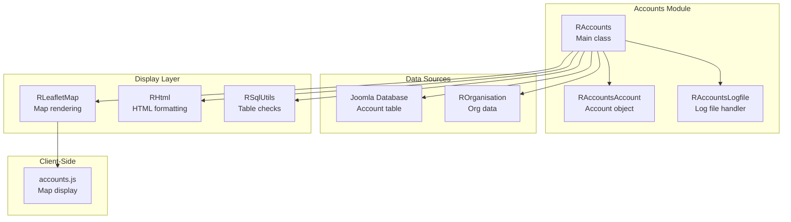
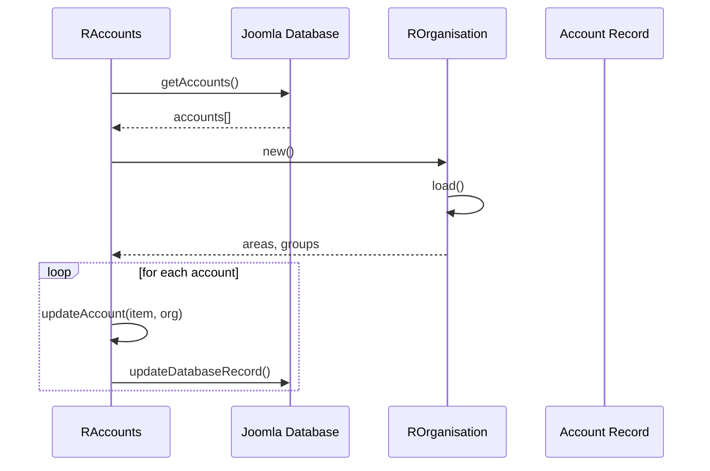

# accounts Module - High Level Design

## Overview

The `accounts` module manages hosted site account information, including domain management, status tracking, and log file analysis. It integrates with organisation data and provides map visualization of hosted sites.

**Purpose**: Account management, domain tracking, and hosted site visualization.

**Key Responsibilities**:
- Read account data from database
- Update accounts with organisation data
- Display account information in various formats
- Visualize hosted sites on maps
- Manage log file analysis

## Component Architecture



## Public Interface

### RAccounts

**Main account manager.**

#### Constructor
```php
public function __construct()
```
- **Behavior**: Automatically calls `readAccounts()` to load account data

#### Account Management Methods
```php
public function updateAccounts()
```
- **Behavior**: 
  - Gets accounts from database
  - Loads organisation data
  - Updates database with organisation information (area, group, codes)

```php
public function readAccounts()
```
- **Behavior**: Reads account data from database into `$dbresults`

```php
public function getResults()
```
- **Returns**: Database results array

#### Display Methods
```php
public function listLogDetails($format)
```
- **Parameters**: `$format` - Display format constant
- **Behavior**: 
  - Renders account information table
  - Supports multiple formats (NOLOGFILE, SPF, SINGLE)
  - Includes log file details if applicable

```php
public function addMapMarkers($map)
```
- **Parameters**: `$map` - `RLeafletMap` instance
- **Behavior**: 
  - Configures map for hosted sites
  - Sets command to `"ra.display.accountsMap"`
  - Injects hosted site data
  - Loads `accounts.js` script

#### Private Methods
```php
private function getAccounts($sortbystatus)
private function updateDatabase($org)
private function updateAccount($item, $org)
private function updateDatabaseRecord($id, $group, $area, $uppCode)
private function defaultDatabaseRecord($id, $uppCode, $domain)
```

### RAccountsAccount

**Individual account object.**

- Represents single hosted site account
- Provides column data for table display
- Handles format-specific rendering

### RAccountsLogfile

**Log file analysis handler.**

- Analyzes account log files
- Provides log file display options
- Integrates with account display

## Data Flow

### Account Update Flow



## Integration Points

### Used By
- **Joomla pages/modules** that list hosted sites or render the hosted sites map → [media/accounts HLD](../media/accounts/HLD.md#integration-points).

### Uses
- **ROrganisation** for enriching account rows with area/group metadata → [organisation HLD](../organisation/HLD.md#integration-points).
- **RLeafletMap / RLeafletScript** for map rendering and JSON injection → [leaflet HLD](../leaflet/HLD.md#integration-points).
- **RLoad** for enqueueing `/media/js` and `/media/accounts/accounts.js` → [media/js HLD](../media/js/HLD.md#integration-points).
- **RSqlUtils** for existence checks on the accounts table → [sql HLD](../sql/HLD.md#integration-points).
- **RHtml** for tabular rendering paths → [html HLD](../html/HLD.md#integration-points).

### Data Sources
- **Joomla Database**: `#__ra_accounts_domains` table holding hosted site metadata.
- **Organisation feed cache**: Group/area codes consumed through `ROrganisation`.

### Display Layer
- **Server**: `RAccounts::listLogDetails()` (tables) and `RAccounts::addMapMarkers()` (map) prepare payloads.
- **Client**: `ra.display.accountsMap` in `/media/accounts/accounts.js` renders markers/popups.

### Key Features (`RAccounts`)
- Loads hosted site accounts, enriches them with organisation data, and exposes table/log displays.
- Configures Leaflet map commands/data for `ra.display.accountsMap` with minimal caller setup.
- Supports multiple display formats and integrates log file analysis for each account.

## Media Integration
### Joomla Integration
- **Document pipeline**: `RLoad::addScript()` and `RLeafletMap::display()` publish cache-busted assets and the bootstrap JSON/command for the browser.

### Vendor Library Integration
- **Leaflet.js + markercluster**: Loaded via `RLeafletScript` for map rendering.

### Media Asset Relationships (Server → Client)

```mermaid
flowchart LR
    Accounts[RAccounts::addMapMarkers]
    Map[RLeafletMap]
    Loader[RLoad]
    BaseJS[/media/js<br/>ra.js, ra.map.js, ra.tabs.js]
    AccountsJS[/media/accounts/accounts.js]
    Leaflet[Leaflet core + plugins]

    Accounts --> Map
    Map --> Loader
    Loader --> BaseJS
    Loader --> Leaflet
    Loader --> AccountsJS
```

`RAccounts::addMapMarkers()` enqueues `/media/accounts/accounts.js` alongside the shared `/media/js` bootstrap by calling `RLoad::addScript()`; `RLeafletScript::add()` then injects Leaflet core and plugins so that `ra.display.accountsMap` can run in the browser.

### Key Features (`accounts.js`)
- Status-aware marker clustering and popups for hosted sites.
- Area vs group iconography based on account code length.
- Automatic fit-to-bounds after marker creation.
- Consumes JSON injected by `RAccounts::addMapMarkers()` without extra configuration.

## Examples

### Example 1: Display Account List

```php
$accounts = new RAccounts();
$accounts->listLogDetails(RAccountsAccount::FORMAT_NOLOGFILE);
```

### Example 2: Display Map

```php
$accounts = new RAccounts();
$map = new RLeafletMap();
$accounts->addMapMarkers($map);
```

### Asset Inclusion Example

```php
$accounts = new RAccounts();
$map = new RLeafletMap();
$accounts->addMapMarkers($map);
// RLoad injects media/js/ra.js and media/accounts/accounts.js
// RLeafletScript supplies Leaflet before ra.display.accountsMap renders markers
```

### Example 3: Update Accounts

```php
$accounts = new RAccounts();
$accounts->updateAccounts();
```

## Performance Observations

### Database Operations
- **Table Checks**: Uses `RSqlUtils::tableExists()` before operations
- **Batch Updates**: Updates multiple accounts in single operation
- **Caching**: Organisation data cached via `RFeedhelper`

### Map Rendering
- **Marker Clustering**: Used for large datasets
- **Client-Side**: Map rendering handled by JavaScript

## Error Handling

### Database Errors
- **Missing Table**: Checked via `RSqlUtils::tableExists()` before writes.
- **Query Failures**: Relies on Joomla database error propagation and messages.

### Organisation Errors
- **Missing Data**: Shows error message and skips updates rather than failing the batch.

## References

### Related HLD Documents
- [organisation HLD](../organisation/HLD.md) - Organisation data source
- [leaflet HLD](../leaflet/HLD.md) - Map rendering
- [html HLD](../html/HLD.md) - HTML formatting
- [sql HLD](../sql/HLD.md) - Database utilities

### Key Source Files
- `accounts/accounts.php` - RAccounts class
- `accounts/account.php` - RAccountsAccount class
- `accounts/logfile.php` - RAccountsLogfile class

### Related Media Files
- `media/accounts/accounts.js` - Client-side map display
