# Ramblers Library Architecture 
Comprehensive Architectural Overview + High-Level Design (HLD)

> **Scope**: Ramblers Library as a Joomla *site library* aggregating `jsonwalks`, `leaflet`, `event`, `organisation`, `accounts`, and shared utilities (caching, errors, geometry, HTML).【F:ramblers.xml†L2-L58】

## 0. Quick orientation

### 0.1 What this library does (in one sentence)
It retrieves walk/event data (primarily from Walk Manager), normalises it into a domain model, then renders listings, maps, and calendar exports consistently across Joomla sites.【F:jsonwalks/feed.php†L18-L200】【F:leaflet/script.php†L21-L151】【F:ics/output.php†L14-L78】

### 0.2 Key Classes by Module

| Module | Key Classes | Purpose |
|--------|-------------|---------|
| **jsonwalks** | `RJsonwalksFeed`, `RJsonwalksWalks`, `RJsonwalksWalk` | Walk data orchestration and domain modeling |
| **jsonwalks/std** | `RJsonwalksStdDisplay`, `RJsonwalksStdSimplelist`, `RJsonwalksStdWalktable` | Standard display presenters |
| **jsonwalks/wm** | `RJsonwalksWmFeed`, `RJsonwalksWmFileio`, `RJsonwalksWmCachefolder` | Walk Manager API integration |
| **leaflet** | `RLeafletMap`, `RLeafletScript`, `RLeafletMapoptions` | Interactive map rendering |
| **event** | `REventFeed`, `REventGroup`, `REventDownload` | Event aggregation |
| **ics** | `RIcsOutput`, `RIcsFile` | iCalendar export generation |
| **organisation** | `ROrganisation`, `ROrganisationArea`, `ROrganisationGroup` | Organisation data management |
| **accounts** | `RAccounts`, `RAccount`, `RLogfile` | Account management and logging |
| **feedhelper** | `RFeedhelper` | Generic HTTP feed retrieval with caching |
| **errors** | `RErrors` | Centralized error handling |
| **geometry** | `RGeometryGreatcircle` | Geographic calculations |
| **html** | `RHtml` | HTML formatting utilities |
| **sql** | `RSqlUtils` | Database utilities |
| **load** | `RLoad` | Asset loading with cache-busting |

**For detailed documentation, see individual module HLD documents:**
- [jsonwalks HLD](jsonwalks/HLD.md)
- [jsonwalks/wm HLD](jsonwalks/wm/HLD.md)
- [jsonwalks/std HLD](jsonwalks/std/HLD.md)
- [jsonwalks/walk HLD](jsonwalks/walk/HLD.md)
- [jsonwalks/leaflet HLD](jsonwalks/leaflet/HLD.md)
- [leaflet HLD](leaflet/HLD.md)
- [event HLD](event/HLD.md)
- [ics HLD](ics/HLD.md)
- [organisation HLD](organisation/HLD.md)
- [accounts HLD](accounts/HLD.md)
- [feedhelper HLD](feedhelper/HLD.md)
- [errors HLD](errors/HLD.md)
- [geometry HLD](geometry/HLD.md)
- [html HLD](html/HLD.md)
- [sql HLD](sql/HLD.md)
- [load HLD](load/HLD.md)

### 0.3 Integration overview (API, boundaries, caching, media assets)

- **Walk Manager API (OpenAPI-driven)**: `RJsonwalksWmFeed` constructs query-string calls to the WM Volunteer API (group codes, date ranges, walk/event/wellbeing toggles) and validates JSON payload shape before conversion.【F:jsonwalks/wm/feed.php†L9-L129】【F:jsonwalks/wm/feedoptions.php†L7-L85】  
- **Joomla boundaries**: The library is packaged as a Joomla *site library* (`ramblers.xml`) and pushes assets + JSON data into `JDocument` via `RLeafletScript`/`RLoad`, keeping presentation concerns inside Joomla’s document pipeline.【F:ramblers.xml†L2-L58】【F:leaflet/script.php†L12-L164】【F:load/load.php†L3-L24】  
- **Caching**: Walk Manager responses are cached on disk (`RJsonwalksWmCachefolder`) with a fixed 10-minute TTL, including fallback to stale cache on upstream failure.【F:jsonwalks/wm/feed.php†L52-L118】【F:jsonwalks/wm/cachefolder.php†L14-L65】  
- **Media asset pipeline**: PHP presenters delegate to `RLoad` for cache-busted scripts/styles and to `RLeafletScript` for JSON payload injection, enabling JS bootstrap (`ra.bootstrapper`) to hydrate maps, tabs, and tables.【F:jsonwalks/std/display.php†L60-L133】【F:leaflet/script.php†L21-L151】【F:load/load.php†L3-L24】

### 0.4 Key execution "spines"
- **Walk listing spine**: `RJsonwalksFeed → RJsonwalksWalks → presenter (RJsonwalksDisplaybase subclasses) → Leaflet bridge (RLeafletMap / RLeafletScript) → Joomla document injection`.【F:jsonwalks/feed.php†L18-L200】【F:leaflet/map.php†L21-L42】【F:leaflet/script.php†L21-L151】  
- **Walk Manager spine**: `RJsonwalksSourcewalksmanager → RJsonwalksWmFeed → cache folder + file IO → WM API → error escalation`.【F:jsonwalks/sourcewalksmanager.php†L13-L176】【F:jsonwalks/wm/feed.php†L16-L189】  
- **Calendar spine**: `event/feed.php → RIcsOutput (RFC5545 output)` with optional shared JS dataset exposure via `RLeafletScript::registerWalks`.【F:event/feed.php†L13-L28】【F:ics/output.php†L14-L78】【F:leaflet/script.php†L153-L164】

### 0.5 Data Flow Overview

#### Complete BU51 Feed to Display Flow
This updated sequence diagram highlights the external WM API call (per the published OpenAPI spec), cache layering, and the media-asset pipeline driven by `RLoad`:

**Key Points:**
- Feed options configure data source (group codes, date ranges, types)
- Walk Manager feed handles caching (10-minute freshness, fallback to stale cache)
- Conversion layer transforms WM JSON to internal `RJsonwalksWalk` objects
- Display classes configure presentation (tabs, formats, styles)
- Leaflet integration injects assets and JSON payloads into Joomla document
- See [jsonwalks/wm HLD](jsonwalks/wm/HLD.md) for detailed WM feed architecture

## 0.6 Discrepancies and resolutions (updated)

1. **ICS entrypoint naming**: `REventFeed` (in `event/feed.php`) remains the ICS aggregation entrypoint and extends `RIcsOutput`; `REventGroup` is the collector that adds walk data and registers it with `RLeafletScript`.【F:event/feed.php†L9-L25】【F:event/group.php†L11-L61】  
2. **Configuration surface**: module parameters are the primary integration point for site builders, but direct PHP construction is fully supported and uses the same `RJsonwalksFeedoptions` methods (e.g., `addWalksMangerGroupWalks`) and feed orchestration path.【F:jsonwalks/feed.php†L18-L200】【F:jsonwalks/feedoptions.php†L15-L129】  
3. **Method naming**: diagrams now use the actual method identifiers—`RLeafletMapoptions::setinitialviewView` (note casing) and `RJsonwalksFeedoptions::addWalksMangerGroupWalks` / `addWalksManagerGroupsInArea`—so terminology aligns with code.【F:leaflet/mapoptions.php†L8-L32】【F:jsonwalks/feedoptions.php†L63-L90】

### 0.7 Integration Points

The library modules integrate through well-defined interfaces across three layers:

#### Server-Side Integration (PHP Module Interactions)

**Data Acquisition Layer:**
- **feedhelper** → Used by `organisation` and `jsonwalks` sources for HTTP feed retrieval
- **jsonwalks/wm** → Provides Walk Manager API client used by `jsonwalks` source adapters
- **jsonwalks/sourcewalksmanager** → Converts WM JSON to internal walk domain objects

**Domain Layer:**
- **jsonwalks** → Core domain models (`RJsonwalksFeed`, `RJsonwalksWalks`, `RJsonwalksWalk`)
- **jsonwalks/walk** → Value objects (Admin, Basics, Items, TimeLocation, Flags, Bookings)
- **jsonwalks/feedoptions** → Configuration object consumed by feed classes

**Presentation Layer:**
- **jsonwalks/displaybase** → Abstract base for all display presenters
- **jsonwalks/std** → Standard display implementations (tabs, lists, tables, cancelled)
- **leaflet** → Map rendering and script injection
- **load** → Asset loading with cache-busting (used by all display modules)

**Export Layer:**
- **event** → Aggregates walks into events, uses `ics` for output
- **ics** → RFC5545 iCalendar format generation

**Organisation & Accounts:**
- **organisation** → Uses `feedhelper` for group feeds, `leaflet` for maps
- **accounts** → Uses `organisation`, `sql` utils, `html` formatting, `leaflet` maps

**Cross-Cutting Utilities:**
- **errors** → Used by all modules for error reporting
- **geometry** → Used by `jsonwalks` filtering and `leaflet` distance calculations
- **html** → Used by `accounts` and other modules for HTML formatting
- **sql** → Used by `accounts` and `organisation` for database operations

#### Leaflet data-source adapters (commands + payloads)
- **CSV/JSON/SQL lists**: `RLeafletCsvList`, `RLeafletJsonList`, and `RLeafletSqlList` read external files/queries, then call `setCommand('ra.display.tableList.display')` with table/pagination metadata for `ra.leafletmap` to render tabbed tables and markers.【F:leaflet/csv/list.php†L24-L63】【F:leaflet/sql/list.php†L20-L61】【F:leaflet/json/list.php†L23-L66】
- **Single GPX**: `RLeafletGpxMap::displayPath()` injects a single GPX track and elevation payload via `ra.display.gpxSingle`.【F:leaflet/gpx/map.php†L15-L78】
- **GPX folder list**: `RLeafletGpxMaplist` builds an item list from a folder (using `RGpxStatistics` for cached summaries) and publishes it through `ra.display.gpxFolder` with download state and styling options.【F:leaflet/gpx/maplist.php†L24-L83】【F:gpx/statistics.php†L16-L130】
- **Route plotting**: `RLeafletMapdraw` sets `ra.display.plotRoute` and loads drawing/upload/download controls so the JS client (`ra.display.plotRoute`) can capture, style, and export user-drawn routes.【F:leaflet/mapdraw.php†L21-L54】【F:media/leaflet/ra.display.plotRoute.js†L8-L188】

#### Client-Side Integration (JavaScript Module Interactions)

**Core Library Integration:**
- **ra.js** → Provides bootstrapper, utilities, event system used by all display modules
- **ra.map.js** → Map utilities and icon factory used by Leaflet displays
- **ra.feedhandler.js** → Location search used by map controls
- **ra.tabs.js** → Tab system used by tabbed displays
- **ra.paginatedDataList.js** → Pagination used by list/table displays
- **ra.walk.js** → Walk utilities and event management used by walk displays

**Display Module Integration:**
- **ra.display.walksTabs** → Standard walk display (List, Table, Calendar, Map tabs)
- **ra.display.walksMap** → Walk map marker display
- **ra.display.organisationMap** → Organisation area/group map display
- **ra.display.accountsMap** → Accounts map display
- **ra.display.gpxSingle** → GPX route display with elevation
- **ra.display.tableList** → Table-based data source display

**Map System Integration:**
- **ra.leafletmap** → Map wrapper with tabbed interface
- **ra._leafletmap** → Internal Leaflet map instance
- **L.Control.*** → Map controls (Places, Search, Tools, Routing, etc.)
- **ra.map.cluster** → Marker clustering system

**Vendor Library Integration:**
- **cvList** → Pagination library used by `ra.paginatedTable` and `ra.paginatedList`
- **FullCalendar** → Calendar view used by `ra.display.walksTabs`
- **Leaflet.js** → Core mapping library
- **Leaflet-gpx** → GPX parsing used by `ra.display.gpxSingle`
- **Leaflet.Elevation** → Elevation profiles used by GPX displays
- **geodesy** → Coordinate conversion used by map controls

#### Cross-Layer Integration (PHP ↔ JavaScript Communication)

**PHP → JavaScript:**
- **RLeafletScript** → Injects bootstrapper code and JSON data payloads
- **RJsonwalksStdDisplay** → Provides walk data for JavaScript rendering
- **RLeafletMap** → Configures map options and data for JavaScript
- **RLoad** → Loads JavaScript files with cache-busting

**JavaScript → PHP:**
- **AJAX Requests** → Form submissions (walkseditor), data fetching
- **Form Submissions** → Walk editor submits via `sendemail.php`
- **Error Reporting** → JavaScript errors sent to server via `ra.errors.toServer()`

**Asset Loading Pipeline:**
1. PHP display class calls `RLoad::addScript()` or `RLeafletScript::add()`
2. `RLoad` adds script/style to Joomla Document with cache-busting
3. Page renders with scripts/styles in `<head>` or before `</body>`
4. Browser loads assets
5. `ra.bootstrapper()` executes on page load
6. JavaScript display module initializes with data payload

**See individual module HLD documents for detailed integration patterns.**

### 0.8 Media Assets Architecture

The Ramblers Library uses a three-layer architecture: **Server-Side PHP**, **Presentation Layer**, and **Client-Side JavaScript**. Media assets bridge the presentation and client-side layers.

#### Three-Layer Architecture

**Data Flow Across Layers:**
1. **Server-Side**: PHP classes fetch and process walk data
2. **Presentation**: Display classes inject data and initialize JavaScript
3. **Client-Side**: JavaScript renders interactive UI and handles user interactions

#### Core JavaScript Library

The `media/js/` module provides the foundation for all client-side functionality:

| File | Purpose | Loaded By | Dependencies |
|------|---------|-----------|--------------|
| `media/js/ra.js` | Core Ramblers library utilities, bootstrapper, event system | All display modules | None (base library) |
| `media/js/ra.map.js` | Map functionality and utilities, icon factory | Leaflet-based displays | ra.js |
| `media/js/ra.feedhandler.js` | Feed data handling, location search | Display modules with feeds | ra.js |
| `media/js/ra.paginatedDataList.js` | Pagination for data lists | List/table displays | ra.js, cvList.js |
| `media/js/ra.tabs.js` | Tab functionality | Tab-based displays (e.g., BU51) | ra.js |
| `media/js/ra.walk.js` | Walk-specific functionality, event management | Walk display modules | ra.js |

**See [media/js HLD](media/js/HLD.md) for complete documentation.**

#### Module-Specific JavaScript

Each module may have its own JavaScript files that integrate with the core library:

- **jsonwalks**: `media/jsonwalks/std/display.js`, `media/jsonwalks/leaflet/mapmarker.js` → [media/jsonwalks HLD](media/jsonwalks/HLD.md)
- **leaflet**: `media/leaflet/ra.leafletmap.js`, `media/leaflet/L.Control.*.js` → [media/leaflet HLD](media/leaflet/HLD.md)
- **organisation**: `media/organisation/organisation.js` → [media/organisation HLD](media/organisation/HLD.md)
- **accounts**: `media/accounts/accounts.js` → [media/accounts HLD](media/accounts/HLD.md)
- **walkseditor**: `media/walkseditor/js/*.js` → [media/walkseditor HLD](media/walkseditor/HLD.md)

#### Vendor Libraries

Customized or heavily integrated vendor libraries:

- **cvList**: Pagination library → [media/vendors HLD](media/vendors/HLD.md)
- **Leaflet.Elevation**: Customized elevation profiles → [media/vendors HLD](media/vendors/HLD.md)
- **leaflet-gpx**: GPX file parsing → [media/vendors HLD](media/vendors/HLD.md)
- **geodesy**: Coordinate conversion → [media/vendors HLD](media/vendors/HLD.md)

**Loading Mechanism:**
- Display classes call `RLoad::addScript()` or `RLeafletScript::add()` to enqueue assets
- Assets are injected into Joomla Document with cache-busting via file modification times
- JavaScript bootstrapper (`ra.bootstrapper`) initializes display modules with data payloads
- See [load HLD](load/HLD.md) for asset loading details

---

## 1. One-page architecture (read this first)

### 1.1 System context diagram (packages + external dependencies)

```mermaid
flowchart LR
  Client[Browser / Client] --> Joomla[Joomla Site]

  subgraph RL["Ramblers Library (site library)"]
    JW[jsonwalks\nfeed + domain + presenters]
    LF[leaflet\nmap + script + options]
    EV[event + ics\ncalendar exports]
    ORG[organisation + accounts\norg feed + DB]
    UTIL[utilities\nerrors + load + geometry + html]
  end

  Joomla --> RL

  JW --> WMAPI[Walk Manager API\nwalks / groups]
  ORG --> ORGFEED[Organisation JSON feeds]
  JW --> Cache[(Disk cache\ncache/ra_wm_feed)]
  ORG --> DB[(Joomla DB tables)]
  LF --> JoomlaDoc[Joomla Document\nscripts + styles + JSON payload]
  UTIL --> Log[Error telemetry + Joomla messages]
```

**Notes**
- Walk/event data is predominantly sourced from Walk Manager; organisation feeds are separate JSON endpoints.【F:jsonwalks/wm/feed.php†L16-L189】【F:organisation/organisation.php†L34-L103】  
- JS/CSS assets and JSON payloads are injected via Joomla’s Document pipeline using `RLoad` and `RLeafletScript`.【F:leaflet/script.php†L21-L151】【F:load/load.php†L3-L24】

### 1.2 Component map by tier

This is the “shape” of the library: `jsonwalks` does orchestration + domain; presenters render; Leaflet is a shared bootstrap; event/ICS exports reuse the domain objects; organisation/accounts reuse feed and mapping utilities.【F:jsonwalks/feed.php†L18-L200】【F:leaflet/script.php†L12-L164】【F:accounts/accounts.php†L24-L205】

### 1.3 Integration + cache + asset-loading view (component/sequence hybrid)

**Highlights:** External WM API calls, cache freshness checks, and the RLoad-driven media pipeline that hands the bootstrapper JSON payloads for client-side rendering.【F:jsonwalks/wm/feed.php†L52-L118】【F:leaflet/script.php†L21-L151】【F:load/load.php†L3-L24】

### 1.4 Primary runtime flow: render a walk listing page (complete flow)

**Server-Side Flow:**

---

## 2. Architecture overview (packaging, tiers, interactions)

### 2.1 Context and Packaging
Ramblers Library is delivered as a Joomla site library that aggregates multiple feature folders—such as jsonwalks, leaflet, event, organisation, and supporting utilities—to deliver Ramblers walk management, mapping, and integration capabilities in a reusable package.【F:ramblers.xml†L2-L58】

### 2.2 Component Map (structural tiers)
- **Data acquisition and caching**: Feed handling lives in feedhelper, which wraps external HTTP retrieval with Joomla-aware caching and error reporting. This capability is reused by organisation lookups and other consumers that depend on remote JSON feeds.【F:feedhelper/feedhelper.php†L13-L119】  
- **Domain modelling for walks**: The jsonwalks folder contains feed orchestration, aggregate walk collections, and individual walk entities with filtering, sorting, and augmentation logic that power downstream displays and exports.【F:jsonwalks/feed.php†L13-L200】【F:jsonwalks/walks.php†L5-L240】【F:jsonwalks/walk.php†L6-L188】  
- **Presentation and interaction services**: The leaflet module coordinates client-side asset loading and data injection for interactive maps, collaborating with reusable loaders in load to handle cache-busting and Joomla document integration.【F:leaflet/map.php†L9-L42】【F:leaflet/script.php†L12-L164】【F:load/load.php†L3-L24】  
- **Events and calendaring**: The event and ics folders expose iCalendar-compatible exports layered atop the walks domain model to support downloads and calendar integration.【F:event/feed.php†L3-L30】【F:ics/output.php†L14-L78】  
- **Organisational intelligence**: organisation and accounts combine feed ingestion, database updates, and presentation helpers to surface hosted-site inventories and geographic context, again leveraging shared utilities for SQL and mapping.【F:organisation/organisation.php†L14-L193】【F:accounts/accounts.php†L16-L205】【F:sql/utils.php†L9-L23】  
- **Cross-cutting utilities**: Error propagation (errors), geometry helpers (geometry), and HTML formatting (html) provide reusable services consumed across the library.【F:errors/errors.php†L10-L150】【F:geometry/greatcircle.php†L8-L107】【F:html/html.php†L3-L103】

### 2.3 Runtime interactions (typical request)
1. External feeds are retrieved through `RFeedhelper`, which caches responses to disk, normalises URLs, and uses `RErrors` to raise structured Joomla messages when fetches fail.【F:feedhelper/feedhelper.php†L13-L116】【F:errors/errors.php†L10-L130】  
2. JSON responses populate domain models in `jsonwalks`; `RJsonwalksFeed` hydrates `RJsonwalksWalks`, applies filters, and marks bookings / “new” statuses.【F:jsonwalks/feed.php†L18-L200】  
3. Presenters pass data to `RLeafletMap` / `RLeafletScript`, which inject assets and JSON payloads via `RLoad` into the Joomla document.【F:leaflet/map.php†L21-L42】【F:leaflet/script.php†L21-L151】【F:load/load.php†L3-L24】  
4. Calendar helpers output iCalendar feeds through `RIcsOutput` (RFC5545), managing escaping/wrapping and sequencing.【F:event/feed.php†L13-L28】【F:ics/output.php†L14-L78】  
5. Organisation and account features orchestrate `RFeedhelper`, `RSqlUtils`, and Leaflet wrappers for tables/maps and DB hydration.【F:organisation/organisation.php†L34-L193】【F:accounts/accounts.php†L92-L205】【F:sql/utils.php†L9-L23】

---

## 3. High-Level Design (HLD)

### 3.1 Feed acquisition and error handling (shared helper)
`RFeedhelper` encapsulates remote retrieval with disk caching keyed by URL, sanitised filenames, and refresh windows; escalates problems through `RErrors::notifyError` for consistent observability.【F:feedhelper/feedhelper.php†L13-L119】【F:errors/errors.php†L10-L69】

### 3.2 Walks domain layer (jsonwalks core)
`RJsonwalksFeed` orchestrates loading and filtering; `RJsonwalksWalks` provides dedupe/filter/sort and booking flags; `RJsonwalksWalk` aggregates sub-records and exposes getters and helpers used by filters and presenters.【F:jsonwalks/feed.php†L18-L200】【F:jsonwalks/walks.php†L5-L240】【F:jsonwalks/walk.php†L6-L188】

### 3.3 Mapping and client integration (leaflet + load)
`RLeafletMap` owns `RLeafletMapoptions` and delegates injection to `RLeafletScript`, which loads assets via `RLoad` (with cache-busting via file mtimes for local assets).【F:leaflet/map.php†L9-L42】【F:leaflet/mapoptions.php†L8-L82】【F:leaflet/script.php†L12-L151】【F:load/load.php†L3-L24】

### 3.4 Events and calendaring (event + ics)
`event/feed.php` (aka “REventFeed” in older notes) renders ICS payloads through `RIcsOutput`, which handles RFC5545 formatting, escaping, wrapping, and sequencing.【F:event/feed.php†L13-L28】【F:ics/output.php†L14-L78】

### 3.5 Organisation and account features (organisation + accounts)
Organisation discovery uses `RFeedhelper` to fetch national group feeds; accounts uses `RSqlUtils` for conditional table access and renders HTML via `RHtml`, optionally projecting results onto Leaflet maps.【F:organisation/organisation.php†L34-L193】【F:accounts/accounts.php†L34-L205】【F:sql/utils.php†L9-L23】【F:html/html.php†L3-L103】

### 3.6 Supporting utilities
`RErrors` for telemetry + validation; `RGeometryGreatcircle` for geo maths; `RLoad` for asset injection and cache invalidation via versioning.【F:errors/errors.php†L10-L150】【F:geometry/greatcircle.php†L8-L107】【F:load/load.php†L3-L24】

---

## 4. Component library (requested components) — dependency view
Focus: **RJsonwalks, RLeaflet, RLoad, RErrors, RFeedhelper, ROrganisation, RAccounts**.

【F:jsonwalks/feed.php†L18-L200】【F:leaflet/script.php†L12-L164】【F:feedhelper/feedhelper.php†L13-L119】【F:accounts/accounts.php†L24-L205】

---

## 5. jsonwalks package structure and extension model
(unchanged; retained for completeness)

- **std/** – standard display suite.【F:jsonwalks/std/display.php†L14-L133】【F:jsonwalks/std/walktable.php†L11-L135】【F:jsonwalks/std/cancelledwalks.php†L11-L69】  
- **walk/** – domain value objects.【F:jsonwalks/walk/admin.php†L9-L114】【F:jsonwalks/walk/timelocation.php†L14-L145】【F:jsonwalks/walk/walk.php†L6-L200】  
- **leaflet/** – map bridge helpers.【F:jsonwalks/leaflet/mapmarker.php†L8-L59】  
- **wm/** – Walk Manager gateway.【F:jsonwalks/wm/feed.php†L16-L189】【F:jsonwalks/wm/cachefolder.php†L14-L65】【F:jsonwalks/wm/fileio.php†L9-L69】【F:jsonwalks/wm/organisation.php†L13-L113】  
- **ml/** – print-friendly monthly listings.【F:jsonwalks/ml/print.php†L11-L105】  
- **ns/** – document export workflows.【F:jsonwalks/ns/walksprinted.php†L16-L199】  

Area lookups reuse `RJsonwalksSourcewalksmanagerarea` via the same adapter with geo filters.【F:jsonwalks/sourcewalksmanagerarea.php†L23-L48】【F:jsonwalks/sourcewalksmanager.php†L13-L176】

---

## 6. Walk Manager lifecycle & caching (deep dive)
(unchanged; retained)

【F:jsonwalks/wm/feed.php†L22-L176】【F:jsonwalks/wm/fileio.php†L9-L69】【F:jsonwalks/wm/organisation.php†L13-L113】

---

## 7. Display + mapping pipeline (jsonwalks → leaflet)
(unchanged; retained)

【F:jsonwalks/displaybase.php†L28-L57】【F:jsonwalks/std/display.php†L14-L133】【F:leaflet/script.php†L12-L164】

---

## 8. Domain composition (walk object model)
(unchanged; retained)

【F:jsonwalks/walk.php†L6-L200】【F:jsonwalks/walk/items.php†L9-L45】【F:jsonwalks/walk/timelocation.php†L14-L145】

---

## 9. Organisation + accounts (hosted-site intelligence)
(unchanged; retained)

【F:organisation/organisation.php†L34-L193】【F:accounts/accounts.php†L92-L205】

---

## 10. Appendix: merged collaboration (compact but complete)
(unchanged; retained)

【F:jsonwalks/std/display.php†L14-L133】【F:jsonwalks/leaflet/mapmarker.php†L15-L56】【F:jsonwalks/wm/feed.php†L22-L176】【F:leaflet/script.php†L21-L151】【F:accounts/accounts.php†L24-L115】【F:organisation/organisation.php†L34-L193】【F:feedhelper/feedhelper.php†L13-L119】

---

## 11. Method catalogue (full; converted to Mermaid)
> Converted from the PlantUML “Method Catalogue and Dependencies” sections in file 3 into Mermaid, keeping method names as shown in that source block.

### 11.1 Display presenters (methods)

【F:jsonwalks/displaybase.php†L14-L57】【F:jsonwalks/std/display.php†L14-L133】【F:jsonwalks/std/simplelist.php†L70-L109】【F:jsonwalks/std/walktable.php†L11-L135】【F:jsonwalks/std/cancelledwalks.php†L11-L69】【F:jsonwalks/leaflet/mapmarker.php†L13-L44】

### 11.2 jsonwalks core (methods)

【F:jsonwalks/feed.php†L18-L200】【F:jsonwalks/walks.php†L5-L240】【F:jsonwalks/walk.php†L6-L188】

### 11.3 Walk Manager gateway (methods)

【F:jsonwalks/wm/feed.php†L16-L189】【F:jsonwalks/wm/fileio.php†L9-L69】【F:jsonwalks/wm/cachefolder.php†L14-L65】【F:jsonwalks/wm/organisation.php†L13-L113】【F:errors/errors.php†L10-L150】

### 11.4 Leaflet + load (methods)

【F:leaflet/map.php†L21-L42】【F:leaflet/mapoptions.php†L12-L82】【F:leaflet/script.php†L12-L164】【F:load/load.php†L3-L24】

### 11.5 Organisation + accounts + shared helper (methods)

【F:feedhelper/feedhelper.php†L13-L119】【F:organisation/organisation.php†L14-L193】【F:accounts/accounts.php†L16-L205】【F:errors/errors.php†L10-L150】

### 11.6 Event + ICS output (methods)

【F:event/feed.php†L13-L28】【F:ics/output.php†L14-L78】【F:errors/errors.php†L10-L150】

---

## 12. Method dependency tree (converted to Mermaid)
> Converted from the PlantUML “Method Dependency Tree” in file 3 into Mermaid flowchart form.

【F:jsonwalks/std/display.php†L14-L133】【F:jsonwalks/leaflet/mapmarker.php†L15-L56】【F:jsonwalks/wm/feed.php†L22-L176】【F:leaflet/script.php†L21-L151】【F:feedhelper/feedhelper.php†L13-L119】【F:organisation/organisation.php†L34-L193】【F:accounts/accounts.php†L24-L205】【F:ics/output.php†L14-L78】

---

## 13. High-Level Design (HLD) Documents

Detailed architecture documentation is available for each module:

### Core Walk Management
- [jsonwalks/HLD.md](jsonwalks/HLD.md) - Main orchestration, domain models, display base classes
- [jsonwalks/wm/HLD.md](jsonwalks/wm/HLD.md) - Walk Manager API integration (detailed)
- [jsonwalks/std/HLD.md](jsonwalks/std/HLD.md) - Standard display implementations
- [jsonwalks/walk/HLD.md](jsonwalks/walk/HLD.md) - Walk domain value objects
- [jsonwalks/leaflet/HLD.md](jsonwalks/leaflet/HLD.md) - Map marker integration

### Data Acquisition & Caching
- [feedhelper/HLD.md](feedhelper/HLD.md) - Generic HTTP feed retrieval with caching
- [jsonwalks/wm/HLD.md](jsonwalks/wm/HLD.md) - WM feed system (see above)

### Presentation & Mapping
- [leaflet/HLD.md](leaflet/HLD.md) - Leaflet map integration, script loading, options
- [leaflet/csv/HLD.md](leaflet/csv/HLD.md) - CSV data source for maps
- [leaflet/gpx/HLD.md](leaflet/gpx/HLD.md) - GPX data source for maps
- [leaflet/json/HLD.md](leaflet/json/HLD.md) - JSON data source for maps
- [leaflet/sql/HLD.md](leaflet/sql/HLD.md) - SQL data source for maps
- [leaflet/table/HLD.md](leaflet/table/HLD.md) - Table column definitions
- [load/HLD.md](load/HLD.md) - Asset loading with cache-busting

### Events & Calendaring
- [event/HLD.md](event/HLD.md) - Event aggregation and ICS export
- [ics/HLD.md](ics/HLD.md) - iCalendar (RFC5545) output generation

### Organisation & Accounts
- [organisation/HLD.md](organisation/HLD.md) - Organisation data management
- [accounts/HLD.md](accounts/HLD.md) - Account management and logging

### Utilities
- [errors/HLD.md](errors/HLD.md) - Centralized error handling and telemetry
- [geometry/HLD.md](geometry/HLD.md) - Geographic calculations
- [html/HLD.md](html/HLD.md) - HTML formatting utilities
- [sql/HLD.md](sql/HLD.md) - Database utilities

### Specialized Modules
- [calendar/HLD.md](calendar/HLD.md) - Calendar functionality
- [gpx/HLD.md](gpx/HLD.md) - GPX file processing
- [gpxsymbols/HLD.md](gpxsymbols/HLD.md) - GPX symbol display
- [directory/HLD.md](directory/HLD.md) - Directory listing
- [dns/HLD.md](dns/HLD.md) - DNS record management
- [walkseditor/HLD.md](walkseditor/HLD.md) - Walk editing interface
- [license/HLD.md](license/HLD.md) - License management

### Media Assets (Client-Side JavaScript)
- [media/js/HLD.md](media/js/HLD.md) - Core JavaScript library (bootstrapper, utilities, events)
- [media/jsonwalks/HLD.md](media/jsonwalks/HLD.md) - Walk display JavaScript (tabs, lists, maps)
- [media/leaflet/HLD.md](media/leaflet/HLD.md) - Leaflet map JavaScript (controls, layers, GPX)
- [media/organisation/HLD.md](media/organisation/HLD.md) - Organisation map JavaScript
- [media/accounts/HLD.md](media/accounts/HLD.md) - Accounts map JavaScript
- [media/walkseditor/HLD.md](media/walkseditor/HLD.md) - Walk editor JavaScript and PHP email
- [media/gpxsymbols/HLD.md](media/gpxsymbols/HLD.md) - GPX symbol existence check PHP
- [media/vendors/HLD.md](media/vendors/HLD.md) - Customized vendor libraries (cvList, elevation, GPX, geodesy)

Each HLD document includes: component architecture diagrams, public interfaces, data flow sequences, integration points, media dependencies, examples, performance notes, and error handling strategies.

---

## 14. Maintainers' notes (operational debugging)

### 13.1 Debugging “no walks” or “stale walks”
- Confirm which adapter was selected (`RJsonwalksSourcewalksmanager` vs area variant).【F:jsonwalks/sourcewalksmanagerarea.php†L23-L48】【F:jsonwalks/sourcewalksmanager.php†L13-L176】  
- Check cache presence/age and whether WM requests are failing and falling back to cached artefacts (see §6).  
- If enabling organisation delta checks, remember the groups endpoint can be slow and is treated as experimental.【F:jsonwalks/wm/feed.php†L57-L70】【F:jsonwalks/wm/organisation.php†L5-L57】  

### 13.2 Debugging “map loads but no markers”
- Validate the presenter is calling `registerWalks()` or setting `RLeafletMap::setDataObject()` (see §7).【F:leaflet/map.php†L26-L32】【F:leaflet/script.php†L153-L164】  
- Confirm scripts/styles were enqueued via `RLoad` and required plugins are enabled.【F:leaflet/script.php†L52-L151】【F:load/load.php†L3-L24】  

---
_End of merged document._
