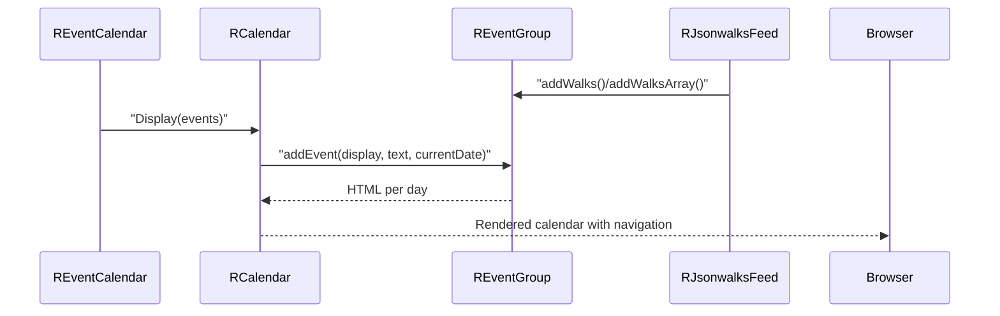

# calendar Module - High Level Design

## Overview

The `calendar` module renders month-by-month calendars and injects per-day walk/event details supplied by event/feed modules.

**Purpose**: Calendar display for walks and events.

**Key Features**:
- Month navigation with optional multi-month rendering
- Injected per-day walk/event lists
- Simple adapter for JSON walks/event collections

## Component Architecture

```mermaid
flowchart TB
    Adapter["REventCalendar\ncalendar.php"]
    Calendar["RCalendar\ncalendar.php"]
    Events["REventGroup\nevent/group.php"]
    Feed[RJsonwalksFeed]
    Toggle["ra.js toggleVisibilities\n("media/js/ra.js")"]
    Styles["calendar.css\nramblerslibrary.css"]

    Adapter --> Calendar
    Adapter --> Events
    Events --> Calendar
    Calendar --> Toggle
    Adapter --> Styles
```

## Public Interface

### `RCalendar`
- **State**: sizing (`$size`), label formats, current month/year cursors, event provider reference, and whether to display all months.
- **Responsibilities**: iterate months, build navigation, render day grids, and delegate per-day content to the supplied events object via `addEvent`.
- **Core Methods**:
  - `show($display, $events)`: drives month rendering starting from the current month through the last available event date.
  - `_showDay($cellNumber)`: positions days in the grid, highlights today, and injects event HTML.
  - `_createNavi($navtype)`: renders Prev/Next controls wired to `ra.html.toggleVisibilities`.

### `REventCalendar` (in `event/calendar.php`)
- Adapts JSON walks/event data for `RCalendar`.
- Adds CSS/JS assets (`calendar.css`, `ramblerslibrary.css`, `ra.js`), configures month labels, and invokes `RCalendar->show`.

### `REventGroup::addEvent` (from `event/group.php`)
- Supplies the `addEvent` interface expected by `RCalendar`, returning HTML for each day (lists, hover blocks, etc.).

## Data Flow



## Integration Points

### Used By
- **jsonwalks/std calendar tab** rendering → [jsonwalks/std HLD](../jsonwalks/std/HLD.md#integration-points).
- **Event module download displays** that show month grids alongside ICS links → [event HLD](../event/HLD.md#integration-points).

### Uses
- **REventGroup** for per-day event HTML → [event HLD](../event/HLD.md#integration-points).
- **RJsonwalksFeed** as a common source for events → [jsonwalks HLD](../jsonwalks/HLD.md#integration-points).
- **Ramblers JS foundation** (`ra.js` toggleVisibilities) for month navigation → [media/js HLD](../media/js/HLD.md#integration-points).

### Data Sources
- **Walk/event data** supplied as `REventGroup` built from JSON walks feeds or event feeds → [event HLD](../event/HLD.md#data-sources).

### External Services
- None; all calendar rendering is server-side HTML with local JS helpers.

### Display Layer
- **Server**: `RCalendar` outputs HTML markup and navigation controls.
- **Client**: `ra.js` toggles month visibility when users navigate; styles from `calendar.css`/`ramblerslibrary.css` → [media/jsonwalks HLD](../media/jsonwalks/HLD.md#display-layer) for calendar tab context.

### Joomla Integration
- Assets (`calendar.css`, `ramblerslibrary.css`, `ra.js`) are enqueued into the Joomla document by `REventCalendar`.
- Calendar HTML is embedded in Joomla modules/pages that supply event data.

### Vendor Library Integration
- None beyond shared Ramblers JS/CSS assets.

### Media Asset Relationships
- Server enqueues `media/lib_ramblers/calendar/calendar.css`, `media/lib_ramblers/css/ramblerslibrary.css`, and `media/lib_ramblers/js/ra.js` before rendering calendar markup; no module-specific JS beyond the shared toggle helper.

## Performance Observations

- **Rendering cost**: Server-side loops over all days between today and the last event date; manageable for typical ranges.
- **Client cost**: Minimal; toggle visibility via `ra.js` only.
- **Asset footprint**: Lightweight CSS/JS; benefits from Joomla cache-busting.

## Error Handling

- **Empty event sets**: Calendar renders with empty days; navigation still works.
- **Invalid dates**: `REventGroup::getLastDate()` should guard against null; adapter can default to current month if absent.
- **Asset loading**: Missing `ra.js` disables toggle buttons but still shows the first month.

## References

- [event HLD](../event/HLD.md) - Event aggregation and ICS
- [jsonwalks/std HLD](../jsonwalks/std/HLD.md) - Calendar tab usage
- [media/jsonwalks HLD](../media/jsonwalks/HLD.md) - Client calendar assets in displays
- `calendar/calendar.php` - Calendar implementation
