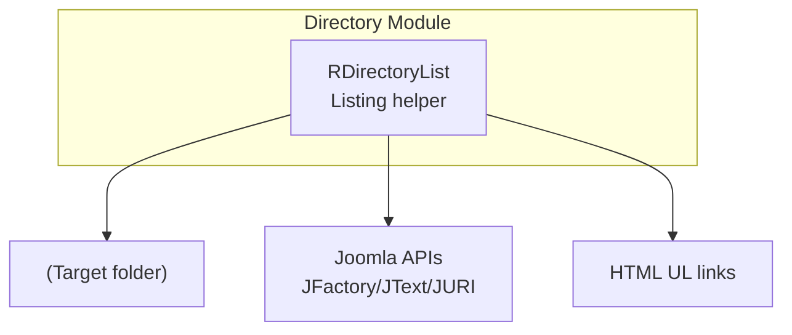
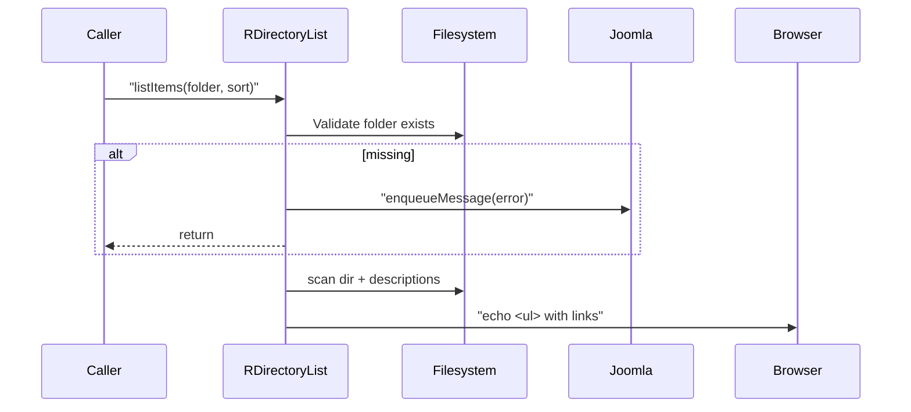

# directory Module - High Level Design

## Overview

The `directory` module renders simple directory listings, filtering by allowed extensions and decorating entries with optional descriptions.

**Purpose**: Directory listing utilities for front-end rendering within Joomla-powered pages.

**Key File**: `directory/list.php`

## Component Architecture

## Public Interface

### RDirectoryList
- **Constructor**: `__construct(array $fileTypes)` – configure allowed extensions.
- **Methods**:
  - `listItems(string $folder, int $sort = self::ASC): void` – validate folder, filter files, read sidecar descriptions (`.text`/`.txt`), and echo an HTML `<ul>` sorted ascending/descending.

## Data Flow

## Integration Points

### Used By
- **Joomla components/modules** that need lightweight folder listings (downloads, documents).

### Uses
- **Joomla Application and helpers** (`JFactory`, `JText`, `JURI`) for messages, translations, and base URLs.
- **Filesystem**: `scandir`, `file_exists`, `filemtime` to enumerate files and sidecar descriptions.

### Data Sources
- **Local folders** supplied by callers; optional `filename.text`/`filename.txt` description files.

### Display Layer
- **Server**: Outputs HTML directly into the page; styling handled by surrounding templates.

### Joomla Integration
- **Messages**: Validation failures surfaced via `enqueueMessage`.
- **Link roots**: URLs built from `JURI::base()` to respect site base path.

### Vendor Library Integration
- None.

### Media Asset Relationships
- None; emits plain HTML without additional assets.

## Performance Observations
- **Lightweight scans**: Uses `scandir` and simple filters; cost scales with folder size.
- **Sidecar reads**: Only attempts to open `.text`/`.txt` files matching listed items.

## Error Handling
- **Missing folder**: Warns via Joomla message and exits.
- **Unreadable description files**: Skips and continues listing.
- **Unsupported extensions**: Files filtered out silently.

## References

- `directory/list.php` - Directory listing implementation
