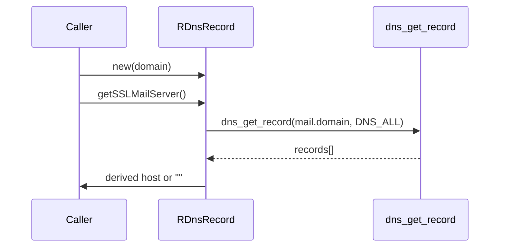

# dns Module - High Level Design

## Overview

The `dns` module resolves mail-related DNS records to help the library discover hosting-specific mail servers for a given domain.

**Purpose**: DNS record discovery for mail routing.

**Key File**: `dns/DnsRecord.php`

## Component Architecture

```mermaid
flowchart TB
    Dns[RDnsRecord<br/>Resolver]
    DNS[dns_get_record(DNS_ALL)<br/>External DNS]
    Host[SSL mail host<br/>mail<octet>.extendcp.co.uk]

    Dns --> DNS
    DNS --> Dns
    Dns --> Host
```

## Public Interface

### RDnsRecord
- **Constructor**: `__construct(string $domain)` – capture the domain to resolve.
- **Methods**:
  - `getSSLMailServer(): string` – call `dns_get_record` for `mail.<domain>`, derive the provider-specific `mail<octet>.extendcp.co.uk` host; returns empty string on failure.

## Data Flow



## Integration Points

### Used By
- **Setup/diagnostic helpers** that need to suggest mail servers for hosted domains.

### Uses
- **PHP DNS extension** (`dns_get_record`) to retrieve records.

### Data Sources
- **Public DNS** queried for `mail.<domain>`.

### Display Layer
- None; returns a string to calling PHP.

### Joomla Integration
- None directly; callers may surface the result in Joomla forms/messages.

### Vendor Library Integration
- None.

### Media Asset Relationships
- None.

## Performance Observations
- **Network-bound**: DNS lookup latency dominates; work is single-call per domain.
- **Lightweight**: Minimal processing beyond string manipulation of the first IPv4 record.

## Error Handling
- **Empty/failed lookups**: Return empty string to indicate no derived host.
- **Missing IPv4 record**: Falls back to empty string (no exception thrown).

## References

- `dns/DnsRecord.php` - DNS record class
