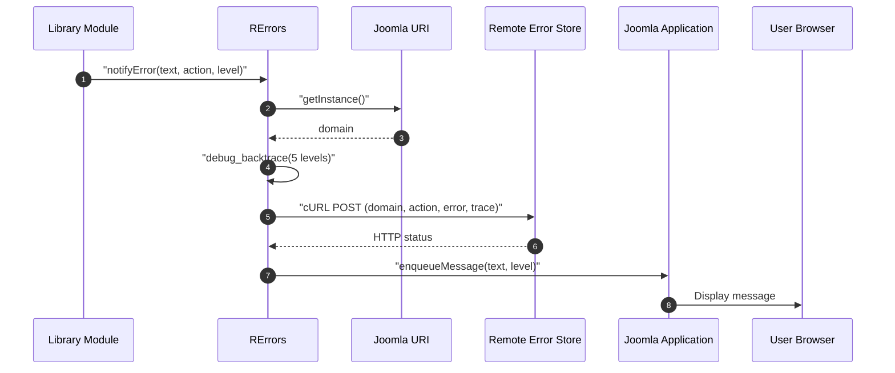
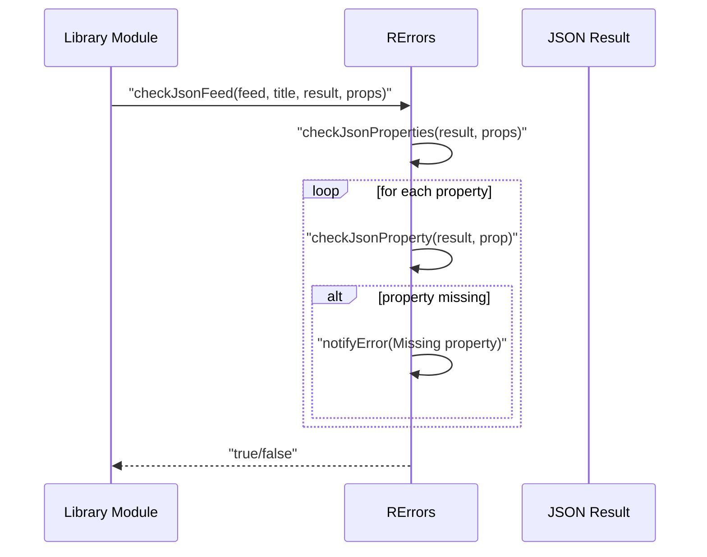

# errors Module - High Level Design

## Overview

The `errors` module provides centralized error handling and telemetry for the Ramblers Library. It collects error information, sends it to a remote error store, displays Joomla messages, and optionally emails administrators. Used across all modules for consistent error reporting.

**Purpose**: Centralized error handling, logging, and telemetry.

**Key Responsibilities**:
- Collect error information with context
- Send errors to remote error store
- Display Joomla user messages
- Optional email notifications
- JSON feed validation
- Stack trace capture

## Component Architecture


## Public Interface

### RErrors

**Centralized error handling and telemetry.**

#### Error Notification Method
```php
public static function notifyError($errorText, $action, $level, $returncode = null)
```
- **Parameters**: 
  - `$errorText` - Error message text
  - `$action` - Component/action identifier (e.g., "Walks Manager")
  - `$level` - Severity level: "message", "notice", "warning", "error"
  - `$returncode` - Optional return code to append to action
- **Behavior**:
  - Captures current domain from Joomla URI
  - Captures stack trace (5 levels, no args)
  - Sends error to remote error store via cURL POST
  - Displays Joomla message to user
  - Logs cURL errors if remote store unavailable

#### JSON Feed Validation Method
```php
public static function checkJsonFeed($feed, $feedTitle, $result, $properties)
```
- **Parameters**: 
  - `$feed` - Feed identifier
  - `$feedTitle` - Feed title for error messages
  - `$result` - JSON decoded result (array/object)
  - `$properties` - Array of required property names
- **Returns**: Boolean (true if valid)
- **Behavior**:
  - Validates JSON structure
  - Checks required properties exist
  - Reports errors for missing properties
  - Returns false if validation fails

#### Private Methods
```php
private static function emailError($errorText, $action, $level)
```
- Sends email notification (currently not called, reserved for future use)

```php
private static function checkJsonProperties($item, $properties)
private static function checkJsonProperty($item, $property)
```
- Internal validation helpers

## Data Flow

### Error Notification Flow



### JSON Validation Flow



## Integration Points

### Used By
- **All modules**: Universal error reporting hook.
- **RJsonwalksWmFeed / RJsonwalksWmFileio** for WM API and cache errors → [jsonwalks/wm HLD](../jsonwalks/wm/HLD.md#integration-points).
- **RFeedhelper** for HTTP/caching issues → [feedhelper HLD](../feedhelper/HLD.md#integration-points).
- **ROrganisation** for organisation feed failures → [organisation HLD](../organisation/HLD.md#integration-points).

### Uses
- **cURL** for POSTing structured error payloads to the remote store.
- **Joomla Application/URI** via `JFactory::getApplication()` and `Uri::getInstance()` for messaging and domain capture.
- **Joomla Mailer** for optional email notifications.

### Data Sources
- **Error context** built from inputs (`$errorText`, `$action`, `$level`, `$returncode`), domain, and stack trace.

### Display Layer
- **Server-side messages**: `enqueueMessage()` renders feedback in Joomla pages; no client JS.

### Joomla Integration
- **Configuration**: Reads mail-from address from Joomla config; surfaces messages through the Joomla message queue.

### Vendor Library Integration
- None beyond PHP cURL and Joomla’s mailer.

### Media Asset Relationships
- None; the module is server-side only.

## Examples

### Example 1: Basic Error Notification

```php
RErrors::notifyError(
    'Failed to fetch walk data',
    'Walks Manager',
    'error'
);
```

### Example 2: Error with Return Code

```php
$result = $this->fetchData();
if ($result === false) {
    RErrors::notifyError(
        'API request failed',
        'Walk Manager API',
        'error',
        500 // HTTP status code
    );
}
```

### Example 3: JSON Feed Validation

```php
$json = json_decode($response);
$required = ['data', 'status', 'count'];

if (!RErrors::checkJsonFeed('WM API', 'Walk Manager Feed', $json, $required)) {
    // Validation failed, errors already reported
    return false;
}
// Continue processing valid JSON
```

### Example 4: Warning Level

```php
RErrors::notifyError(
    'Using stale cache data',
    'Walk Manager Cache',
    'warning'
);
```

## Performance Observations

### Error Reporting Performance
- **Remote Store**: cURL POST with 10s connect timeout, 20s total timeout.
- **Non-Blocking**: Errors don't block execution (async-style reporting).
- **Stack Traces**: Limited to 5 levels for performance.

### Optimization Opportunities
1. **Async Reporting**: Queue errors for background processing
2. **Batching**: Batch multiple errors in single request
3. **Local Logging**: Log to local file if remote store unavailable
4. **Rate Limiting**: Prevent error spam from same source

## Error Handling

### Remote Store Failures
- **cURL Errors**: Logged as Joomla warning message.
- **HTTP Errors**: Non-200 status codes logged.
- **Graceful Degradation**: User message still displayed even if remote store fails.

### Error Levels
- **message**: Informational.
- **notice**: Important information.
- **warning**: Potential issues.
- **error**: Critical errors.

### Stack Trace Capture
- **Depth**: 5 levels (configurable via `DEBUG_BACKTRACE_IGNORE_ARGS`).
- **No Arguments**: Arguments excluded for privacy/performance.
- **JSON Encoded**: Stack trace sent as JSON string.

## References

### Related HLD Documents
- [jsonwalks/wm HLD](../jsonwalks/wm/HLD.md) - WM error usage
- [feedhelper HLD](../feedhelper/HLD.md) - Feed error usage
- [organisation HLD](../organisation/HLD.md) - Organisation error usage

### Key Source Files
- `errors/errors.php` - RErrors class

### External Services
- Error Store: `https://errors.theramblers.org.uk/store_errors.php`
