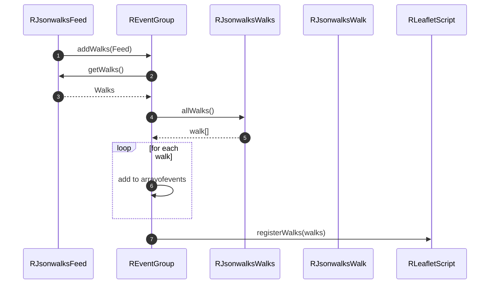
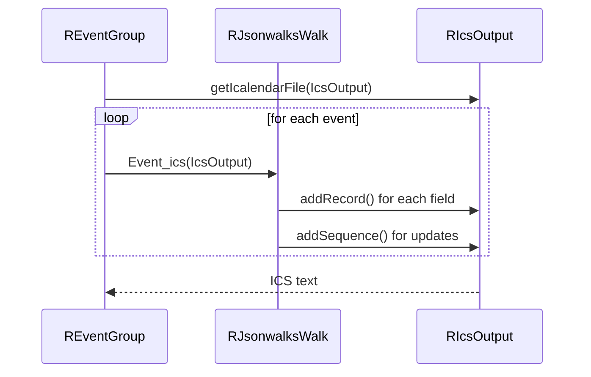

# event Module - High Level Design

## Overview

The `event` module aggregates walk data into event collections and provides iCalendar (ICS) export functionality. It bridges the gap between walk domain objects and calendar-compatible event formats, enabling users to download walk schedules as calendar files.

**Purpose**: Event aggregation and iCalendar export for walk collections.

**Key Responsibilities**:
- Aggregate walks into event collections
- Generate iCalendar (RFC5545) format output
- Provide download links for calendar files
- Register walk data for client-side calendar views
- Support event filtering and date range queries

## Component Architecture

```mermaid
flowchart TB
    subgraph Event["Event Classes"]
        EventFeed[REventFeed<br/>ICS output]
        EventGroup[REventGroup<br/>Event collection]
        EventDownload[REventDownload<br/>Download link]
    end

    subgraph Domain["Domain Integration"]
        Feed[RJsonwalksFeed]
        Walks[RJsonwalksWalks]
        Walk[RJsonwalksWalk]
    end

    subgraph Export["Export Layer"]
        IcsOutput[RIcsOutput<br/>RFC5545 generator]
        IcsFile[RIcsFile]
    end

    subgraph Client["Client Integration"]
        LeafletScript[RLeafletScript<br/>registerWalks()]
    end

    EventFeed --> IcsOutput
    EventGroup --> Walk
    EventDownload --> EventGroup
    EventDownload --> IcsOutput
    
    Feed --> EventGroup
    Walks --> EventGroup
    Walk --> EventGroup
    
    EventGroup --> LeafletScript
```

## Public Interface

### REventFeed

**iCalendar output generator (extends RIcsOutput).**

#### Constructor
```php
public function __construct()
```

#### Output Methods
```php
public function output($events)
```
- **Parameters**: `$events` - `REventGroup` instance
- **Returns**: ICS formatted text string
- **Behavior**: Calls `$events->getIcalendarFile($this)` to generate ICS

```php
public function getText($events)
```
- **Parameters**: `$events` - `REventGroup` instance
- **Returns**: ICS formatted text string
- **Behavior**: Creates new `RIcsOutput`, generates ICS, returns text

### REventGroup

**Event collection manager aggregating walks into events.**

#### Constructor
```php
public function __construct()
```
- Initializes empty event array

#### Walk Addition Methods
```php
public function addWalks($feed)
```
- **Parameters**: `$feed` - `RJsonwalksFeed` instance
- **Behavior**: 
  - Gets walks from feed
  - Adds all walks to event collection
  - Registers walks with `RLeafletScript::registerWalks()` for client-side calendar

```php
public function addWalksArray($arrayofwalks)
```
- **Parameters**: `$arrayofwalks` - Array of `RJsonwalksWalk` objects
- **Behavior**: Adds walks directly to event collection

#### Query Methods
```php
public function getEvents()
```
- **Returns**: Array of walk/event objects

```php
public function getLastDate()
```
- **Returns**: Latest event date as "Y-m-d" string

```php
public function addEvent($display, $text, $currentDate)
```
- **Parameters**: 
  - `$display` - Display format
  - `$text` - Date text
  - `$currentDate` - Date string "Y-m-d"
- **Returns**: HTML string for events on given date
- **Behavior**: Groups events by date, generates HTML list

#### ICS Export Method
```php
public function getIcalendarFile($icsfile)
```
- **Parameters**: `$icsfile` - `RIcsOutput` instance
- **Behavior**: Iterates events, calls `$event->Event_ics($icsfile)` for each

#### Configuration Methods
```php
public function setWalkClass($class)
```
- Sets CSS class for event rendering

### REventDownload

**Download link generator for ICS files.**

#### Constructor
```php
public function __construct()
```

#### Display Methods
```php
public function DisplayWalks($walks)
```
- **Parameters**: `$walks` - `RJsonwalksWalks` collection
- **Behavior**: Creates `REventGroup`, adds walks, displays download link

```php
public function Display($filename, $events)
```
- **Parameters**: 
  - `$filename` - ICS filename
  - `$events` - `REventGroup` instance
- **Behavior**: Generates ICS file download link

```php
public function getText($events)
```
- **Parameters**: `$events` - `REventGroup` instance
- **Returns**: ICS formatted text string

#### Configuration Methods
```php
public function setLinkText($value)
public function setPreText($value)
public function setPostText($value)
```

## Data Flow

### Event Aggregation Flow



### ICS Export Flow



## Integration Points

### Used By
- **jsonwalks/std calendar tab** through `REventGroup` data passed into displays → [jsonwalks/std HLD](../jsonwalks/std/HLD.md#integration-points).
- **ICS download links** emitted by presenters that call `REventDownload` → [jsonwalks HLD](../jsonwalks/HLD.md#integration-points).
- **Calendar module** adapters that render month grids → [calendar HLD](../calendar/HLD.md#integration-points).

### Uses
- **RJsonwalksFeed/Walks/Walk** as event data sources → [jsonwalks HLD](../jsonwalks/HLD.md#integration-points) and [jsonwalks/walk HLD](../jsonwalks/walk/HLD.md#integration-points).
- **RIcsOutput / RIcsFile** for ICS generation → [ics HLD](../ics/HLD.md#integration-points).
- **RLeafletScript::registerWalks** to expose walk data to client calendars/maps → [leaflet HLD](../leaflet/HLD.md#integration-points).

### Data Sources
- **Walk collections** from `RJsonwalksFeed` or arrays of `RJsonwalksWalk` supplied directly.

### External Services
- None; ICS generation and event aggregation are server-side.

### Display Layer
- **Server**: Generates HTML download links, event lists, and ICS payloads.
- **Client**: Calendar views rely on JSON emitted by `registerWalks()` and on FullCalendar loaded by display modules → [media/jsonwalks HLD](../media/jsonwalks/HLD.md#display-layer).

### Joomla Integration
- ICS files are delivered via Joomla controllers/views; messages and errors surfaced through Joomla messaging.

### Vendor Library Integration
- **FullCalendar** used by jsonwalks displays (loaded elsewhere) to visualize events.

### Media Asset Relationships
- No module-specific assets; relies on media loaded by upstream displays (e.g., `jsonwalks/std` tabs + FullCalendar) after `registerWalks()` exposes event data.

## Performance Observations

### Event Aggregation
- **Memory**: All walks loaded into memory as event array
- **Processing**: Linear iteration through walks (O(n))
- **No Caching**: Events generated on-demand (consider caching for large collections)

### ICS Generation
- **Formatting**: RFC5545 formatting is lightweight
- **Size**: ICS files typically small (<100KB for 1000 events)
- **Streaming**: Could stream large ICS files for better memory usage

### Optimization Opportunities
1. **Lazy Event Loading**: Only load events for requested date range
2. **ICS Caching**: Cache generated ICS files by feed parameters
3. **Incremental Updates**: Support ICS incremental updates (RFC5545)

## Error Handling

### Event Collection Errors
- **Empty Collections**: Returns empty array (graceful)
- **Invalid Walks**: Invalid walk objects skipped (logged)

### ICS Generation Errors
- **Encoding Issues**: Handled by `RIcsOutput::escapeString()` → [ics HLD](../ics/HLD.md)
- **Date Format Errors**: Walk date methods handle invalid dates gracefully

### Download Errors
- **File Generation**: Errors logged, user sees error message
- **Missing Data**: Empty ICS file generated (valid but empty)

## Media Dependencies

### No Module-Specific Media Files

The event module does not have dedicated JavaScript or CSS files. It relies on:
- Client-side calendar views provided by `jsonwalks/std` display classes
- FullCalendar library loaded by display modules
- See [jsonwalks/std HLD](../jsonwalks/std/HLD.md) for calendar view assets

## Examples

### Example 1: Basic ICS Export

```php
$options = new RJsonwalksFeedoptions('BU51');
$feed = new RJsonwalksFeed($options);

$events = new REventGroup();
$events->addWalks($feed);

$icsOutput = new REventFeed();
$icsText = $icsOutput->output($events);
// Output $icsText as file download
```

### Example 2: Download Link Display

```php
$feed = new RJsonwalksFeed($options);
$download = new REventDownload();
$download->setLinkText("Download Calendar");
$download->setPreText("Click to download: ");
$download->DisplayWalks($feed->getWalks());
```

### Example 3: Event List by Date

```php
$events = new REventGroup();
$events->addWalks($feed);

$currentDate = "2025-01-15";
$html = $events->addEvent("list", "15th January", $currentDate);
echo $html; // Renders events for that date
```

### Example 4: Get Latest Event Date

```php
$events = new REventGroup();
$events->addWalks($feed);
$lastDate = $events->getLastDate();
echo "Last walk: " . $lastDate;
```

## Performance Notes

### Event Aggregation
- **Memory**: All walks loaded into memory as event array
- **Processing**: Linear iteration through walks (O(n))
- **No Caching**: Events generated on-demand (consider caching for large collections)

### ICS Generation
- **Formatting**: RFC5545 formatting is lightweight
- **Size**: ICS files typically small (<100KB for 1000 events)
- **Streaming**: Could stream large ICS files for better memory usage

### Optimization Opportunities
1. **Lazy Event Loading**: Only load events for requested date range
2. **ICS Caching**: Cache generated ICS files by feed parameters
3. **Incremental Updates**: Support ICS incremental updates (RFC5545)

## Error Handling

### Event Collection Errors
- **Empty Collections**: Returns empty array (graceful)
- **Invalid Walks**: Invalid walk objects skipped (logged)

### ICS Generation Errors
- **Encoding Issues**: Handled by `RIcsOutput::escapeString()` → [ics HLD](../ics/HLD.md)
- **Date Format Errors**: Walk date methods handle invalid dates gracefully

### Download Errors
- **File Generation**: Errors logged, user sees error message
- **Missing Data**: Empty ICS file generated (valid but empty)

## References

### Related HLD Documents
- [jsonwalks HLD](../jsonwalks/HLD.md) - Walk data source
- [jsonwalks/walk HLD](../jsonwalks/walk/HLD.md) - Walk domain objects
- [ics HLD](../ics/HLD.md) - iCalendar output generation
- [leaflet HLD](../leaflet/HLD.md) - Client-side calendar integration
- [jsonwalks/std HLD](../jsonwalks/std/HLD.md) - Calendar view display

### Key Source Files
- `event/feed.php` - REventFeed class
- `event/group.php` - REventGroup class
- `event/download.php` - REventDownload class
- `event/calendar.php` - Calendar view helper
- `ics/output.php` - RIcsOutput class
- `ics/file.php` - RIcsFile class

