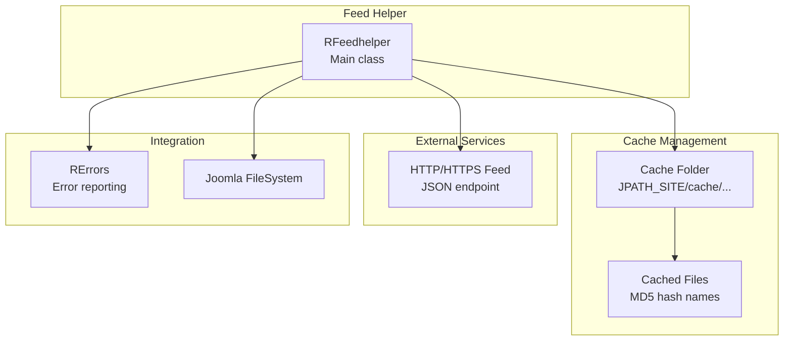
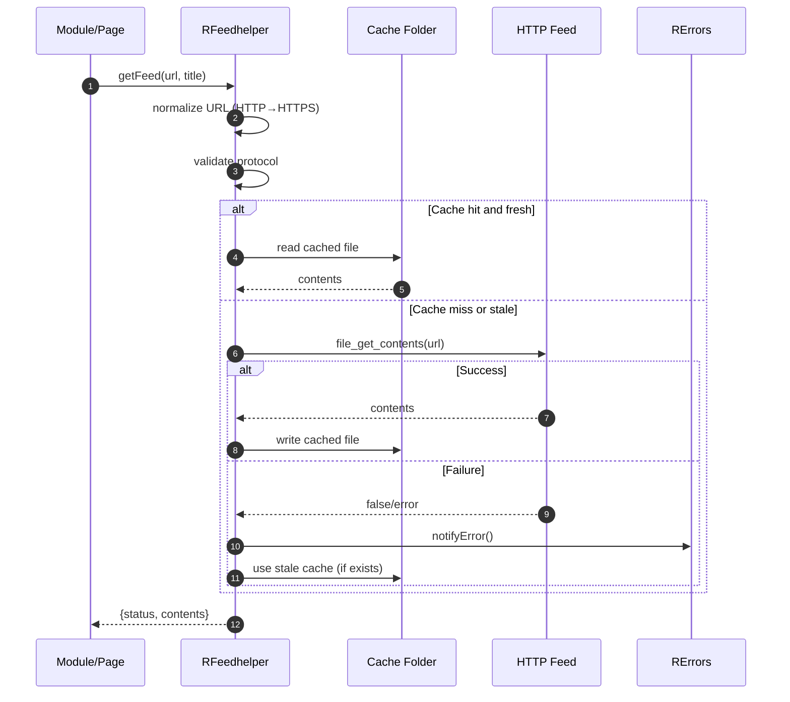

# feedhelper Module - High Level Design

## Overview

The `feedhelper` module provides generic HTTP feed retrieval with disk-based caching. It handles remote JSON feed fetching, URL normalization, cache management, and error reporting. Used by organisation feeds and other modules requiring HTTP data retrieval.

**Purpose**: Reusable HTTP feed client with caching and error handling.

**Key Responsibilities**:
- Fetch remote HTTP/HTTPS feeds
- Cache responses to disk with TTL
- Normalize URLs (HTTP → HTTPS upgrade)
- Handle timeouts and connection errors
- Report errors via centralized error system

## Component Architecture



## Public Interface

### RFeedhelper

**HTTP feed retrieval with caching.**

#### Constructor
```php
public function __construct($cacheLocation, $cacheTime)
```
- **Parameters**: 
  - `$cacheLocation` - Relative path from `JPATH_SITE` (e.g., "cache/ra_feeds")
  - `$cacheTime` - Cache TTL in minutes
- **Behavior**: 
  - Creates cache folder if it doesn't exist
  - Validates cache location (dies if invalid)

#### Feed Retrieval Method
```php
public function getFeed($feedurl, $title)
```
- **Parameters**: 
  - `$feedurl` - HTTP/HTTPS URL to fetch
  - `$title` - Title for error reporting
- **Returns**: Array with keys:
  - `"status"` - Status constant (OK, READFAILED, FEEDERROR, FEEDFOPEN)
  - `"contents"` - Feed contents (string) or NULL on error
- **Behavior**:
  - Normalizes URL (upgrades HTTP to HTTPS for ramblers.org.uk)
  - Validates URL protocol (must be HTTP/HTTPS)
  - Checks cache for fresh copy
  - Fetches from remote if cache miss/stale
  - Writes to cache on successful fetch
  - Returns cached or fresh contents

#### Configuration Methods
```php
public function setReadTimeout($value)
```
- **Parameters**: `$value` - Timeout in seconds (default: 15)
- **Behavior**: Sets HTTP read timeout

#### Cache Management Methods
```php
public function clearCache()
```
- **Behavior**: Deletes all cached files in cache folder

#### Status Constants
```php
const OK = 0;
const READFAILED = 1;
const FEEDERROR = 2;
const FEEDFOPEN = 3;
```

## Data Flow

### Feed Retrieval Flow



## Integration Points

### Used By
- **ROrganisation**: Fetches organisation group feeds → [organisation HLD](../organisation/HLD.md)
- **Other modules**: Any module requiring HTTP feed retrieval

### Dependencies
- **RErrors**: Error reporting → [errors HLD](../errors/HLD.md)
- **Joomla FileSystem**: File operations
- **PHP file_get_contents()**: HTTP fetching (requires `allow_url_fopen`)

## Media Dependencies

### No Media Files

The feedhelper module is server-side only with no JavaScript or CSS dependencies.

## Examples

### Example 1: Basic Feed Retrieval

```php
$feedHelper = new RFeedhelper('cache/ra_feeds', 60); // 60 min TTL
$result = $feedHelper->getFeed(
    'https://www.ramblers.org.uk/api/groups.json',
    'Ramblers Groups'
);

if ($result['status'] === RFeedhelper::OK) {
    $json = json_decode($result['contents']);
    // Process JSON data
} else {
    // Handle error
}
```

### Example 2: With Custom Timeout

```php
$feedHelper = new RFeedhelper('cache/ra_feeds', 30);
$feedHelper->setReadTimeout(30); // 30 second timeout
$result = $feedHelper->getFeed($url, $title);
```

### Example 3: Clear Cache

```php
$feedHelper = new RFeedhelper('cache/ra_feeds', 60);
$feedHelper->clearCache(); // Remove all cached files
```

## Performance Notes

### Caching Strategy
- **TTL-Based**: Cache valid for specified minutes
- **File-Based**: Each URL cached as separate file (MD5 hash filename)
- **Stale Fallback**: Uses stale cache if fetch fails (resilient)

### HTTP Performance
- **Timeout**: Configurable (default 15 seconds)
- **HTTPS Upgrade**: Automatically upgrades ramblers.org.uk URLs
- **No Retries**: Single attempt (consider adding retry logic)

### Optimization Opportunities
1. **HTTP/2 Support**: Use cURL with HTTP/2 for faster connections
2. **Compression**: Support gzip/deflate for large feeds
3. **Conditional Requests**: Use If-Modified-Since headers
4. **Parallel Fetching**: Fetch multiple feeds concurrently

## Error Handling

### Error Types
- **READFAILED**: File read error (cache or remote)
- **FEEDERROR**: Invalid URL protocol
- **FEEDFOPEN**: `allow_url_fopen` disabled in PHP

### Error Reporting
- All errors reported via `RErrors::notifyError()`
- Status returned in result array
- Stale cache used as fallback if available

### Validation
- **URL Protocol**: Must start with "http"
- **Cache Location**: Must be valid directory path
- **PHP Settings**: Checks `allow_url_fopen` setting

## References

### Related HLD Documents
- [errors HLD](../errors/HLD.md) - Error reporting system
- [organisation HLD](../organisation/HLD.md) - Organisation feed usage
- [jsonwalks/wm HLD](../jsonwalks/wm/ARCHITECTURE.md) - WM feed system (similar but specialized)

### Key Source Files
- `feedhelper/feedhelper.php` - RFeedhelper class


