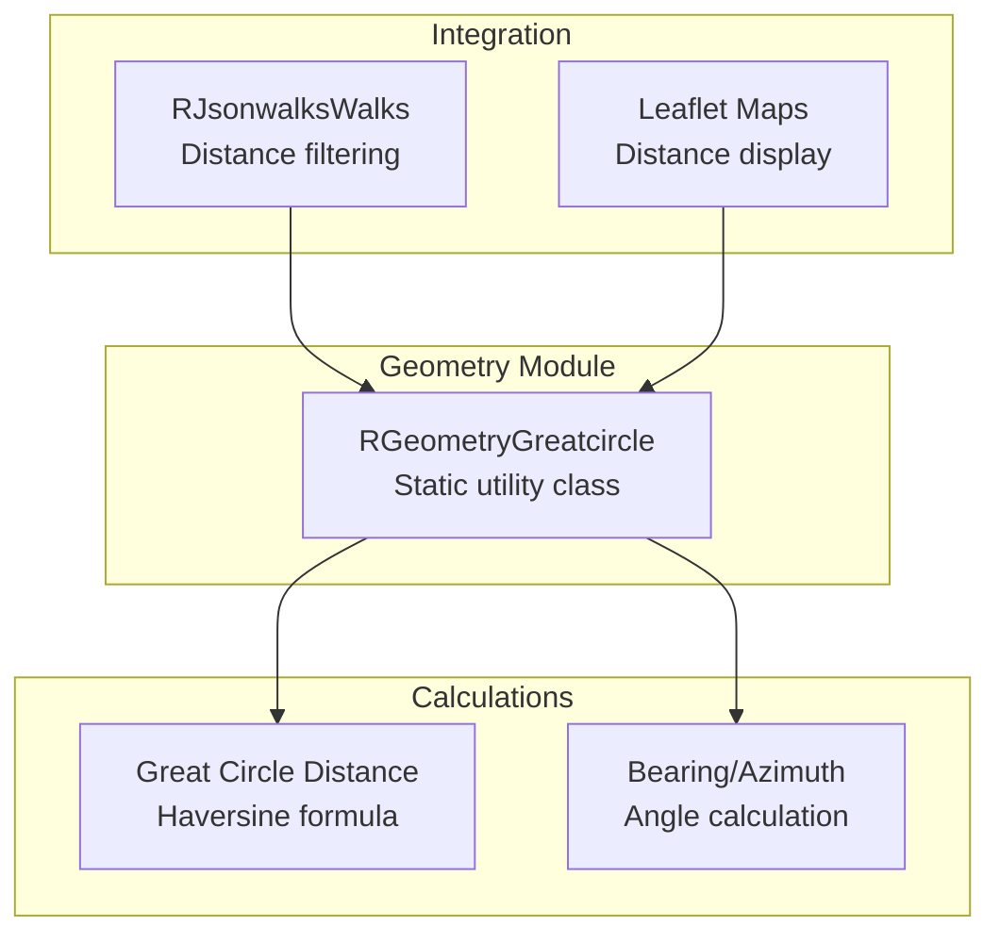
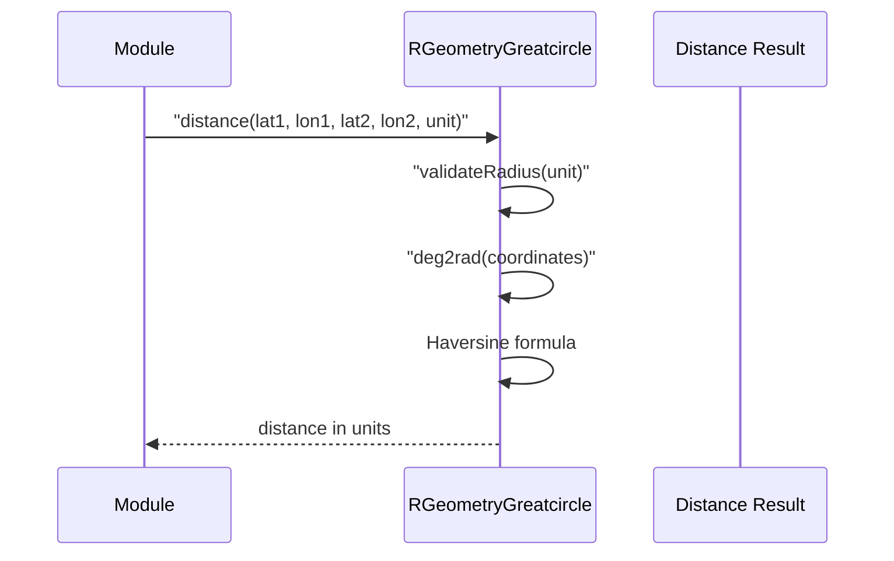

# geometry Module - High Level Design

## Overview

The `geometry` module provides geographic calculation utilities, primarily great circle distance and bearing calculations between two geographic coordinates. Used by walk filtering and map distance calculations.

**Purpose**: Geographic distance and bearing calculations.

**Key Responsibilities**:
- Calculate great circle distance between two points
- Calculate bearing (azimuth) between two points
- Support multiple distance units (km, miles, nautical miles, yards, feet)
- Handle coordinate conversions (degrees to radians)

## Component Architecture



## Public Interface

### RGeometryGreatcircle

**Static utility class for geographic calculations.**

#### Distance Calculation
```php
public static function distance($lat1, $lon1, $lat2, $lon2, $unit = KM)
```
- **Parameters**: 
  - `$lat1`, `$lon1` - First point coordinates (decimal degrees)
  - `$lat2`, `$lon2` - Second point coordinates (decimal degrees)
  - `$unit` - Distance unit constant or numeric radius (default: KM)
- **Returns**: Distance in specified units (float)
- **Algorithm**: Haversine formula for great circle distance
- **Units**: `KM`, `MI` (miles), `NM` (nautical miles), `YD` (yards), `FT` (feet)

#### Bearing Calculation
```php
public static function bearing($lat1, $lon1, $lat2, $lon2)
```
- **Parameters**: 
  - `$lat1`, `$lon1` - Origin coordinates (decimal degrees)
  - `$lat2`, `$lon2` - Destination coordinates (decimal degrees)
- **Returns**: Bearing in degrees (0-360, 0 = North)
- **Algorithm**: Spherical bearing calculation

#### Constants
```php
const KM = 6371.009;    // Earth radius in km
const MI = 3958.761;    // Earth radius in miles
const NM = 3440.070;    // Earth radius in nautical miles
const YD = 6967420;     // Earth radius in yards
const FT = 20902260;    // Earth radius in feet
```

## Data Flow

### Distance Calculation Flow



## Integration Points

### Used By
- **RJsonwalksWalks**: `filterDistanceFromLatLong()` method → [jsonwalks HLD](../jsonwalks/HLD.md)
- **RJsonwalksWalk**: `distanceFromLatLong()` method → [jsonwalks/walk HLD](../jsonwalks/walk/HLD.md)
- **Leaflet maps**: Distance calculations for markers → [leaflet HLD](../leaflet/HLD.md)

## Media Dependencies

### No Media Files

The geometry module is server-side only with no JavaScript or CSS dependencies.

## Examples

### Example 1: Distance Between Two Points

```php
$distance = RGeometryGreatcircle::distance(
    51.5074, -0.1278,  // London
    52.4862, -1.8904,  // Birmingham
    RGeometryGreatcircle::KM
);
// Returns: ~163.5 km
```

### Example 2: Distance in Miles

```php
$distance = RGeometryGreatcircle::distance(
    $lat1, $lon1,
    $lat2, $lon2,
    RGeometryGreatcircle::MI
);
```

### Example 3: Bearing Calculation

```php
$bearing = RGeometryGreatcircle::bearing(
    51.5074, -0.1278,  // From London
    52.4862, -1.8904   // To Birmingham
);
// Returns: ~312 degrees (NW direction)
```

## Performance Notes

### Calculation Performance
- **Fast**: Simple trigonometric calculations (O(1))
- **No Caching**: Calculations are stateless and fast enough to not require caching
- **Precision**: Uses standard Earth radius (6371.009 km), suitable for most use cases

### Optimization Opportunities
1. **Batch Calculations**: Calculate multiple distances in single call
2. **Approximation**: Use simpler formulas for very short distances
3. **Coordinate System**: Support different coordinate systems (UTM, OSGB)

## Error Handling

### Input Validation
- **Invalid Units**: Throws `Exception` if unit constant not defined and not numeric
- **Coordinate Range**: No validation (assumes valid lat/lon in degrees)

### Edge Cases
- **Same Point**: Returns 0 distance, undefined bearing
- **Antipodal Points**: Returns maximum distance (~20,000 km)

## References

### Related HLD Documents
- [jsonwalks HLD](../jsonwalks/HLD.md) - Distance filtering usage
- [jsonwalks/walk HLD](../jsonwalks/walk/HLD.md) - Walk distance calculations
- [leaflet HLD](../leaflet/HLD.md) - Map distance display

### Key Source Files
- `geometry/greatcircle.php` - RGeometryGreatcircle class


