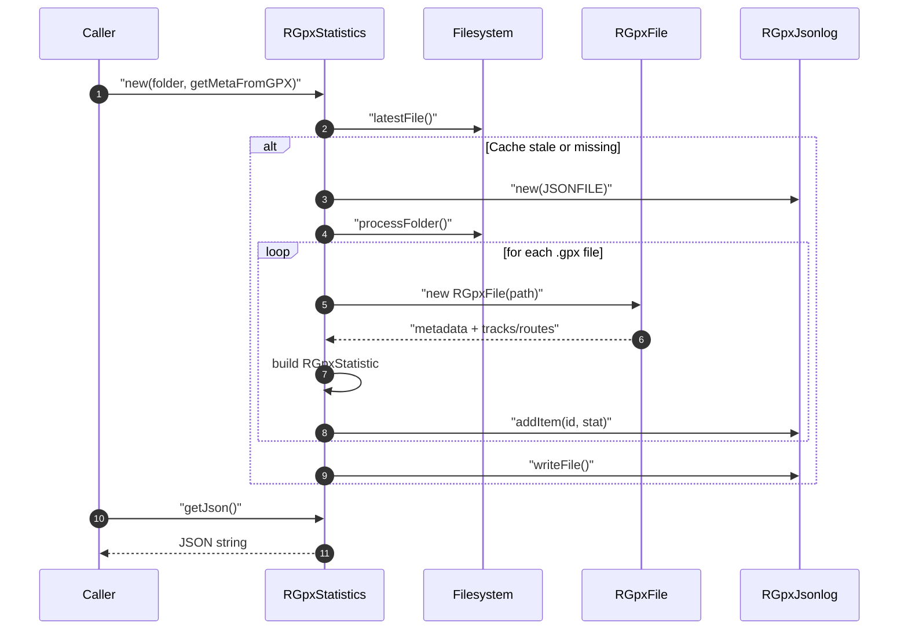

# gpx Module - High Level Design

## Overview

The `gpx` module provides GPX file processing utilities including file reading, JSON conversion, and statistics generation.

**Purpose**: GPX file processing and statistics.

**Key Responsibilities**:
- Parse individual GPX files into structured PHP objects.
- Calculate per-file statistics (distance, elevation, dates, author, links).
- Aggregate folder-level statistics and persist them as JSON for reuse.
- Validate folder contents and emit diagnostics when regenerating caches.

## Component Architecture

```mermaid
flowchart TB
    subgraph Parsing["Per-file Parsing"]
        File["RGpxFile\nGPX reader"]
    end

    subgraph Stats["Statistics"]
        Stat["RGpxStatistic\nValue object"]
        Stats["RGpxStatistics\nFolder aggregator"]
    end

    subgraph Persistence["Persistence"]
        Jsonlog["RGpxJsonlog\nJSON writer"]
        Cache["0000gpx_statistics_file.json\nCache file"]
    end

    Filesystem["(GPX folder)"]

    Filesystem --> File
    File --> Stat
    Stat --> Stats
    Stats --> Jsonlog
    Jsonlog --> Cache
```

## Public Interface

### RGpxFile
- **Responsibility**: Parse an individual GPX file to expose metadata (title, description, author, date, links, start/end coordinates, distance, elevation, tracks/routes, duration).
- **Key Methods**: Constructor reads the file; public properties expose parsed values.

### RGpxStatistic
- **Responsibility**: Lightweight value object used to store derived statistics per GPX file (filename, title, description, coordinates, distance, elevation gain, min/max altitude, tracks/routes/duration).

### RGpxJsonlog
- **Constructor**: `__construct(string $path)`
- **Methods**:
  - `addItem(string $id, RGpxStatistic $stat)`: append a stat record keyed by ID.
  - `writeFile()`: persist the aggregated stats as JSON to disk.

### RGpxStatistics
- **Constructor**: `__construct(string $folder, bool $getMetaFromGPX)`
  - Creates/refreshes `0000gpx_statistics_file.json` when newer GPX files are present.
- **Public Methods**:
  - `getJson(): string` – return the cached JSON payload for downstream consumers.

### Helper Methods (RGpxStatistics)
- `processFolder()`: scan the folder, parse GPX files, and add statistics to the JSON log.
- `processGPXFile(string $file): RGpxStatistic`: parse a single GPX file and build its statistic record.
- `latestFile(): string`: find the most recently modified file to decide whether to regenerate the cache.
- `getTitlefromName()` / `getDescription()`: derive defaults when GPX metadata is absent.

## Data Flow

### Folder Scan and Cache Generation



## Integration Points

### Used By
- **RLeafletGpxMaplist / RLeafletGpxMap** to supply GPX summaries and download metadata → [leaflet/gpx HLD](../leaflet/gpx/HLD.md#integration-points).
- **RLeafletScript** consumers that need cached GPX statistics for client rendering → [leaflet HLD](../leaflet/HLD.md#integration-points).

### Uses
- **Filesystem**: Reads `.gpx` files and writes the `0000gpx_statistics_file.json` cache.
- **RHtml**: Generates diagnostic tables during cache regeneration → [html HLD](../html/HLD.md#integration-points).
- **Joomla application messaging** for folder errors (`enqueueMessage`).

### Data Sources
- **Local GPX folders** supplied by callers; optional GPX metadata (title/description) is used when `getMetaFromGPX` is true.

### Display Layer
- **Server**: Exposes cached JSON via `RGpxStatistics::getJson()` for PHP presenters.
- **Client**: Map/list presenters in `/media/leaflet/gpx` consume the JSON to render tracks, markers, and download links → [media/leaflet HLD](../media/leaflet/HLD.md#integration-points).

### Joomla Integration
- **Diagnostics**: Writes HTML diagnostics to the response while rebuilding the cache (until Joomla cache expiry).
- **Messaging**: Surfaces folder access errors through `JFactory::getApplication()->enqueueMessage`.

### Vendor Library Integration
- None directly; downstream Leaflet presenters pull in Leaflet/Elevation vendors.

### Media Asset Relationships
- **Server → Client**: GPX stats JSON produced here is loaded by Leaflet GPX presenters, which then enqueue `/media/leaflet/gpx` JavaScript plus Leaflet/Elevation assets (see [leaflet/gpx HLD](../leaflet/gpx/HLD.md#media-asset-relationships)).

## Performance Observations

- **Cache reuse**: Regenerates statistics only when a GPX file is newer than `0000gpx_statistics_file.json`, keeping repeated requests fast.
- **Parsing cost**: Per-file parsing is linear in GPX size; folder scans can be noisy but are limited to cache refresh events.
- **Memory**: Holds stats for all files in memory during regeneration; typical folders remain manageable.

## Error Handling

- **Missing folder**: Emits Joomla error message and stops processing.
- **Folder access errors**: Logs warnings and continues with an empty file list.
- **GPX parsing gaps**: Falls back to filename-derived title/description when metadata is absent.
- **Invalid cache writes**: `writeFile()` failure would leave stale cache; diagnostics are printed during regeneration for visibility.

## References

- [leaflet/gpx HLD](../leaflet/gpx/HLD.md) - GPX presentation layer
- `gpx/file.php` - GPX file parser
- `gpx/jsonlog.php` - JSON writer
- `gpx/statistic.php` - Statistic value object
- `gpx/statistics.php` - Folder aggregation and cache logic

