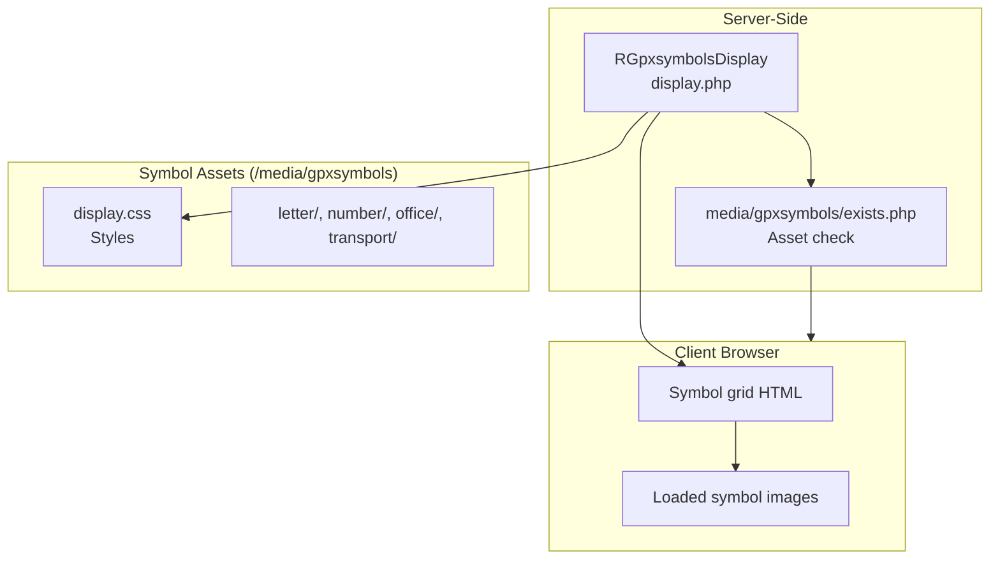
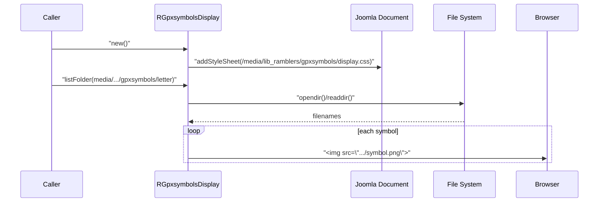
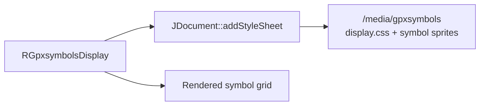

# gpxsymbols Module - High Level Design

## Overview

The `gpxsymbols` module renders available GPX waypoint symbols within Joomla views. It discovers symbol assets on disk, streams them to the browser, and wires the companion `/media/gpxsymbols` helper for existence checks.

**Purpose**: GPX symbol rendering and discovery.

**Key File**: `gpxsymbols/display.php`

## Component Architecture



## Public Interface

### RGpxsymbolsDisplay

**Main symbol renderer.**

#### Constructor
```php
public function __construct()
```
- **Behavior**: Obtains the Joomla document and enqueues `/media/lib_ramblers/gpxsymbols/display.css` to style the rendered grid.

#### Symbol Listing Method
```php
public function listFolder($folder)
```
- **Parameters**: `$folder` - Absolute path to a symbol directory under `/media/lib_ramblers/gpxsymbols/*`.
- **Behavior**:
  - Enumerates files, sorts naturally, and renders a `<details>` panel with thumbnails and filenames.
  - Uses `displayImage()` to emit individual symbol entries.

#### Private Helper
```php
private function displayImage($folder, $entry)
```
- **Behavior**: Outputs an `` element for the symbol and a caption derived from the filename.

### Key Features
- Automatic stylesheet injection for symbol grids.
- Natural sorting of symbol filenames for predictable display order.
- Reusable renderer that targets any `/media/lib_ramblers/gpxsymbols/*` subfolder.

## Data Flow

### Symbol Discovery Flow



## Integration Points

### Uses
- **Joomla Document**: Queues `/media/gpxsymbols` assets for the rendered page.
- **`media/gpxsymbols/exists.php`**: Optional existence checks for symbol files → [media/gpxsymbols HLD](../media/gpxsymbols/HLD.md)

### Media Assets (/media/gpxsymbols)
- **Server-to-Client Loading**: `RGpxsymbolsDisplay::__construct()` injects the symbol stylesheet via the Joomla document API; the rendered HTML references symbol image files directly under `/media/lib_ramblers/gpxsymbols/*` when building the grid.
- **Asset Relationship**:



### Related HLD Documents
- [media/gpxsymbols HLD](../media/gpxsymbols/HLD.md) - Symbol existence endpoint and asset inventory
