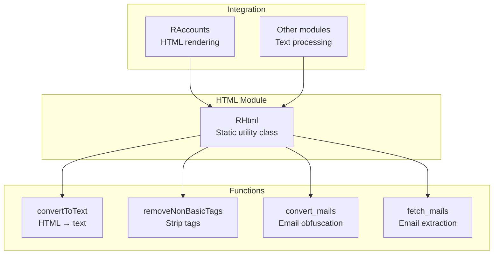
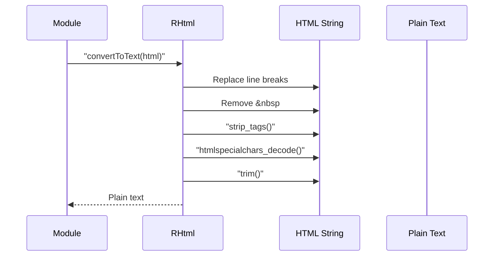

# html Module - High Level Design

## Overview

The `html` module provides HTML formatting and text conversion utilities. It handles HTML-to-text conversion, tag stripping, email obfuscation, and text sanitization. Used primarily by accounts and other modules for HTML processing.

**Purpose**: HTML formatting and text conversion utilities.

**Key Responsibilities**:
- Convert HTML to plain text
- Strip HTML tags (with optional whitelist)
- Obfuscate email addresses
- Extract email addresses from text
- Sanitize HTML content

## Component Architecture



## Public Interface

### RHtml

**Static utility class for HTML processing.**

#### Text Conversion Methods
```php
public static function convertToText($html)
```
- **Parameters**: `$html` - HTML string
- **Returns**: Plain text string
- **Behavior**: 
  - Replaces line breaks with spaces
  - Removes `&nbsp;` entities
  - Strips all HTML tags
  - Decodes HTML entities
  - Trims whitespace

```php
public static function removeNonBasicTags($html)
```
- **Parameters**: `$html` - HTML string
- **Returns**: HTML with tags removed (preserves whitespace)
- **Behavior**: 
  - Similar to `convertToText()` but preserves whitespace better
  - Uses `strip_tags_with_whitespace()` internally

```php
public static function strip_tags_with_whitespace($string, $allowable_tags = null)
```
- **Parameters**: 
  - `$string` - HTML string
  - `$allowable_tags` - Optional tag whitelist
- **Returns**: String with tags removed
- **Behavior**: 
  - Adds space before `<` to preserve whitespace
  - Strips tags (with optional whitelist)
  - Collapses multiple spaces

#### Email Methods
```php
public static function convert_mails($text)
```
- **Parameters**: `$text` - Text containing email addresses
- **Returns**: Text with emails obfuscated (replaces `@` with image)
- **Behavior**: 
  - Finds all email addresses
  - Replaces `@` symbol with image (`symbol_at.png`)
  - Prevents email harvesting by bots

```php
public static function fetch_mails($text)
```
- **Parameters**: `$text` - Text to search
- **Returns**: Array of email addresses found
- **Behavior**: 
  - Uses regex to find email addresses
  - Returns empty array if none found

## Data Flow

### HTML to Text Conversion Flow



## Integration Points

### Used By
- **RAccounts**: HTML rendering and email obfuscation → [accounts HLD](../accounts/HLD.md)
- **Other modules**: Text processing and sanitization

## Media Dependencies

### Image File
- `media/images/symbol_at.png` - `@` symbol image used for email obfuscation
  - Loaded via `JURI::base(true)` in `convert_mails()`

## Examples

### Example 1: Convert HTML to Text

```php
$html = '<p>Hello <strong>world</strong>!</p>';
$text = RHtml::convertToText($html);
// Returns: "Hello world!"
```

### Example 2: Remove Tags with Whitelist

```php
$html = '<p>Hello <b>world</b> <script>alert("xss")</script></p>';
$text = RHtml::removeNonBasicTags($html);
// Returns: "Hello world alert("xss")"
```

### Example 3: Obfuscate Emails

```php
$text = 'Contact us at info@example.com';
$obfuscated = RHtml::convert_mails($text);
// Returns: 'Contact us at infoexample.com'
```

### Example 4: Extract Emails

```php
$text = 'Email: info@example.com or support@example.org';
$emails = RHtml::fetch_mails($text);
// Returns: ['info@example.com', 'support@example.org']
```

## Performance Notes

### Processing Performance
- **Fast**: Simple string operations (O(n))
- **Regex**: Email extraction uses regex (moderate cost)
- **No Caching**: Stateless operations, no caching needed

### Optimization Opportunities
1. **Regex Optimization**: Compile regex patterns once
2. **Batch Processing**: Process multiple strings in single call

## Error Handling

### Input Validation
- **Null Input**: Returns empty string (graceful)
- **Invalid HTML**: Handled by `strip_tags()` (safe)

### Edge Cases
- **No Emails**: `fetch_mails()` returns empty array
- **Malformed HTML**: `strip_tags()` handles gracefully

## References

### Related HLD Documents
- [accounts HLD](../accounts/HLD.md) - HTML rendering usage

### Key Source Files
- `html/html.php` - RHtml class

### Related Media Files
- `media/images/symbol_at.png` - Email obfuscation image


