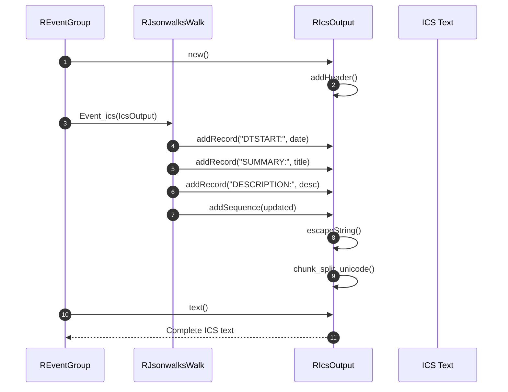

# ics Module - High Level Design

## Overview

The `ics` module provides iCalendar (RFC5545) format generation for calendar exports. It handles ICS file creation, field escaping, line wrapping, and sequence management. Used by event module to export walk schedules as calendar files.

**Purpose**: iCalendar (RFC5545) format output generation.

**Key Responsibilities**:
- Generate RFC5545-compliant ICS files
- Escape special characters in ICS fields
- Handle line wrapping (73 characters per line)
- Manage sequence numbers for updates
- Support HTML content in descriptions

## Component Architecture

```mermaid
flowchart TB
    subgraph Ics["ICS Module"]
        IcsOutput[RIcsOutput<br/>ICS generator]
        IcsFile[RIcsFile<br/>File handler]
    end

    subgraph Functions["Functions"]
        AddRecord[addRecord<br/>Add ICS field]
        EscapeString[escapeString<br/>Escape special chars]
        AddSequence[addSequence<br/>Update sequence]
        ChunkSplit[chunk_split_unicode<br/>Line wrapping]
    end

    subgraph Integration["Integration"]
        EventFeed[REventFeed<br/>Event export]
        EventGroup[REventGroup<br/>Event collection]
        Walk[RJsonwalksWalk<br/>Event_ics() method]
    end

    IcsOutput --> AddRecord
    IcsOutput --> EscapeString
    IcsOutput --> AddSequence
    IcsOutput --> ChunkSplit
    EventFeed --> IcsOutput
    EventGroup --> IcsOutput
    Walk --> IcsOutput
```

## Public Interface

### RIcsOutput

**iCalendar format generator.**

#### Constructor
```php
public function __construct()
```
- **Behavior**: Automatically adds ICS header (`BEGIN:VCALENDAR`)

#### Output Method
```php
public function text()
```
- **Returns**: Complete ICS formatted text string
- **Behavior**: Appends `END:VCALENDAR` footer and returns

#### Record Addition Method
```php
public function addRecord($command, $content = "", $html = false)
```
- **Parameters**: 
  - `$command` - ICS field name (e.g., "DTSTART:", "SUMMARY:")
  - `$content` - Field value
  - `$html` - Boolean, if true wraps content in HTML structure
- **Behavior**: 
  - Converts encoding to UTF-8
  - Escapes special characters
  - If HTML: wraps in HTML document structure, converts `\n` to `<br/>`
  - If not HTML: converts HTML tags to text, strips tags, decodes entities
  - Wraps lines at 73 characters (RFC5545 requirement)
  - Appends to internal ICS string

#### Utility Methods
```php
public static function escapeString($string)
```
- **Parameters**: `$string` - String to escape
- **Returns**: Escaped string
- **Behavior**: Escapes commas and semicolons with backslash

```php
public function addSequence($dateUpdated)
```
- **Parameters**: `$dateUpdated` - DateTime object
- **Behavior**: 
  - Calculates days since 2010-01-01
  - Adds seconds since midnight for daily updates
  - Adds `SEQUENCE:` field

#### Private Methods
```php
private function addHeader()
```
- Adds ICS header (`BEGIN:VCALENDAR`, `VERSION:2.0`, `PRODID`, etc.)

```php
private function chunk_split_unicode($str, $l = 73, $e = "\r\n")
```
- Wraps Unicode strings at specified length (RFC5545 line length)

### RIcsFile

**File output handler (if exists).**

- Handles file writing and download headers
- See source file for implementation details

## Data Flow

### ICS Generation Flow



## Integration Points

### Used By
- **REventFeed**: Generates ICS output → [event HLD](../event/HLD.md)
- **REventGroup**: Calls `getIcalendarFile()` → [event HLD](../event/HLD.md)
- **RJsonwalksWalk**: `Event_ics()` method generates walk ICS records → [jsonwalks/walk HLD](../jsonwalks/walk/HLD.md)

### Dependencies
- **PHP mbstring**: Unicode string handling for `chunk_split_unicode()`

## Media Dependencies

### No Media Files

The ics module is server-side only with no JavaScript or CSS dependencies.

## Examples

### Example 1: Basic ICS Generation

```php
$ics = new RIcsOutput();
$ics->addRecord("DTSTART:", "20250115T100000Z");
$ics->addRecord("DTEND:", "20250115T150000Z");
$ics->addRecord("SUMMARY:", "Walk Title");
$ics->addRecord("DESCRIPTION:", "Walk description");
$icsText = $ics->text();
// Output $icsText as file download
```

### Example 2: With HTML Content

```php
$ics = new RIcsOutput();
$htmlDesc = "<p>Description with <b>formatting</b></p>";
$ics->addRecord("DESCRIPTION:", $htmlDesc, true);
// Wraps in HTML document structure
```

### Example 3: With Sequence

```php
$ics = new RIcsOutput();
$updated = new DateTime('2025-01-15 10:30:00');
$ics->addSequence($updated);
// Adds SEQUENCE field for update tracking
```

### Example 4: Escape Special Characters

```php
$text = "Meeting, notes; details";
$escaped = RIcsOutput::escapeString($text);
// Returns: "Meeting\, notes\; details"
```

## Performance Notes

### ICS Generation Performance
- **String Operations**: Fast string concatenation
- **Unicode Handling**: `mb_convert_encoding()` and `chunk_split_unicode()` add overhead
- **Memory**: Entire ICS built in memory (may be large for 1000+ events)

### Optimization Opportunities
1. **Streaming**: Stream ICS output for large files
2. **Batch Escaping**: Escape multiple strings in single operation
3. **Template System**: Use templates for common ICS structures

## Error Handling

### Encoding Errors
- **UTF-8 Conversion**: `mb_convert_encoding()` handles invalid encoding gracefully
- **Special Characters**: Escaping prevents ICS format errors

### Format Errors
- **Line Length**: `chunk_split_unicode()` ensures 73-char lines
- **Missing Fields**: ICS validators may complain, but file still generated

## References

### Related HLD Documents
- [event HLD](../event/HLD.md) - Event export usage
- [jsonwalks/walk HLD](../jsonwalks/walk/HLD.md) - Walk ICS generation

### Key Source Files
- `ics/output.php` - RIcsOutput class
- `ics/file.php` - RIcsFile class (if exists)
- `ics/feed.php` - Feed handler (if exists)

### Standards
- **RFC5545**: iCalendar specification
- **RFC7986**: iCalendar extensions


