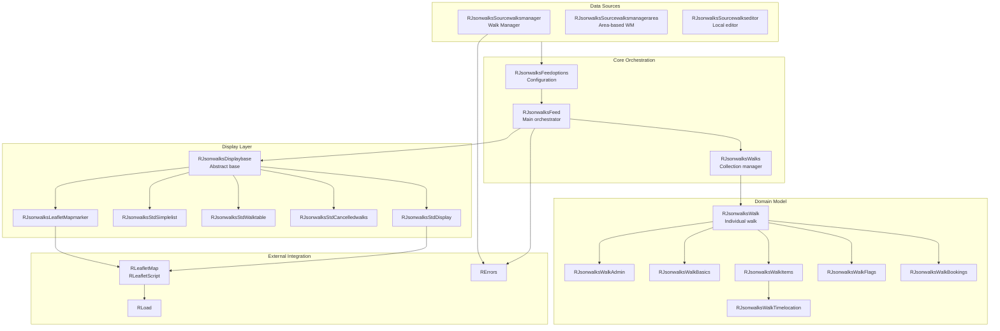
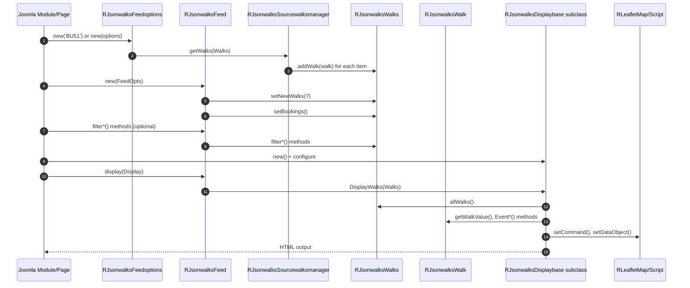
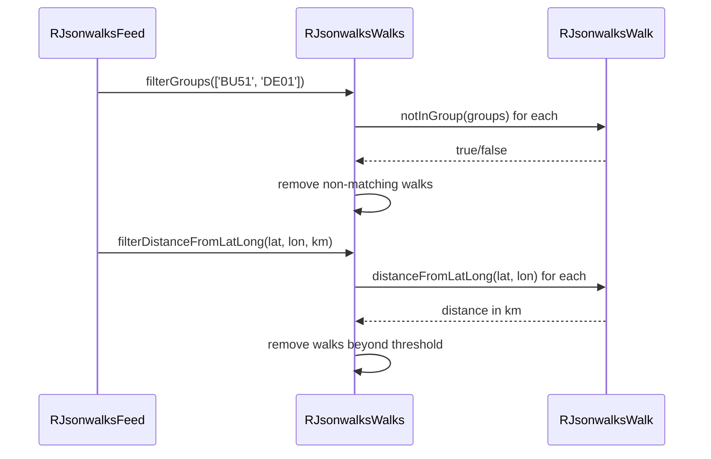

# jsonwalks Module - High Level Design

## Overview

The `jsonwalks` module is the core orchestration layer for walk data management in the Ramblers Library. It provides feed orchestration, domain modeling, filtering, and display presentation capabilities. The module coordinates data acquisition from Walk Manager API, transforms raw JSON into internal domain objects, applies filtering and sorting, and delegates rendering to specialized display classes.

**Purpose**: Central hub for walk data lifecycle from acquisition through presentation.

**Key Responsibilities**:
- Feed orchestration and data source management
- Domain model construction (`RJsonwalksWalks`, `RJsonwalksWalk`)
- Filtering, sorting, and data augmentation
- Display presenter coordination
- Integration with Walk Manager API and other data sources

## Component Architecture



## Public Interface

### RJsonwalksFeed

**Main orchestrator class for walk data management.**

#### Constructor
```php
public function __construct($options)
```
- **Parameters**: `$options` - String (group codes) or `RJsonwalksFeedoptions` object
- **Behavior**: 
  - Creates `RJsonwalksWalks` collection
  - Calls `$options->getWalks()` to populate from data sources
  - Applies legacy filters if options is a string (days, distance, limit)
  - Sets "new walks" flag (7 days default)
  - Sets booking flags

#### Filtering Methods
```php
public function filterCancelled()
public function filterStatus($status)
public function filterWalksDistance($minDistance, $maxDistance)
public function filterDistanceFromLatLong($lat, $lon, $distanceKm)
public function filterGroups($filter)
public function filterEvents()
public function filterWalks()
public function filterTitle($filter, $option = 'remove')
public function filterTitleContains($filter, $option = 'remove')
public function filterNationalGrade($grades)
public function filterFestivals($filter)
public function noFestivals()
public function allFestivals()
public function filterDateRange($datefrom, $dateto)
public function filterDayofweek($days)
public function filterFlags($flags, $include = true)
public function limitNumberWalks($no)
public function noWalks($no)
```

#### Display Methods
```php
public function display($displayclass)
```
- **Parameters**: `$displayclass` - Instance of `RJsonwalksDisplaybase` subclass
- **Behavior**: 
  - Adds base stylesheet (`ramblerslibrary.css`)
  - Calls `$displayclass->DisplayWalks($this->walks)`

```php
public function displayIcsDownload($name, $pretext, $linktext, $posttext)
```
- Creates `REventGroup`, adds walks, displays ICS download link

#### Utility Methods
```php
public function setNewWalks($days)
public function numberWalks()
public function walksInFuture($period)
public function noCancelledWalks()
public function appendWalkTitle($group, $title)
public function getWalks()
public function filterFeed($filter)
```

### RJsonwalksWalks

**Collection manager for walk objects with filtering and sorting.**

#### Core Methods
```php
public function __construct()
public function addWalk($walk)
public function removeWalk($key)
public function allWalks()
public function totalWalks()
public function events()
```

#### Filtering Methods
```php
public function filterDistanceFromLatLong($lat, $lon, $distanceKm)
public function filterGroups($groups)
public function filterStatus($status)
public function filterCancelled()
public function filterDayofweek($days)
public function filterDateRange($fromdate, $todate)
public function filterTitle($filter, $option = 'remove')
public function filterTitleContains($filter, $option = 'remove')
public function filterNationalGrade($grades)
public function filterDistance($distanceMin, $distanceMax)
public function filterFlags($flags, $include = true)
public function filterEvents()
public function filterWalks()
public function limitNumberWalks($no)
public function noWalks($no)
public function walksInFuture($period)
```

#### Sorting and Augmentation
```php
public function sort($sortorder1, $sortorder2, $sortorder3)
```
- Sort orders: `RJsonwalksWalk::SORT_DATE`, `SORT_TIME`, `SORT_DISTANCE`

```php
public function setNewWalks($days)
public function setBookings()
public function appendWalkTitle($titles)
```

### RJsonwalksWalk

**Domain value object representing a single walk/event.**

#### Composition Methods
```php
public function addAdmin($admin)
public function addBasics($basics)
public function addWalk($walk)
public function addMeeting($meet)
public function addStart($start)
public function addFinish($finish)
public function addContact($contact)
public function addMedia($media)
public function setFlags($flags)
```

#### Query Methods
```php
public function isWalk($walk)
public function hasMeetPlace()
public function isCancelled()
public function getSortValue($type)
public function notInGroup($groups)
public function notInDayList($days)
public function isStatus($status)
public function titleIs($filter)
public function titleContains($filter)
public function notInGradeList($grades)
public function flagsExists($flags)
public function filterDateRange($fromdate, $todate)
public function distanceFromLatLong($lat, $long)
```

#### Display Methods
```php
public function EventDate()
public function EventText()
public function EventList($display, $class)
public function EventLink($display, $text)
public function EventStatus()
public function Event_ics($icsfile)
public function getWalkValues($items, $link = true)
public function getWalkValue($option)
```

## Data Flow

### Primary Flow: Feed Options → Display



### Filtering Flow



## Integration Points

### Data Sources
- **Walk Manager**: `RJsonwalksSourcewalksmanager` → `RJsonwalksWmFeed` → [jsonwalks/wm HLD](wm/ARCHITECTURE.md)
- **Area-based WM**: `RJsonwalksSourcewalksmanagerarea` → extends sourcewalksmanager
- **Local Editor**: `RJsonwalksSourcewalkseditor` → local walk data

### Display Layer
- **Base Class**: `RJsonwalksDisplaybase` → abstract base for all presenters
- **Standard Displays**: [jsonwalks/std HLD](std/HLD.md) for implementation details
- **Map Integration**: `RJsonwalksLeafletMapmarker` → [jsonwalks/leaflet HLD](leaflet/HLD.md)

### External Services
- **Leaflet Maps**: `RLeafletMap`, `RLeafletScript` → [leaflet HLD](../leaflet/HLD.md)
- **Asset Loading**: `RLoad` → [load HLD](../load/HLD.md)
- **Error Handling**: `RErrors` → [errors HLD](../errors/HLD.md)
- **Geometry**: `RGeometryGreatcircle` → used for distance filtering → [geometry HLD](../geometry/HLD.md)

### Domain Model
- **Walk Components**: See [jsonwalks/walk HLD](walk/HLD.md) for detailed value object structure

## Media Dependencies

### Shared JavaScript (loaded by display classes)
- `media/js/ra.js` - Core utilities
- `media/js/ra.map.js` - Map functionality
- `media/js/ra.feedhandler.js` - Feed handling
- `media/js/ra.paginatedDataList.js` - Pagination
- `media/js/ra.tabs.js` - Tab functionality
- `media/js/ra.walk.js` - Walk-specific functionality

### Module-Specific Media
- **std/**: `media/jsonwalks/std/display.js` - Standard display JavaScript → [jsonwalks/std HLD](std/HLD.md)
- **leaflet/**: `media/jsonwalks/leaflet/mapmarker.js` - Map marker JavaScript → [jsonwalks/leaflet HLD](leaflet/HLD.md)
- **ml/**: `media/jsonwalks/ml/script.js` - Monthly listing JavaScript
- **sr02/**: `media/jsonwalks/sr02/display.js` - SR02 display JavaScript
- **bu51/**: `media/jsonwalks/bu51/bu51style.css` - BU51 stylesheet

**Loading**: Display classes use `RLoad::addStyleSheet()` and `RLeafletScript::add()` to enqueue assets.

## Examples

### Example 1: Basic Feed with Standard Display

```php
$options = new RJsonwalksFeedoptions('BU51');
$feed = new RJsonwalksFeed($options);
$display = new RJsonwalksStdDisplay();
RLoad::addStyleSheet('media/lib_ramblers/css/ramblerslibrary.css');
$feed->display($display);
```

### Example 2: Filtered Feed with Custom Display

```php
$options = new RJsonwalksFeedoptions('BU51,DE01');
$feed = new RJsonwalksFeed($options);
$feed->filterNationalGrade(['Leisurely', 'Moderate']);
$feed->filterDateRange(
    new DateTime('2025-01-01'),
    new DateTime('2025-12-31')
);
$feed->limitNumberWalks(10);

$display = new RJsonwalksBU51Tabs();
$feed->display($display);
```

### Example 3: Distance-Based Filtering

```php
$options = new RJsonwalksFeedoptions();
// Configure area-based source...
$feed = new RJsonwalksFeed($options);
$feed->filterDistanceFromLatLong(51.5074, -0.1278, 50); // 50km from London
$display = new RJsonwalksStdSimplelist();
$feed->display($display);
```

### Example 4: Direct Walk Collection Access

```php
$feed = new RJsonwalksFeed($options);
$walks = $feed->getWalks();
$allWalks = $walks->allWalks();
foreach ($allWalks as $walk) {
    echo $walk->getWalkValue('title');
}
```

## Performance Notes

### Caching Strategy
- **Walk Manager Data**: Cached at WM feed level (10-minute freshness) → See [jsonwalks/wm HLD](wm/ARCHITECTURE.md)
- **Walk Collections**: No built-in caching; rely on source-level caching
- **Display Rendering**: No fragment caching (future enhancement opportunity)

### Optimization Opportunities
1. **Per-Walk Object Caching**: Cache `RJsonwalksWalk` objects by `{id}.{date_updated}` key
2. **Per-Walk Fragment Caching**: Cache rendered HTML per walk per display template
3. **Collection Index Caching**: Cache filtered/sorted walk ID lists

### Memory Considerations
- Walk collections hold full domain objects in memory
- Large collections (1000+ walks) may impact performance
- Consider pagination or limiting via `limitNumberWalks()`

## Error Handling

### Error Propagation
- **Data Source Errors**: Propagated through `RErrors::notifyError()` → [errors HLD](../errors/HLD.md)
- **Walk Manager Errors**: Handled in `RJsonwalksWmFeed` → logged centrally
- **Display Errors**: Graceful degradation (empty collections render as "No walks found")

### Validation
- **Feed Options**: Invalid input shows Joomla error message, returns early
- **Walk Data**: Invalid walk items are skipped during conversion (logged)
- **Filtering**: Invalid filter parameters may cause warnings but don't crash

### Graceful Degradation
- Empty walk collections return empty arrays, not null
- Display classes handle empty collections gracefully
- Missing walk properties return empty strings or default values

## References

### Related HLD Documents
- [jsonwalks/wm HLD](wm/ARCHITECTURE.md) - Walk Manager API integration
- [jsonwalks/std HLD](std/HLD.md) - Standard display implementations
- [jsonwalks/walk HLD](walk/HLD.md) - Walk domain value objects
- [jsonwalks/leaflet HLD](leaflet/HLD.md) - Map marker integration
- [leaflet HLD](../leaflet/HLD.md) - Leaflet map system
- [load HLD](../load/HLD.md) - Asset loading
- [errors HLD](../errors/HLD.md) - Error handling
- [geometry HLD](../geometry/HLD.md) - Geographic calculations

### Key Source Files
- `jsonwalks/feed.php` - RJsonwalksFeed class
- `jsonwalks/walks.php` - RJsonwalksWalks class
- `jsonwalks/walk.php` - RJsonwalksWalk class
- `jsonwalks/feedoptions.php` - RJsonwalksFeedoptions class
- `jsonwalks/displaybase.php` - RJsonwalksDisplaybase abstract class
- `jsonwalks/sourcewalksmanager.php` - Walk Manager source adapter
- `jsonwalks/sourcewalksmanagerarea.php` - Area-based source adapter
- `jsonwalks/sourcewalkseditor.php` - Local editor source adapter


