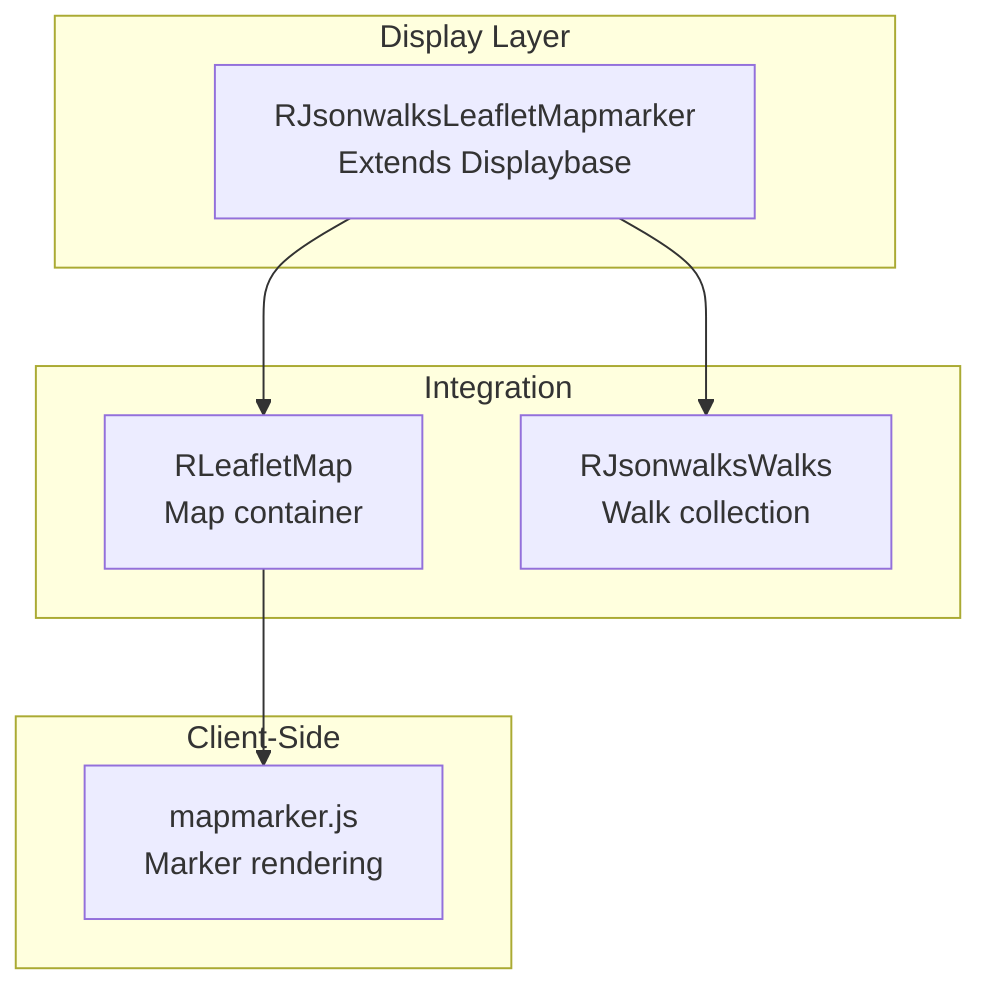

# jsonwalks/leaflet Module - High Level Design

## Overview

The `jsonwalks/leaflet` module provides Leaflet map marker display for walk collections. It extends the display base class to render walks as interactive map markers with clustering support.

**Purpose**: Map marker display for walk collections.

**Key Responsibilities**:
- Display walks as map markers
- Integrate with Leaflet map system
- Support marker clustering
- Provide interactive walk popups

## Component Architecture



## Public Interface

### RJsonwalksLeafletMapmarker

**Map marker display for walks.**

#### Constructor
```php
public function __construct()
```
- Creates `RLeafletMap` instance
- Sets command to `"ra.display.walksMap"`
- Configures map options (clustering, fullscreen, etc.)

#### Display Method
```php
public function DisplayWalks($walks)
```
- **Parameters**: `$walks` - `RJsonwalksWalks` collection
- **Behavior**: 
  - Gets all walks
  - Injects walk data as JSON
  - Displays map
  - Loads `mapmarker.js` script

#### Configuration Methods
```php
public function getMap()
public function mapHeight($height)
public function mapWidth($width)
public function setLegend($position)
```

## Integration Points

### Parent Classes
- **RJsonwalksDisplaybase**: Abstract base → [jsonwalks HLD](../HLD.md)

### Dependencies
- **RLeafletMap**: Map rendering → [leaflet HLD](../../leaflet/HLD.md)
- **RJsonwalksWalks**: Walk collection → [jsonwalks HLD](../HLD.md)

## Media Dependencies

### JavaScript File

#### `media/jsonwalks/leaflet/mapmarker.js`
- **Purpose**: Client-side walk marker rendering
- **Dependencies**: `ra.js`, `ra.leafletmap.js`, Leaflet.js
- **Integration**: Loaded via `RLoad::addScript()` in `DisplayWalks()`
- **Key Functions**: Walk marker creation, popup content, clustering

## Examples

### Example 1: Basic Map Display

```php
$feed = new RJsonwalksFeed($options);
$display = new RJsonwalksLeafletMapmarker();
$display->mapHeight('600px');
$feed->display($display);
```

## References

### Related HLD Documents
- [jsonwalks HLD](../HLD.md) - Walk orchestration
- [leaflet HLD](../../leaflet/HLD.md) - Map system

### Key Source Files
- `jsonwalks/leaflet/mapmarker.php` - RJsonwalksLeafletMapmarker class

### Related Media Files
- `media/jsonwalks/leaflet/mapmarker.js` - Client-side marker rendering


