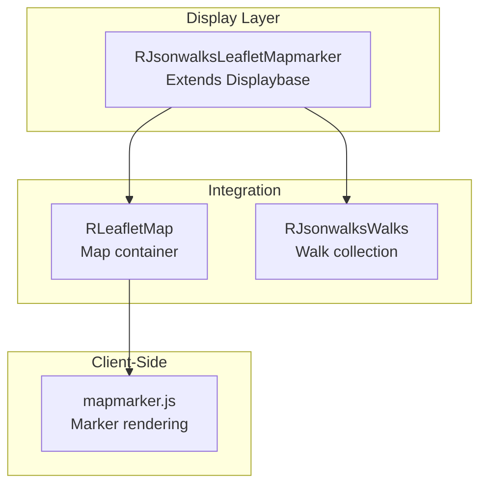
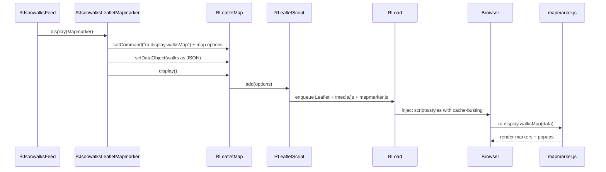

# jsonwalks/leaflet Module - High Level Design

## Overview

The `jsonwalks/leaflet` module provides Leaflet map marker display for walk collections. It extends the display base class to render walks as interactive map markers with clustering support.

**Purpose**: Map marker display for walk collections.

**Key Responsibilities**:
- Display walks as map markers
- Integrate with Leaflet map system
- Support marker clustering
- Provide interactive walk popups

## Component Architecture



## Public Interface

### RJsonwalksLeafletMapmarker

**Map marker display for walks.**

#### Constructor
```php
public function __construct()
```
- Creates `RLeafletMap` instance
- Sets command to `"ra.display.walksMap"`
- Configures map options (clustering, fullscreen, etc.)

#### Display Method
```php
public function DisplayWalks($walks)
```
- **Parameters**: `$walks` - `RJsonwalksWalks` collection
- **Behavior**: 
  - Gets all walks
  - Injects walk data as JSON
  - Displays map
  - Loads `mapmarker.js` script

#### Configuration Methods
```php
public function getMap()
public function mapHeight($height)
public function mapWidth($width)
public function setLegend($position)
```

## Data Flow



## Integration Points

### Used By
- **Standard tabbed display map tabs** inside `RJsonwalksStdDisplay` → [jsonwalks/std HLD](../std/HLD.md#integration-points).
- **Standalone map presenters** embedded in Joomla articles/modules via `RJsonwalksFeed::display()` → [jsonwalks HLD](../HLD.md#integration-points).

### Uses
- **Base presenter**: Inherits initialization and asset hooks from `RJsonwalksDisplaybase` → [jsonwalks HLD](../HLD.md#integration-points).
- **Map infrastructure**: `RLeafletMap` and `RLeafletScript` for Leaflet options and asset injection → [leaflet HLD](../../leaflet/HLD.md#integration-points).
- **Walk collections**: Consumes `RJsonwalksWalks` objects from the feed → [jsonwalks/walk HLD](../walk/HLD.md#integration-points).
- **Asset loader**: `RLoad` to enqueue `media/js` foundations prior to map scripts → [load HLD](../../load/HLD.md#integration-points).

### Data Sources
- **Walk data** supplied by `RJsonwalksFeed` (WM/editor sources) serialized to JSON payloads → [jsonwalks HLD](../HLD.md#data-sources).

### External Services
- **Leaflet CDN plugins** (core + clustering) pulled through `RLeafletScript` → [leaflet HLD](../../leaflet/HLD.md#vendor-library-integration).

### Display Layer
- **Server**: Emits `ra.display.walksMap` command with walk data and map options.
- **Client**: `media/jsonwalks/leaflet/mapmarker.js` renders clustered markers and popups → [media/jsonwalks HLD](../../media/jsonwalks/HLD.md#display-layer).

### Joomla Integration
- **Document pipeline**: Uses `RLoad`/`RLeafletScript` to enqueue scripts/styles with Joomla cache-busting and to register walk data for ICS/calendar export when needed.

### Vendor Library Integration
- **Leaflet.markercluster** and **Leaflet.fullscreen** used for clustering/fullscreen support when options enable them → [leaflet HLD](../../leaflet/HLD.md#vendor-library-integration).

### Media Asset Relationships
- Server enqueues shared `/media/js` utilities (`ra.js`, `ra.walk.js`, `ra.leafletmap.js`) before `media/jsonwalks/leaflet/mapmarker.js`; Leaflet CSS/JS loads via CDN through `RLeafletScript`.

## Media Dependencies

### JavaScript File

#### `media/jsonwalks/leaflet/mapmarker.js`
- **Purpose**: Client-side walk marker rendering
- **Dependencies**: `ra.js`, `ra.leafletmap.js`, Leaflet.js
- **Integration**: Loaded via `RLoad::addScript()` in `DisplayWalks()`
- **Key Functions**: Walk marker creation, popup content, clustering

## Examples

### Example 1: Basic Map Display

```php
$feed = new RJsonwalksFeed($options);
$display = new RJsonwalksLeafletMapmarker();
$display->mapHeight('600px');
$feed->display($display);
```

## Performance Observations

- **Payload size**: Sends full walk JSON to the browser; large collections (>500 walks) may slow marker clustering.
- **Asset reuse**: Leaflet and shared `/media/js` libraries are cached across pages, reducing repeat cost.
- **Clustering**: Enabled by default to keep DOM counts manageable for larger datasets.

## Error Handling

- **Missing data**: If no walks are provided, the client renders an empty map container.
- **Asset failures**: Missing Leaflet or `mapmarker.js` scripts degrade maps; other displays still render.
- **Invalid coordinates**: Walks without coordinates are ignored client-side.

## References

### Related HLD Documents
- [jsonwalks HLD](../HLD.md) - Walk orchestration
- [leaflet HLD](../../leaflet/HLD.md) - Map system

### Key Source Files
- `jsonwalks/leaflet/mapmarker.php` - RJsonwalksLeafletMapmarker class

### Related Media Files
- `media/jsonwalks/leaflet/mapmarker.js` - Client-side marker rendering

