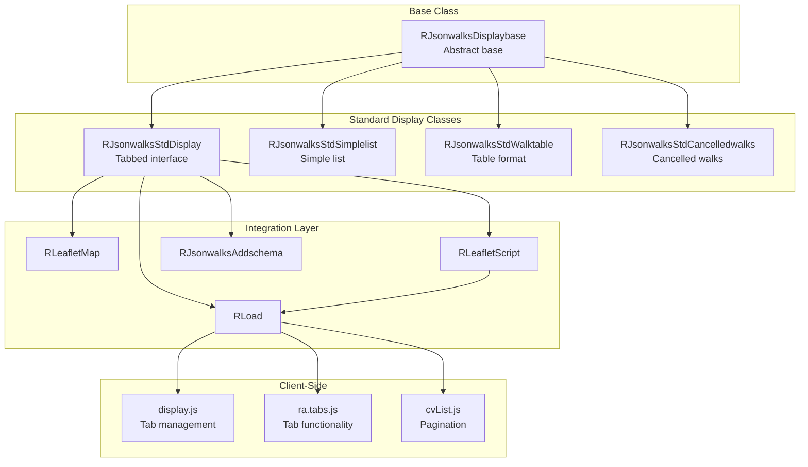
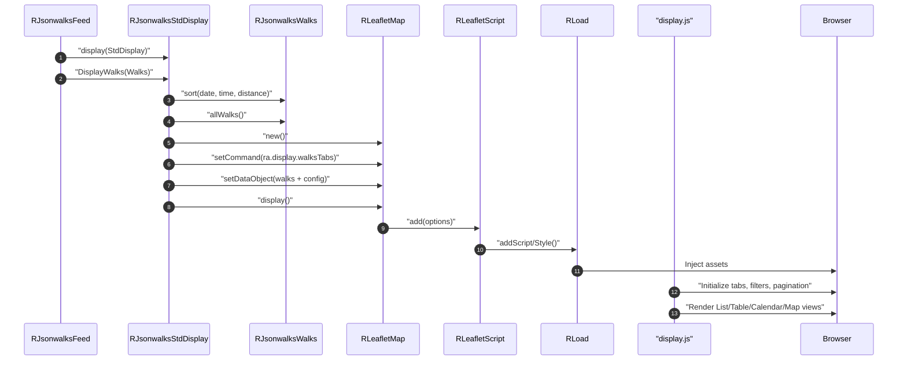
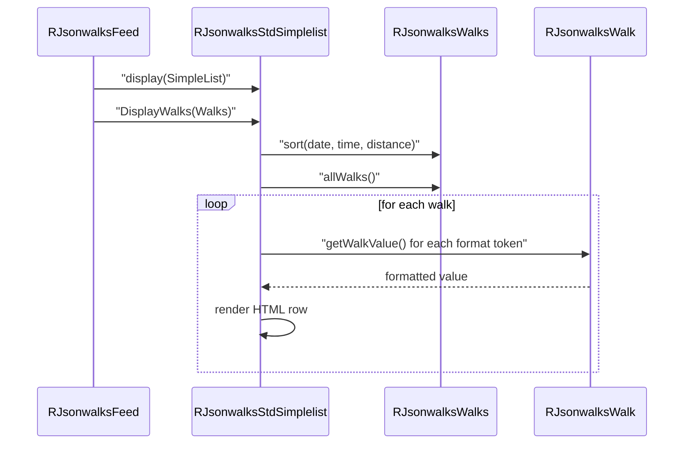

# jsonwalks/std Module - High Level Design

## Overview

The `jsonwalks/std` module provides standard display implementations for rendering walk collections in various formats: tabbed views (List/Table/Calendar/Map), simple lists, tables, and cancelled walks displays. These classes extend `RJsonwalksDisplaybase` and integrate with Leaflet maps and JavaScript for interactive presentation.

**Purpose**: Standardized display presenters for walk collections with configurable formats and interactive features.

**Key Responsibilities**:
- Render walk collections in multiple formats (list, table, calendar, map)
- Provide tabbed interface for switching between views
- Integrate with Leaflet maps for geographic visualization
- Support custom formatting and filtering via JavaScript
- Handle pagination and display options

## Component Architecture



## Public Interface

### RJsonwalksStdDisplay

**Tabbed display with List/Table/Calendar/Map views.**

#### Constructor
```php
public function __construct()
```
- Initializes via parent `RJsonwalksDisplaybase`
- Sets up Leaflet script and options
- Default tab order: `['List', 'Calendar', 'Map']` (configurable)

#### Display Method
```php
public function DisplayWalks($walks)
```
- **Parameters**: `$walks` - `RJsonwalksWalks` collection
- **Behavior**:
  - Sorts walks by date, time, distance
  - Displays cancelled walks summary (if >3 cancelled)
  - Creates `RLeafletMap` with tabbed interface command
  - Configures map options (clustering, calendar, settings)
  - Injects walk data as JSON payload
  - Loads required JavaScript and CSS assets
  - Adds schema.org metadata

#### Configuration Methods
```php
public function setWalksClass($value)
public function setTabOrder($value)
public function setCustomListFormat($value)
public function setCustomTableFormat($value)
public function setCustomGradesFormat($value)
public function setCustomCalendarFormat($value)
```

#### Public Properties
```php
public $legendposition = "top";
public $displayClass = "";
public $paginationTop = true;
public $paginationBottom = true;
public $noPagination = false;
public $displayDetailsPrompt = true;
public $filterCancelled = true;
```

### RJsonwalksStdSimplelist

**Simple list display with configurable format.**

#### Constructor
```php
public function __construct()
```
- Initializes via parent
- Sets default list format

#### Display Method
```php
public function DisplayWalks($walks)
```
- Renders walks as simple list
- Supports custom format via `customFormat()`
- Groups by month if configured
- Alternates odd/even row classes

#### Configuration Methods
```php
public function customFormat($format)
public function inLineDisplay()
public function setWalksClass($class)
public function setWalkClass($class)
```

#### Public Properties
```php
public $addGridRef = true;
public $addStartGridRef = false;
public $addDescription = false;
```

### RJsonwalksStdWalktable

**Table format display with configurable columns.**

#### Display Method
```php
public function DisplayWalks($walks)
```
- Renders walks as HTML table
- Supports custom table format
- Displays table header
- Alternates row classes

#### Configuration Methods
```php
public function customFormat($format)
public function setMonthlyReminder($clss, $method)
public function setRowClass($clss, $method)
public function setWalksClass($class)
public function setWalkClass($class)
public function setTableClass($class)
```

### RJsonwalksStdCancelledwalks

**Specialized display for cancelled walks.**

#### Display Method
```php
public function DisplayWalks($walks)
public function getWalksOutput($walks)
```
- Filters and displays only cancelled walks
- Shows cancellation reason
- Can be used standalone or embedded in other displays

#### Configuration Methods
```php
public function setWalksClass($class)
public function setWalkClass($class)
```

## Data Flow

### Tabbed Display Flow



### Simple List Flow



## Integration Points

### Used By
- **jsonwalks/feed orchestration** via `RJsonwalksFeed::display()` to render walk collections → [jsonwalks HLD](../HLD.md#integration-points).
- **Media/jsonwalks assets** consumed by Joomla modules/pages that embed standard displays → [media/jsonwalks HLD](../../media/jsonwalks/HLD.md#integration-points).

### Uses
- **Base presenter**: `RJsonwalksDisplaybase` for shared initialization → [jsonwalks HLD](../HLD.md#integration-points).
- **Map/rendering services**: `RLeafletMap`, `RLeafletScript`, and `RLoad` for asset injection → [leaflet HLD](../../leaflet/HLD.md#integration-points) and [load HLD](../../load/HLD.md#integration-points).
- **Domain data**: `RJsonwalksWalks` / `RJsonwalksWalk` collections → [jsonwalks/walk HLD](../walk/HLD.md#integration-points).
- **Structured data**: `RJsonwalksAddschema` for schema.org injection.
- **Optional bookings**: `Ra_eventbookingHelper` when event booking component is available → [event HLD](../../event/HLD.md#integration-points).

### Data Sources
- **Walk collections** supplied by `RJsonwalksFeed` (from WM/editor sources) → [jsonwalks HLD](../HLD.md#data-sources).

### External Services
- **Leaflet CDN plugins** pulled by `RLeafletScript` for map rendering → [leaflet HLD](../../leaflet/HLD.md#vendor-library-integration).

### Display Layer
- **Server**: Standard presenters emit commands `ra.display.walksTabs`/`walksList`/`tableList`.
- **Client**: `media/jsonwalks/std/display.js` orchestrates tabs, pagination, calendar, and map rendering using Leaflet → [media/jsonwalks HLD](../../media/jsonwalks/HLD.md#display-layer).

### Joomla Integration
- **Module/page rendering**: Presenters write HTML into Joomla document and enqueue assets through `RLoad`.
- **Error surface**: Falls back to Joomla messages when inputs are invalid (e.g., missing walks).

### Vendor Library Integration
- **cvList** pagination and **FullCalendar** loaded via `display.js` for table and calendar tabs → [media/vendors HLD](../../media/vendors/HLD.md#integration-points).
- **Leaflet plugins** (clustering, tabs) loaded via `RLeafletScript` to support map tab → [leaflet HLD](../../leaflet/HLD.md#vendor-library-integration).

### Media Asset Relationships
- Server emits shared `/media/js` utilities (ra.js, ra.tabs.js, ra.walk.js, cvList) before module-specific `/media/jsonwalks/std/display.js`, ensuring tab/pagination scripts are available before the bootstrapper runs.

## Media Dependencies

### JavaScript Files

#### `media/jsonwalks/std/display.js`
- **Purpose**: Client-side walk display management for tabbed interface
- **Dependencies**: `ra.js`, `ra.tabs.js`, `ra.walk.js`, `cvList.js`, FullCalendar
- **Integration**: Loaded via `RLoad::addScript()` in `DisplayWalks()`
- **Key Functions**:
  - `ra.display.walksTabs(mapOptions, data)` - Main initialization function
  - Tab management (List, Table, Calendar, Map views)
  - Walk filtering and pagination
  - Event registration and display
  - Map integration
- **API**:
  - `this.events` - Event collection manager
  - `this.settings` - Display configuration (formats, pagination, etc.)
  - `this.load()` - Initializes DOM and tabs
  - `this.displayWalks()` - Renders current view
- **Usage**: Automatically initialized when `RLeafletMap` sets command to `"ra.display.walksTabs"`

#### External Dependencies (loaded by display.js or RLoad)
- `media/js/ra.js` - Core utilities
- `media/js/ra.tabs.js` - Tab functionality
- `media/js/ra.walk.js` - Walk-specific functionality
- `media/vendors/cvList/cvList.js` - Pagination library
- `media/vendors/fullcalendar-6.1.9/index.global.js` - Calendar view

### CSS Files

#### `media/vendors/cvList/cvList.css`
- **Purpose**: Pagination control styling
- **Integration**: Loaded via `RLoad::addStyleSheet()`

#### `media/css/ra.tabs.css`
- **Purpose**: Tab interface styling
- **Integration**: Loaded via `RLoad::addStyleSheet()`

#### `media/css/ramblerslibrary.css`
- **Purpose**: Base library styles
- **Integration**: Loaded by `RJsonwalksFeed::display()`

### Loading Order
1. Base stylesheet (`ramblerslibrary.css`) - loaded by Feed
2. Tab stylesheet (`ra.tabs.css`) - loaded by StdDisplay
3. Pagination stylesheet (`cvList.css`) - loaded by StdDisplay
4. Core JavaScript (`ra.js`, `ra.tabs.js`, `ra.walk.js`) - loaded by LeafletScript
5. Pagination library (`cvList.js`) - loaded by StdDisplay
6. Display script (`display.js`) - loaded by StdDisplay
7. FullCalendar (if calendar view enabled) - loaded dynamically by display.js

## Examples

### Example 1: Standard Tabbed Display

```php
$options = new RJsonwalksFeedoptions('BU51');
$feed = new RJsonwalksFeed($options);
$display = new RJsonwalksStdDisplay();
$display->setTabOrder(['List', 'Map', 'Calendar']);
$display->setCustomListFormat(['{gradeimg}', '{title}', '{dowdd}', '{startTime}']);
RLoad::addStyleSheet('media/lib_ramblers/css/ramblerslibrary.css');
$feed->display($display);
```

### Example 2: Simple List with Custom Format

```php
$feed = new RJsonwalksFeed($options);
$display = new RJsonwalksStdSimplelist();
$display->customFormat(['{dowdd}', '{title}', '{distance}', '{contactname}']);
$display->setWalksClass('my-walks');
$feed->display($display);
```

### Example 3: Table Display

```php
$feed = new RJsonwalksFeed($options);
$display = new RJsonwalksStdWalktable();
$display->customFormat([
    ['title' => 'Date', 'items' => ['{dowddmm}']],
    ['title' => 'Title', 'items' => ['{title}']],
    ['title' => 'Distance', 'items' => ['{distance}']]
]);
$feed->display($display);
```

### Example 4: Custom Tab Order (BU51 Style)

```php
class RJsonwalksBU51Tabs extends RJsonwalksStdDisplay {
    public $tabOrder = ['List', 'Calendar', 'Map'];
    public $listFormat = ['{gradeimg}', '{title}', '{dowdd}', '{startTime}'];
    
    public function __construct() {
        parent::__construct();
        parent::setTabOrder($this->tabOrder);
        parent::setCustomListFormat($this->listFormat);
        RLoad::addStyleSheet("media/lib_ramblers/jsonwalks/bu51/bu51style.css");
    }
}
```

## Performance Observations

### Client-Side Rendering
- **Initial Load**: All walk data sent as JSON payload (can be large for 100+ walks)
- **Pagination**: Client-side pagination via `cvList.js` (no server round-trip)
- **Filtering**: Client-side filtering via JavaScript (instant response)
- **Map Rendering**: Leaflet map renders markers client-side (may be slow for 500+ markers)

### Optimization Opportunities
1. **Server-Side Pagination**: Limit initial payload, fetch more on demand
2. **Lazy Map Loading**: Load map view only when tab is activated
3. **Fragment Caching**: Cache rendered HTML fragments per walk
4. **Data Compression**: Minify JSON payload

### Memory Considerations
- All walk data loaded into browser memory
- Large collections (1000+ walks) may impact browser performance
- Consider limiting via `RJsonwalksFeed::limitNumberWalks()`

## Error Handling

### Display Errors
- **Empty Collections**: Renders as "No walks found" (graceful)
- **Missing Walk Properties**: Returns empty strings (no crashes)
- **JavaScript Errors**: Caught by browser console (doesn't break page)

### Validation
- **Invalid Formats**: Custom formats validated client-side, falls back to defaults
- **Missing Assets**: Page still renders, but features may not work
- **Map Failures**: Map view shows error message, other tabs still functional

## References

### Related HLD Documents
- [jsonwalks HLD](../HLD.md) - Core orchestration and domain models
- [jsonwalks/walk HLD](../walk/HLD.md) - Walk domain value objects
- [jsonwalks/displaybase HLD](../HLD.md#rjsonwalksdisplaybase) - Display base class
- [leaflet HLD](../../leaflet/HLD.md) - Leaflet map integration
- [load HLD](../../load/HLD.md) - Asset loading

### Key Source Files
- `jsonwalks/std/display.php` - RJsonwalksStdDisplay class
- `jsonwalks/std/simplelist.php` - RJsonwalksStdSimplelist class
- `jsonwalks/std/walktable.php` - RJsonwalksStdWalktable class
- `jsonwalks/std/cancelledwalks.php` - RJsonwalksStdCancelledwalks class
- `jsonwalks/displaybase.php` - RJsonwalksDisplaybase abstract class
- `media/jsonwalks/std/display.js` - Client-side display management

### Related Media Files
- `media/jsonwalks/std/display.js` - Main display JavaScript (493 lines)
- `media/js/ra.tabs.js` - Tab functionality
- `media/js/ra.walk.js` - Walk utilities
- `media/vendors/cvList/cvList.js` - Pagination library
- `media/vendors/fullcalendar-6.1.9/index.global.js` - Calendar view
- `media/css/ra.tabs.css` - Tab styles
- `media/vendors/cvList/cvList.css` - Pagination styles
