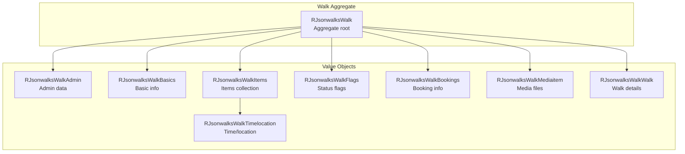
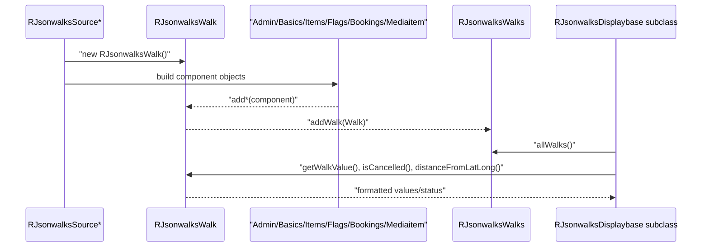

# jsonwalks/walk Module - High Level Design

## Overview

The `jsonwalks/walk` module provides domain value objects representing individual walk components. These classes compose the `RJsonwalksWalk` aggregate root, providing structured access to walk data.

**Purpose**: Walk domain value objects and component classes.

**Key Responsibilities**:
- Represent walk components (Admin, Basics, Items, TimeLocation, Flags, Bookings, MediaItem)
- Provide getters and validation for walk properties
- Support filtering and querying operations
- Generate display values and formatted output

## Component Architecture



## Public Interface

### RJsonwalksWalk (Aggregate Root)

**Main walk domain object.** See [jsonwalks HLD](../HLD.md) for full interface.

### Component Classes

#### RJsonwalksWalkAdmin
- Admin/editor metadata
- Source information
- Edit timestamps

#### RJsonwalksWalkBasics
- Title, description
- National/local grades
- Distance, pace, ascent
- Walk shape (circular, linear, figure-8)

#### RJsonwalksWalkItems
- Collection of time/location items
- Meeting place, start, finish, contacts
- Media items

#### RJsonwalksWalkTimelocation
- Date/time information
- Location (name, grid ref, postcode, coordinates)
- Description

#### RJsonwalksWalkFlags
- Status flags (cancelled, new, etc.)
- Feature flags

#### RJsonwalksWalkBookings
- Booking requirement information
- Booking system integration

#### RJsonwalksWalkMediaitem
- Media file references
- Images, documents

#### RJsonwalksWalkWalk
- Walk-specific details
- Shape, grade, distance
- Implements `JsonSerializable`

## Data Flow



## Integration Points

### Used By
- **RJsonwalksWalks** aggregates and filters component instances → [jsonwalks HLD](../HLD.md#integration-points).
- **RJsonwalksFeed** applies domain filtering and sorting via methods on `RJsonwalksWalk` → [jsonwalks HLD](../HLD.md#public-interface).
- **Display classes** render formatted values and flags → [jsonwalks/std HLD](../std/HLD.md#integration-points) and [jsonwalks/leaflet HLD](../leaflet/HLD.md#integration-points).

### Uses
- **Source adapters** populate value objects from WM/editor payloads → [jsonwalks/wm HLD](../wm/HLD.md#integration-points).
- **Utility helpers** such as `RGeometryGreatcircle` for distance calculations → [geometry HLD](../../geometry/HLD.md#integration-points).

### Data Sources
- **Walk Manager / editor JSON** mapped into component classes through source adapters → [jsonwalks/wm HLD](../wm/HLD.md#data-sources).

### External Services
- None directly; relies on upstream sources for content.

### Display Layer
- **Server presenters** call `getWalkValue()`, `Event*()`, and flag helpers to build HTML.
- **Client** receives pre-formatted strings (e.g., distance, dates) from `RJsonwalksWalk` values → [media/jsonwalks HLD](../../media/jsonwalks/HLD.md#display-layer).

### Joomla Integration
- Values are serialized into data objects emitted into the Joomla document (via `RJsonwalksFeed::display()`), using Joomla messaging for validation failures upstream.

### Vendor Library Integration
- None; all logic is PHP-side with no direct plugin dependencies.

### Media Asset Relationships
- No direct assets; walk values are embedded into JSON payloads consumed by `/media/jsonwalks` JavaScript once presenters emit them.

## Media Dependencies

### No Module-Specific Media Files

Walk value objects are server-side domain models with no direct media dependencies.

## Performance Observations

- **In-memory only**: Objects are lightweight but can be numerous; filtering occurs in PHP before sending to the browser.
- **Distance calculations**: Great-circle computations add per-walk cost when filtering by proximity.
- **Serialization**: `JsonSerializable` output is used by displays; keep payload fields concise to reduce client load.

## Error Handling

- **Missing properties**: Accessors return empty strings or defaults rather than throwing errors.
- **Validation**: Upstream source adapters skip invalid components; walk objects remain consistent even with partial data.

## Examples

### Example 1: Access Walk Components

```php
$walk = new RJsonwalksWalk();
$walk->addBasics($basicsData);
$walk->addAdmin($adminData);

$title = $walk->getWalkValue('title');
$distance = $walk->getWalkValue('distance');
```

### Example 2: Check Walk Properties

```php
if ($walk->isCancelled()) {
    // Handle cancelled walk
}
if ($walk->hasMeetPlace()) {
    // Display meeting place
}
```

## References

### Related HLD Documents
- [jsonwalks HLD](../HLD.md) - Main walk orchestration
- [jsonwalks/std HLD](../std/HLD.md) - Walk display
- [jsonwalks/wm HLD](../wm/HLD.md) - Source mapping for Walk Manager data
- [geometry HLD](../../geometry/HLD.md) - Distance calculations

### Key Source Files
- `jsonwalks/walk/walk.php` - RJsonwalksWalkWalk class
- `jsonwalks/walk/admin.php` - RJsonwalksWalkAdmin
- `jsonwalks/walk/basics.php` - RJsonwalksWalkBasics
- `jsonwalks/walk/items.php` - RJsonwalksWalkItems
- `jsonwalks/walk/timelocation.php` - RJsonwalksWalkTimelocation
- `jsonwalks/walk/flags.php` - RJsonwalksWalkFlags
- `jsonwalks/walk/bookings.php` - RJsonwalksWalkBookings
- `jsonwalks/walk/mediaitem.php` - RJsonwalksWalkMediaitem

