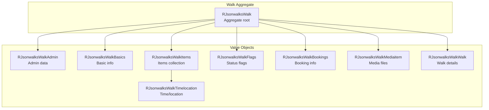

# jsonwalks/walk Module - High Level Design

## Overview

The `jsonwalks/walk` module provides domain value objects representing individual walk components. These classes compose the `RJsonwalksWalk` aggregate root, providing structured access to walk data.

**Purpose**: Walk domain value objects and component classes.

**Key Responsibilities**:
- Represent walk components (Admin, Basics, Items, TimeLocation, Flags, Bookings, MediaItem)
- Provide getters and validation for walk properties
- Support filtering and querying operations
- Generate display values and formatted output

## Component Architecture



## Public Interface

### RJsonwalksWalk (Aggregate Root)

**Main walk domain object.** See [jsonwalks HLD](../HLD.md) for full interface.

### Component Classes

#### RJsonwalksWalkAdmin
- Admin/editor metadata
- Source information
- Edit timestamps

#### RJsonwalksWalkBasics
- Title, description
- National/local grades
- Distance, pace, ascent
- Walk shape (circular, linear, figure-8)

#### RJsonwalksWalkItems
- Collection of time/location items
- Meeting place, start, finish, contacts
- Media items

#### RJsonwalksWalkTimelocation
- Date/time information
- Location (name, grid ref, postcode, coordinates)
- Description

#### RJsonwalksWalkFlags
- Status flags (cancelled, new, etc.)
- Feature flags

#### RJsonwalksWalkBookings
- Booking requirement information
- Booking system integration

#### RJsonwalksWalkMediaitem
- Media file references
- Images, documents

#### RJsonwalksWalkWalk
- Walk-specific details
- Shape, grade, distance
- Implements `JsonSerializable`

## Integration Points

### Used By
- **RJsonwalksWalks**: Walk collection → [jsonwalks HLD](../HLD.md)
- **RJsonwalksFeed**: Walk filtering → [jsonwalks HLD](../HLD.md)
- **Display Classes**: Walk rendering → [jsonwalks/std HLD](../std/HLD.md)

## Media Dependencies

### No Module-Specific Media Files

Walk value objects are server-side domain models with no direct media dependencies.

## Examples

### Example 1: Access Walk Components

```php
$walk = new RJsonwalksWalk();
$walk->addBasics($basicsData);
$walk->addAdmin($adminData);

$title = $walk->getWalkValue('title');
$distance = $walk->getWalkValue('distance');
```

### Example 2: Check Walk Properties

```php
if ($walk->isCancelled()) {
    // Handle cancelled walk
}
if ($walk->hasMeetPlace()) {
    // Display meeting place
}
```

## References

### Related HLD Documents
- [jsonwalks HLD](../HLD.md) - Main walk orchestration
- [jsonwalks/std HLD](../std/HLD.md) - Walk display

### Key Source Files
- `jsonwalks/walk/walk.php` - RJsonwalksWalkWalk class
- `jsonwalks/walk/admin.php` - RJsonwalksWalkAdmin
- `jsonwalks/walk/basics.php` - RJsonwalksWalkBasics
- `jsonwalks/walk/items.php` - RJsonwalksWalkItems
- `jsonwalks/walk/timelocation.php` - RJsonwalksWalkTimelocation
- `jsonwalks/walk/flags.php` - RJsonwalksWalkFlags
- `jsonwalks/walk/bookings.php` - RJsonwalksWalkBookings
- `jsonwalks/walk/mediaitem.php` - RJsonwalksWalkMediaitem


