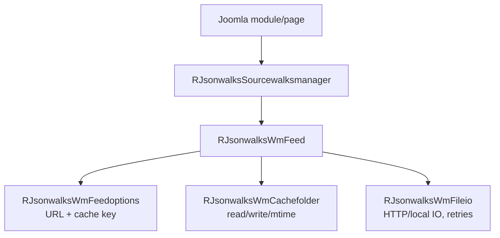

# Walks Manager (WM) Feed System - High Level Design

## Overview

The `jsonwalks/wm` module provides the Walks Manager integration layer for Ramblers Library. It builds WM API URLs, retrieves JSON (with retries and gzip support), applies a 10-minute cache window, and hands validated items back to the `jsonwalks` domain for conversion into `RJsonwalksWalk` objects.

**Key Classes (module-owned)**
- `RJsonwalksWmFeed` – Orchestrates reads from WM API or cache and performs JSON validation.
- `RJsonwalksWmCachefolder` – Manages cache directory operations (read/write/mtime checks).
- `RJsonwalksWmFileio` – HTTP/file reader with retry, HTTPS upgrade, gzip, and error redaction.
- `RJsonwalksWmFeedoptions` – Builds WM API URLs and deterministic cache filenames.
- `RJsonwalksWmOrganisation` – Optional source selector based on WM “last updated” timestamps (rarely used in practice).

**Constants**
- `WALKMANAGER` – Base WM API URL (`https://walks-manager.ramblers.org.uk/api/volunteers/walksevents?`).
- `APIKEY` – WM API key (redacted in logs via `RJsonwalksWmFileio::setSecretStrings`).
- `READSOURCE` – Enum for `FEED` vs `CACHE`.

## Component Architecture



## RJsonwalksWmFeed (`feed.php`)

### Public Interface

- `getGroupFutureItems($groups, $readwalks, $readevents, $readwellbeingwalks): array`  
  Builds a 12-month date window starting “today”, sets inclusion flags, and delegates to `getFeed` for cache/HTTP retrieval.

- `getItemsWithinArea($latitude, $longitude, $distance, $readwalks, $readevents, $readwellbeingwalks): array`  
  Builds an area query (lat/long/radius) and delegates to `getFeed`. Note: both walk/event inclusion flags are mirrored into `include_events/include_walks` before calling WM.

### Core Behaviour

- **Cache selection**: `whichSource()` returns `CACHE` when a cache file exists and is younger than 10 minutes; otherwise `FEED`. Organisation-based source selection can be toggled by changing `$method`.
- **Cache fallback**: On feed failure, it will read any existing cache file even if stale; on success it writes the fresh body back to cache.
- **Validation**: `convertResults()` ensures JSON starts with `{`, decodes, and checks for expected properties before returning `$items->data`; returns `[]` on any failure.
- **Error reporting**: Errors are routed through `RJsonwalksWmFileio::errorMsg`/`RErrors::notifyError` with API keys redacted.

## RJsonwalksWmFileio (`fileio.php`)

### Public Interface

- `readFile($urlOrPath)` – Reads HTTP(S) URLs or local files with HTTPS upgrade, gzip support, 3 retry attempts, and an 8s timeout. Returns string or `false`. Secrets registered via `setSecretStrings()` are redacted in errors.
- `writeFile($filename, $data)` – Thin wrapper over Joomla file write (used by cache).
- `setSecretStrings(array $values)` – Registers secrets to mask in logs.

### Error Handling

Errors are reported through `RErrors::notifyError` with sensitive substrings removed; no exceptions are thrown (callers see `false`).

## RJsonwalksWmCachefolder (`cachefolder.php`)

### Responsibilities

- Ensures the cache directory exists under `JPATH_SITE/cache/<name>`.
- Provides `fileExists`, `readFile`, `writeFile`, and `lastModified` helpers for cache management.
- Used by `RJsonwalksWmFeed` to decide freshness and to persist successful feed reads.

## RJsonwalksWmFeedoptions (`feedoptions.php`)

### Responsibilities

- Holds query parameters (group codes, date range, inclusion flags, area search).
- Builds the WM API URL via `getFeedURL()` (uses `http_build_query`) and constructs deterministic cache filenames via `getCacheFileName($extension)`.

### Key Properties

`groupCode`, `include_walks`, `include_events`, `include_wellbeing_walks`, `latitude`, `longitude`, `distance`, `date_start`, `date_end`.

## RJsonwalksWmOrganisation (`organisation.php`)

### Role

Optional helper that can choose FEED vs CACHE based on WM group “last updated” timestamps. It is wired into `RJsonwalksWmFeed` but bypassed when `$method === "time"` (the default).

## Data Flow (time-based mode)

```
RJsonwalksFeedoptions → RJsonwalksSourcewalksmanager → RJsonwalksWmFeed
   → RJsonwalksWmFeedoptions (URL + cache key)
   → whichSource(): cache? (<10 min) → read cache
                    else → RJsonwalksWmFileio::readFile(feed URL)
   → on success: cache write
   → convertResults(): decode/validate → items->data
   → returned to Source → converted to RJsonwalksWalk → presenters
```

## Integration Points

### Used By
- **RJsonwalksSourcewalksmanager** to fetch WM data for the jsonwalks domain → [jsonwalks HLD](../HLD.md#integration-points).
- **RJsonwalksFeedoptions** consumers in presenters that need WM query URLs → [jsonwalks/std HLD](../std/HLD.md#integration-points).

### Uses
- **RErrors** for telemetry and user messages → [errors HLD](../../errors/HLD.md#integration-points).
- **RFeedhelper**-style patterns for caching and IO via `RJsonwalksWmFileio` and `RJsonwalksWmCachefolder`.

### Data Sources
- **Walk Manager API** (`WALKMANAGER`) with API key injection.
- **Local cache** under `JPATH_SITE/cache/<name>` for 10-minute freshness windows.

### External Services
- **Walk Manager** HTTPS endpoint for walks/events/wellbeing data.

### Display Layer
- **Server only**: Returns arrays to the jsonwalks domain; rendered later by presenters → [media/jsonwalks HLD](../../media/jsonwalks/HLD.md#display-layer).

### Joomla Integration
- **File paths and cache roots** resolved via Joomla constants; messages surfaced through `RErrors`/Joomla messaging.

### Vendor Library Integration
- None directly; HTTP and file handling rely on PHP/cURL.

### Media Asset Relationships
- None; this module is server-side.

## Performance Observations

- **Caching**: 10-minute TTL reduces WM traffic; stale cache is reused on failures.
- **IO cost**: Single HTTP call per refresh; retries add overhead only on failures.
- **JSON validation**: Simple property checks; negligible CPU cost.

## Error Handling

- **Graceful degradation**: Return empty arrays on errors; never throw.
- **Redaction**: API keys masked before logging or messaging.
- **Cache fallback**: Reads stale cache when WM is unavailable.

## Testing/Mocking Hooks

- Mock `RJsonwalksWmFileio::readFile()` to simulate API responses/timeouts.
- Inject test cache files and vary mtimes to exercise `whichSource()`.
- Verify redaction by registering dummy secrets via `setSecretStrings()`.

## References

- [jsonwalks HLD](../HLD.md) – Feed orchestration
- [jsonwalks/std HLD](../std/HLD.md) – Presenter usage
- `jsonwalks/wm/feed.php` – RJsonwalksWmFeed
- `jsonwalks/wm/feedoptions.php` – URL/cache builder
- `jsonwalks/wm/fileio.php` – HTTP/local IO with retries
- `jsonwalks/wm/cachefolder.php` – Cache helpers
- `jsonwalks/wm/organisation.php` – Optional org-based source selector
