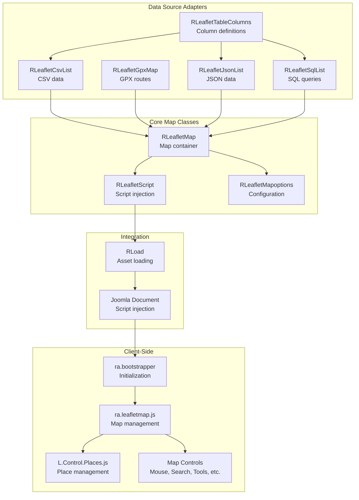
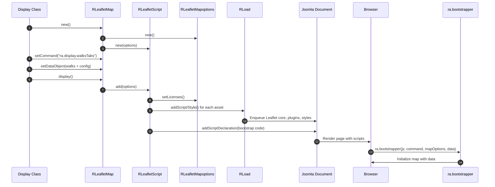
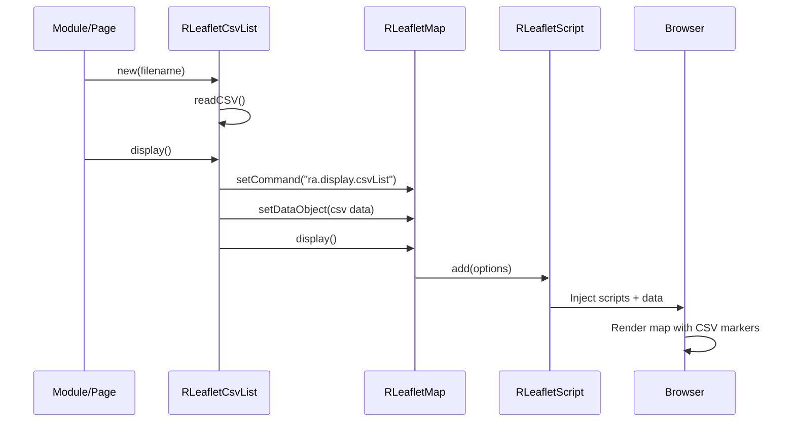
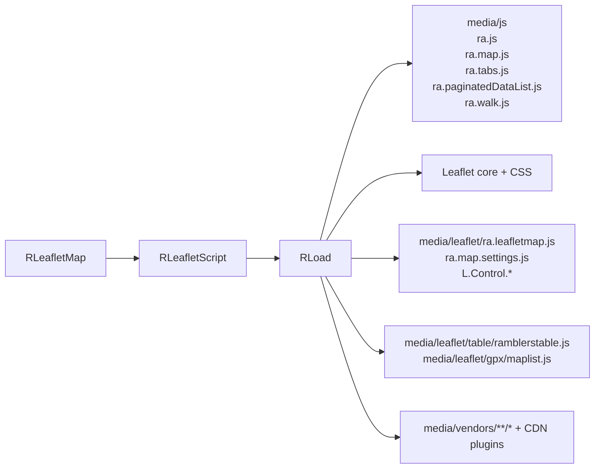

# leaflet Module - High Level Design

## Overview

The `leaflet` module provides comprehensive Leaflet.js map integration for the Ramblers Library. It handles map initialization, script injection, data source integration (CSV, GPX, JSON, SQL), and provides a rich set of map controls and features including clustering, elevation profiles, routing, and interactive place management.

**Purpose**: Unified Leaflet.js map system with multiple data sources and advanced features.

**Key Responsibilities**:
- Map container and script management
- Asset loading (Leaflet.js, plugins, stylesheets)
- Data source adapters (CSV, GPX, JSON, SQL)
- Map options and configuration
- Client-side map initialization via JavaScript bootstrap
- Integration with Joomla document system

## Component Architecture



## Public Interface

### RLeafletMap

**Main map container class (not typically called directly by users).**

#### Constructor
```php
public function __construct()
```
- Creates `RLeafletMapoptions` instance
- Creates `RLeafletScript` instance with options

#### Configuration Methods
```php
public function setCommand($command)
```
- **Parameters**: `$command` - JavaScript function name to call (e.g., "ra.display.walksTabs")
- **Behavior**: Sets command for client-side initialization

```php
public function setDataObject($value)
```
- **Parameters**: `$value` - Data object (walks, places, etc.) to pass to JavaScript
- **Behavior**: Serializes data as JSON for client-side consumption

```php
public function display()
```
- **Behavior**: 
  - Sets help page in options
  - Configures map defaults (Topo map if specified)
  - Calls `RLeafletScript::add()` to inject scripts and initialize

#### Public Properties
```php
public $mapHeight = "100%";
public $mapWidth = "500px";
public $help_page = "";
public $leafletLoad = true;
public $defaultMap = "";
public $options; // RLeafletMapoptions instance
```

### RLeafletScript

**Script injection and asset loading manager.**

#### Constructor
```php
public function __construct()
```

#### Configuration Methods
```php
public function setCommand($command)
public function setDataObject($value)
```

#### Asset Loading Method
```php
public function add($options)
```
- **Parameters**: `$options` - `RLeafletMapoptions` instance
- **Behavior**:
  - Sets license keys in options
  - Injects bootstrap JavaScript into Joomla document
  - Loads all required Leaflet assets (core, plugins, stylesheets)
  - Conditionally loads elevation, OS maps, clustering based on options

#### Walk Registration Method
```php
public function registerWalks($walks)
```
- **Parameters**: `$walks` - `RJsonwalksWalks` collection
- **Behavior**: Registers walk data globally for calendar/ICS exports

### RLeafletMapoptions

**Map configuration and options container.**

#### Constructor
```php
public function __construct()
```
- Generates unique div ID
- Sets base URL
- Initializes license keys object

#### Configuration Methods
```php
public function setinitialviewView($latitude, $longitude, $zoom)
```
- Sets initial map center and zoom level

```php
public function setLicenses()
```
- Populates license keys from `RLicense` class
- Keys: ESRI, ORS, OS, MapBox, ThunderForest, W3W

#### Public Properties
```php
public $divId = ""; // Unique container ID
public $mapHeight = "500px";
public $mapWidth = "100%";
public $cluster = false;
public $fitbounds = false;
public $displayElevation = false;
public $calendar = false;
public $mouseposition = false;
public $rightclick = false;
public $fullscreen = true;
public $settings = true;
public $mylocation = true;
public $print = true;
public $licenseKeys; // stdClass with API keys
```

### Data Source Classes

#### RLeafletCsvList
- **Purpose**: Display map markers from CSV file
- **Location**: `leaflet/csv/list.php`
- **See**: [leaflet/csv HLD](csv/HLD.md)

#### RLeafletGpxMap
- **Purpose**: Display GPX route with elevation profile
- **Location**: `leaflet/gpx/map.php`, `maplist.php`
- **See**: [leaflet/gpx HLD](gpx/HLD.md)

#### RLeafletGpxMaplist (folder-driven GPX index)
- **Purpose**: Enumerate a GPX folder, cache a JSON summary, and present the list/map with downloads, elevation, and pagination.
- **Flow**: `display()` builds a stats object from the configured folder, sorts items (title or date), sets command `ra.display.gpxFolder`, and loads `maplist.js`, tabs, and cvList assets for the client grid + map combo.【F:leaflet/gpx/maplist.php†L24-L83】
- **Caching**: `RGpxStatistics` regenerates `0000gpx_statistics_file.json` only when the most recently modified file is not that JSON (i.e., the folder contents changed), otherwise it reuses the cached JSON for quick responses.【F:gpx/statistics.php†L16-L55】 A rebuild scans `.gpx` files, extracts meta (optionally from GPX itself), and logs diagnostics until Joomla cache expiry.【F:gpx/statistics.php†L57-L130】

#### RLeafletJsonList
- **Purpose**: Display map markers from JSON data
- **Location**: `leaflet/json/list.php`
- **See**: [leaflet/json HLD](json/HLD.md)

#### RLeafletSqlList
- **Purpose**: Display map markers from SQL query
- **Location**: `leaflet/sql/list.php`
- **See**: [leaflet/sql HLD](sql/HLD.md)

#### RLeafletTableColumns
- **Purpose**: Define table column structure for data sources
- **Location**: `leaflet/table/columns.php`, `column.php`
- **See**: [leaflet/table HLD](table/HLD.md)

## Data Flow

### Map Initialization Flow



### Data Source Flow (CSV Example)



## Integration Points

### Display Layer Integration
- **jsonwalks displays**: Use `RLeafletMap` for walk map rendering → [jsonwalks HLD](../jsonwalks/HLD.md)
- **jsonwalks/leaflet**: `RJsonwalksLeafletMapmarker` → [jsonwalks/leaflet HLD](../jsonwalks/leaflet/HLD.md)
- **organisation**: Uses maps for area/group visualization → [organisation HLD](../organisation/HLD.md)
- **accounts**: Uses maps for hosted site markers → [accounts HLD](../accounts/HLD.md)

### Asset Loading
- **RLoad**: Used for all script/stylesheet enqueuing → [load HLD](../load/HLD.md)
- **Joomla Document**: Final script injection point

## Server-to-Client Asset Relationship



`RLeafletScript::add()` drives asset loading through `RLoad`, first enqueuing the shared `media/js` foundation (core RA utilities, tabs, pagination, map helpers) and then loading Leaflet core/CSS, plugin modules under `media/leaflet`, data helpers like `table/ramblerstable.js`, and vendor/CDN dependencies according to the map options.

### License Management
- **RLicense**: Provides API keys for map providers → [license HLD](../license/HLD.md)

### Data Sources
- **CSV**: File-based marker data → [leaflet/csv HLD](csv/HLD.md)
- **GPX**: Route files with elevation → [leaflet/gpx HLD](gpx/HLD.md)
- **JSON**: Structured marker data → [leaflet/json HLD](json/HLD.md)
- **SQL**: Database query results → [leaflet/sql HLD](sql/HLD.md)

## Media Dependencies

### Core JavaScript Files

#### `media/leaflet/ra.leafletmap.js`
- **Purpose**: Main Leaflet map initialization and management
- **Dependencies**: Leaflet.js, ra.js
- **Integration**: Loaded via `RLoad::addScript()` in `RLeafletScript::add()`
- **Key Functions**:
  - Map initialization
  - Layer management
  - Control integration
  - Event handling

#### `media/leaflet/ra.map.settings.js`
- **Purpose**: Map settings panel functionality
- **Dependencies**: ra.js, Leaflet.js
- **Integration**: Loaded when `options->settings = true`

#### `media/leaflet/ra.display.plotRoute.js`
- **Purpose**: Route plotting functionality
- **Dependencies**: Leaflet.js, routing libraries
- **Integration**: Loaded for routing features

##### Plot Route workflow (server ↔ client)
- **Server**: `RLeafletMapdraw` sets the command `ra.display.plotRoute`, enables drawing-friendly options (fullscreen, fitbounds, elevation, right-click, print), and enqueues draw/upload/download/smart-route controls plus styles.【F:leaflet/mapdraw.php†L21-L54】
- **Client**: `ra.display.plotRoute` bootstraps `ra.leafletmap`, wires Leaflet.draw with custom labels, and attaches GPX upload/download, reverse, simplify, and smart-route controls (optional ORS key). All drawn layers land in a FeatureGroup and trigger elevation refreshes and styling updates on edits.【F:media/leaflet/ra.display.plotRoute.js†L8-L188】

#### `media/leaflet/ra-display-places.js`
- **Purpose**: Place management and display
- **Dependencies**: Leaflet.js, ra.js
- **Integration**: Loaded for place features

### Map Control JavaScript Files

#### `media/leaflet/L.Control.Places.js`
- **Purpose**: Places control for map
- **Dependencies**: Leaflet.js, ra.js
- **Integration**: Loaded via `RLoad::addScript()`

#### `media/leaflet/L.Control.Mouse.js`
- **Purpose**: Mouse position display control
- **Dependencies**: Leaflet.js

#### `media/leaflet/L.Control.Search.js`
- **Purpose**: Location search control
- **Dependencies**: Leaflet.js

#### `media/leaflet/L.Control.Tools.js`
- **Purpose**: Map tools control
- **Dependencies**: Leaflet.js

#### `media/leaflet/L.Control.SmartRoute.js`
- **Purpose**: Smart routing control
- **Dependencies**: Leaflet.js, routing libraries

#### `media/leaflet/L.Control.ReverseRoute.js`
- **Purpose**: Reverse route control
- **Dependencies**: Leaflet.js, routing libraries

#### `media/leaflet/L.Control.GpxUpload.js`
- **Purpose**: GPX file upload control
- **Dependencies**: Leaflet.js, File API

#### `media/leaflet/L.Control.GpxDownload.js`
- **Purpose**: GPX file download control
- **Dependencies**: Leaflet.js, FileSaver.js

#### `media/leaflet/L.Control.GpxSimplify.js`
- **Purpose**: GPX simplification control
- **Dependencies**: Leaflet.js, simplify-js

#### `media/leaflet/L.Control.MyLocation.js`
- **Purpose**: User location control
- **Dependencies**: Leaflet.js, Geolocation API

#### `media/leaflet/L.Control.RAContainer.js`
- **Purpose**: Container for Ramblers-specific controls
- **Dependencies**: Leaflet.js

### Table/Data JavaScript

#### `media/leaflet/table/ramblerstable.js`
- **Purpose**: Table rendering for map data
- **Dependencies**: ra.js
- **Integration**: Used by CSV/JSON/SQL list displays

#### `media/leaflet/gpx/maplist.js`
- **Purpose**: GPX map list functionality
- **Dependencies**: Leaflet.js, leaflet-gpx
- **Integration**: Loaded by `RLeafletGpxMap::displayPath()`

### MapLibre Integration

#### `media/leaflet/maplibre.js`
- **Purpose**: MapLibre GL integration for vector tiles
- **Dependencies**: MapLibre GL, Leaflet
- **Integration**: Loaded when OS maps enabled

### External Dependencies (CDN)
- **Leaflet.js 1.9.4**: Core mapping library (unpkg.com)
- **Leaflet CSS**: Core stylesheet (unpkg.com)
- **Proj4js**: Coordinate projection (cdnjs.cloudflare.com)
- **Proj4Leaflet**: Proj4 integration (cdnjs.cloudflare.com)
- **D3.js v3**: Elevation charts (d3js.org)
- **MapLibre GL**: Vector tiles (unpkg.com)
- **FullCalendar**: Calendar view (vendors folder)

### Vendor Libraries (Local)
- **Leaflet.fullscreen**: Fullscreen control
- **Leaflet.markercluster**: Marker clustering
- **Leaflet.draw**: Drawing tools
- **Leaflet.Elevation**: Elevation profiles
- **Leaflet-gpx**: GPX file handling
- **Leaflet.FeatureGroup.SubGroup**: Feature grouping
- **FileSaver.js**: File download
- **simplify-js**: GPX simplification
- **cvList**: Pagination (used by data sources)

### CSS Files

#### `media/leaflet/ramblersleaflet.css`
- **Purpose**: Ramblers-specific Leaflet styles
- **Integration**: Loaded via `RLoad::addStyleSheet()`

#### Vendor CSS
- Leaflet.fullscreen CSS
- Leaflet.markercluster CSS (Default + custom)
- Leaflet.Elevation CSS
- MapLibre GL CSS (when vector tiles enabled)

### Loading Order
1. jQuery framework (Joomla)
2. Core: `ra.js`
3. Leaflet core (CDN)
4. Leaflet map script: `ra.leafletmap.js`
5. Proj4 libraries (for coordinate systems)
6. Fullscreen plugin
7. Elevation plugin (if enabled)
8. MapLibre GL (if OS maps enabled)
9. Clustering plugin
10. FeatureGroup.SubGroup
11. Map controls (Places, Mouse, Search, etc.)
12. Data source scripts (if applicable)
13. Bootstrap script (initialization)

## Examples

### Example 1: Basic Map with Walk Data

```php
$map = new RLeafletMap();
$map->setCommand("ra.display.walksTabs");
$data = new stdClass();
$data->walks = $walksArray;
$map->setDataObject($data);
$map->display();
```

### Example 2: CSV Data Source

```php
$csvMap = new RLeafletCsvList(JPATH_SITE . '/data/places.csv');
$csvMap->paginationDefault = 25;
$csvMap->display();
```

### Example 3: GPX Route Display

```php
$gpxMap = new RLeafletGpxMap();
$gpxMap->linecolour = "#782327";
$gpxMap->imperial = false;
$gpxMap->displayPath('media/gpx/walk-123.gpx');
```

### Example 4: Custom Map Options

```php
$map = new RLeafletMap();
$map->options->cluster = true;
$map->options->displayElevation = true;
$map->options->setinitialviewView(51.5074, -0.1278, 10);
$map->options->mouseposition = true;
$map->options->rightclick = true;
$map->setCommand("ra.display.customMap");
$map->display();
```

### Asset Inclusion Examples

- **Bootstrap chain**: `RLeafletMap::display()` → `RLeafletScript::add()` → `RLoad::addScript()` for `media/js/ra.js`, `media/js/ra.map.js`, and `media/leaflet/ra.leafletmap.js`, followed by Leaflet CDN files and any enabled controls.
- **Data grid support**: `RLeafletCsvList::display()` adds `media/leaflet/table/ramblerstable.js`, `media/js/ra.tabs.js`, and `media/vendors/cvList/cvList.js` so map tabs and paginated tables render together.
- **Route tools**: `RLeafletMapdraw` explicitly enqueues `media/leaflet/ra.display.plotRoute.js`, `media/leaflet/L.Control.GpxUpload.js`, `L.Control.GpxDownload.js`, and `L.Control.GpxSimplify.js` to extend the UI with drawing, import/export, and simplification controls.

## Performance Notes

### Asset Loading
- **CDN Assets**: Leaflet core loaded from unpkg.com (fast, cached)
- **Local Assets**: Loaded with cache-busting via `RLoad` (file mtime versioning)
- **Conditional Loading**: Elevation, OS maps, etc. only loaded when needed

### Map Rendering
- **Marker Clustering**: Reduces DOM elements for large datasets (500+ markers)
- **Lazy Loading**: Map tiles loaded on-demand as user pans/zooms
- **Vector Tiles**: MapLibre GL provides efficient vector rendering

### Optimization Opportunities
1. **Asset Bundling**: Combine multiple JS files to reduce HTTP requests
2. **Lazy Control Loading**: Load controls only when needed
3. **Marker Virtualization**: Render only visible markers for very large datasets
4. **Tile Caching**: Cache map tiles locally

## Error Handling

### Map Initialization Errors
- **Missing Container**: Bootstrap checks for div ID, shows error if missing
- **Invalid Data**: JavaScript validates data structure, falls back gracefully
- **Missing Assets**: Browser console errors, but page still renders

### Data Source Errors
- **CSV**: File read errors show Joomla error message
- **GPX**: Invalid file format shows error message, no map rendered
- **SQL**: Query errors logged, empty map shown

### License Key Errors
- **Missing Keys**: Features requiring keys are disabled (no crashes)
- **Invalid Keys**: API errors logged, fallback to default maps

## References

### Related HLD Documents
- [jsonwalks HLD](../jsonwalks/HLD.md) - Walk data integration
- [jsonwalks/leaflet HLD](../jsonwalks/leaflet/HLD.md) - Walk map markers
- [load HLD](../load/HLD.md) - Asset loading system
- [leaflet/csv HLD](csv/HLD.md) - CSV data source
- [leaflet/gpx HLD](gpx/HLD.md) - GPX route source
- [leaflet/json HLD](json/HLD.md) - JSON data source
- [leaflet/sql HLD](sql/HLD.md) - SQL data source
- [leaflet/table HLD](table/HLD.md) - Table column definitions
- [organisation HLD](../organisation/HLD.md) - Organisation map usage
- [accounts HLD](../accounts/HLD.md) - Accounts map usage
- [license HLD](../license/HLD.md) - License key management

### Key Source Files
- `leaflet/map.php` - RLeafletMap class
- `leaflet/script.php` - RLeafletScript class
- `leaflet/mapoptions.php` - RLeafletMapoptions class
- `leaflet/mapplaces.php` - Place management
- `leaflet/mapcompare.php` - Map comparison
- `leaflet/mapdraw.php` - Map drawing tools
- `leaflet/maplibre.js` - MapLibre integration

### Related Media Files
- `media/leaflet/ra.leafletmap.js` - Main map script
- `media/leaflet/ra.map.settings.js` - Settings panel
- `media/leaflet/ra.display.plotRoute.js` - Route plotting
- `media/leaflet/ra-display-places.js` - Place display
- `media/leaflet/L.Control.*.js` - Map controls (10+ files)
- `media/leaflet/table/ramblerstable.js` - Table rendering
- `media/leaflet/gpx/maplist.js` - GPX list
- `media/leaflet/ramblersleaflet.css` - Stylesheet
