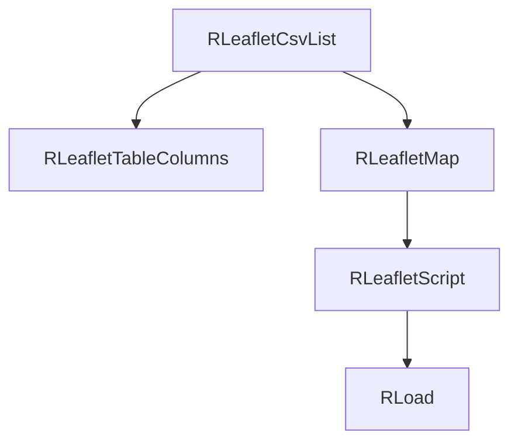

# leaflet/csv Module - High Level Design

## Overview

The `leaflet/csv` module provides CSV data source integration for Leaflet maps. It reads CSV files and displays markers on maps with configurable display options.

**Purpose**: CSV data source for Leaflet maps.

**Key Class**: `RLeafletCsvList` extends `RLeafletMap`

## Component Architecture



## Public Interface

### RLeafletCsvList

```php
public function __construct($filename)
public function setDisplayOptions($displayOptions)
public function display()
```

## Data Flow

1. Construct with a CSV filename.
2. `display()` loads CSV rows, maps columns via `RLeafletTableColumns`, and sets the Leaflet command/data.
3. `RLeafletScript` injects assets; `ra.display.tableList` renders table + map client-side.

## Integration Points

### Used By
- **Leaflet presenters** needing CSV-backed table/map displays → [leaflet HLD](../HLD.md#integration-points).

### Uses
- **RLeafletMap / RLeafletScript** for map options and asset injection → [leaflet HLD](../HLD.md#joomla-integration).
- **RLeafletTableColumns** for column mapping → [leaflet/table HLD](../table/HLD.md#integration-points).
- **RLoad** to enqueue `/media/leaflet` and `/media/js` assets → [media/js HLD](../../media/js/HLD.md#integration-points).

### Data Sources
- **CSV file** supplied at construction; column definitions from caller or defaults.

### External Services
- None; local CSV parsing only.

### Display Layer
- **Client**: `ra.display.tableList` renders table and optional map → [media/leaflet HLD](../../media/leaflet/HLD.md#display-layer).

### Joomla Integration
- **Document pipeline**: Assets and JSON payload emitted via `RLeafletMap::display()` with cache-busting from `RLoad`.

### Vendor Library Integration
- **cvList** for pagination → [media/vendors HLD](../../media/vendors/HLD.md#integration-points).

### Media Asset Relationships
- Server injects `/media/leaflet/table/ramblerstable.js`, `/media/leaflet/gpx/maplist.js` (when map), and `/media/js` foundations before the bootstrapper runs.

## Performance Observations
- **CSV parsing**: Linear with row count; suited for modest datasets.
- **Client pagination**: cvList handles large tables reasonably but avoid huge CSVs.

## Error Handling
- **Missing file**: Generates Joomla error message and halts display.
- **Invalid columns**: Falls back to defaults or omits unmapped fields.

## References

- [leaflet HLD](../HLD.md) - Main map system
- [leaflet/table HLD](../table/HLD.md) - Column mapping
- `leaflet/csv/list.php` - RLeafletCsvList class

