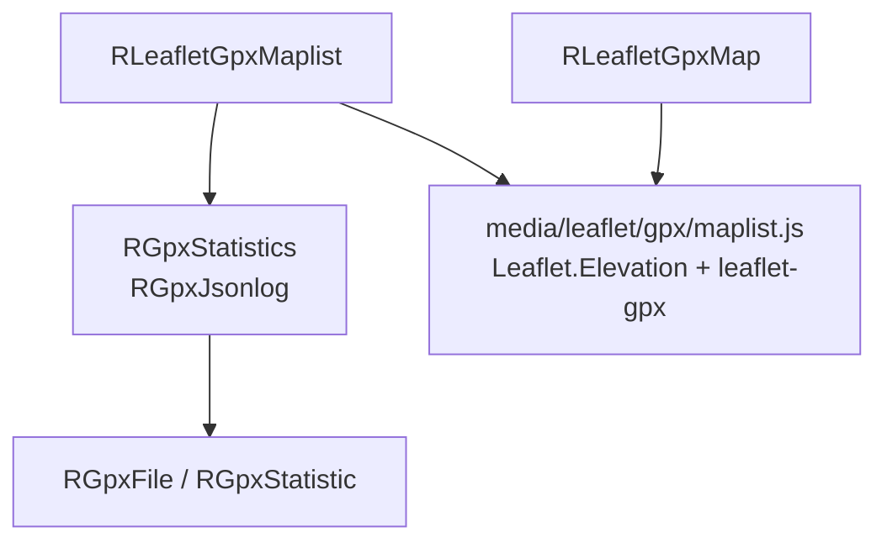
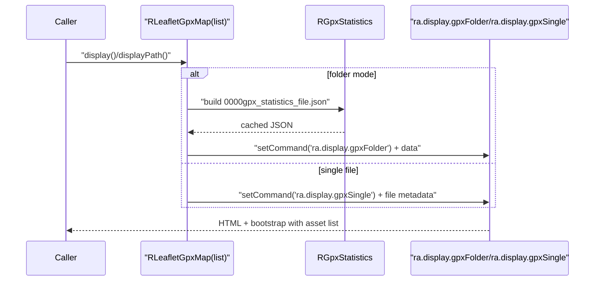
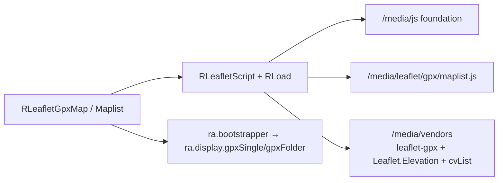

# leaflet/gpx Module - High Level Design

## Overview

The `leaflet/gpx` module provides GPX route file display on Leaflet maps with elevation profiles. It renders GPX tracks as map overlays with interactive elevation charts.

**Purpose**: GPX route visualization with elevation profiles.

**Key Classes (this component)**: 
- `RLeafletGpxMap` extends `RLeafletMap`
- `RLeafletGpxMaplist` extends `RLeafletMap` (folder-driven GPX list + map)

**Dependencies (supporting utilities/assets treated as part of the Leaflet stack)**:
- `RGpxStatistics` / `RGpxJsonlog` / `RGpxFile` / `RGpxStatistic` for folder scanning, caching, and per-file parsing.
- Client assets under `media/leaflet/*` (e.g., `gpx/maplist.js`, elevation, draw/upload/download controls) are documented here as part of the Leaflet module’s media surface.

## Public Interface

### RLeafletGpxMap

```php
public function displayPath($gpx)
public $linecolour = "#782327";
public $imperial = false;
public $addDownloadLink = "Users";
```

**Behaviour**: Validates that the supplied file exists and has a `.gpx` extension, sets `gpxfile` and presentation flags on the data object, and configures the map command to `ra.display.gpxSingle` so the client loads the route with elevation. Downloads are exposed when the file is present; invalid input is surfaced via Joomla messages.

### RLeafletGpxMaplist (folder index)

```php
public $folder = "images";
public $addDownloadLink = "Users"; // None|Users|Public
public $descriptions = true;
public $getMetaFromGPX = true;
public $displayAsPreviousWalks = false;
public $displayTitle = true;
public $linecolour = "#782327";
public $imperial = false;

public function display();
```

**Behaviour**:
- Builds a folder summary via `RGpxStatistics`, which regenerates `0000gpx_statistics_file.json` when any file newer than the JSON exists; otherwise it reuses the cached JSON for fast loads.
- Sorting: by title (default) or by date when `displayAsPreviousWalks` is true.
- Map options: clustering, elevation, fullscreen, mouseposition, rightclick, fitbounds, print, settings, and mylocation are enabled to support list + map views.
- Command: publishes `ra.display.gpxFolder` with a data object containing items, download state (0/1/2), folder name, line colour, and presentation flags for the client to render markers, elevation, pagination, and downloads.
- Assets: enqueues `maplist.js`, tabs, cvList, and shared ramblerslibrary styles to deliver the tabbed table/map UI.

### Supporting classes
- **RGpxStatistics**: Scans the configured folder, extracts metadata from each `.gpx` file (and optional `.txt` descriptions), and writes `0000gpx_statistics_file.json` via `RGpxJsonlog`; emits diagnostics during regeneration to aid admins.
- **RGpxFile / RGpxStatistic**: Parse GPX contents to compute title/description (with optional GPX metadata), author/date, start/end coordinates, distance, elevation stats, tracks/segments/routes counts, and duration used in the JSON summary.

## Component Architecture



## Data Flow



## Integration Points

### Used By
- **Leaflet presenters** that need GPX overlays and elevation profiles → [leaflet HLD](../HLD.md#integration-points).

### Uses
- **RGpxStatistics / RGpxJsonlog / RGpxFile / RGpxStatistic** for folder scanning and JSON cache → [gpx HLD](../../gpx/HLD.md#integration-points).
- **RLoad / RLeafletScript** to enqueue Leaflet, elevation, and GPX assets → [leaflet HLD](../HLD.md#joomla-integration).

### Data Sources
- **Local GPX files/folders** provided by callers; optional `.txt` descriptions and GPX metadata feed titles/descriptions.

### External Services
- None; all IO is local filesystem.

### Display Layer
- **Server**: `RLeafletGpxMap` / `RLeafletGpxMaplist` prepare commands/data.
- **Client**: `ra.display.gpxSingle` and `ra.display.gpxFolder` render tracks, markers, and elevation → [media/leaflet HLD](../../media/leaflet/HLD.md#display-layer).

### Joomla Integration
- **Document pipeline**: Assets and data injected through `RLeafletMap::display()` with cache-busted URLs via `RLoad`.

### Vendor Library Integration
- **Leaflet.gpx**, **Leaflet.Elevation**, **cvList** for pagination, and Leaflet plugins loaded via `RLeafletScript` → [media/vendors HLD](../../media/vendors/HLD.md#integration-points).

### Media Asset Relationships



## Performance Observations

- **Cached summaries**: Folder stats regenerate only when GPX files change (mtime newer than `0000gpx_statistics_file.json`).
- **Client rendering**: Elevation and clustering add cost for very large GPX sets; pagination (cvList) mitigates table load.
- **Single GPX**: Lightweight; parsing handled client-side by leaflet-gpx.

## Error Handling

- **Missing files**: Validated before emitting commands; errors surfaced via Joomla messages.
- **Invalid GPX**: Client libraries handle parse failures gracefully; elevation may skip missing data.
- **Folder access**: Diagnostics printed during regeneration; falls back to existing cache when possible.

## Media Dependencies

- `media/leaflet/gpx/maplist.js` - GPX folder display (list + map + elevation)
- `media/leaflet/ra.display.plotRoute.js` - Shared plotting helpers for interactive drawing (loaded by mapdraw, not maplist)
- `media/vendors/leaflet-gpx-1.3.1/gpx.js` - GPX parsing for single-route display
- `media/vendors/Leaflet.Elevation-0.0.4-ra/` - Elevation charts
- `media/lib_ramblers/vendors/cvList/cvList.js|css` - Pagination for folder list/table
- `media/lib_ramblers/js/ra.tabs.js` - Tabbed UI for list/map toggle

## References

- [leaflet HLD](../HLD.md) - Main map system
- `leaflet/gpx/map.php` - RLeafletGpxMap class
- `leaflet/gpx/maplist.php` - RLeafletGpxMaplist class (if exists)
- `gpx/statistics.php` - Folder scanning + JSON caching
