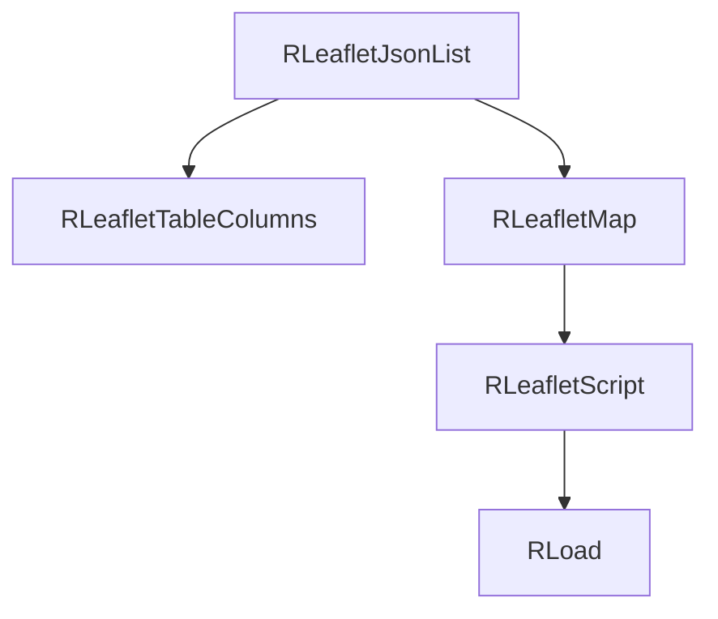

# leaflet/json Module - High Level Design

## Overview

The `leaflet/json` module provides JSON data source integration for Leaflet maps. It reads JSON data and displays markers with configurable display options.

**Purpose**: JSON data source for Leaflet maps.

**Key Class**: `RLeafletJsonList` extends `RLeafletMap`

## Component Architecture



## Public Interface

### RLeafletJsonList

```php
public function __construct($data)
public function setDisplayOptions($displayOptions)
public function display()
```

## Data Flow

1. Construct with JSON array data.
2. `display()` maps columns, sets Leaflet command/data, and enqueues assets.
3. Client `ra.display.tableList` renders table and markers.

## Integration Points

### Used By
- **Leaflet presenters** that render JSON-backed table/map displays → [leaflet HLD](../HLD.md#integration-points).

### Uses
- **RLeafletMap / RLeafletScript** for map setup and asset injection → [leaflet HLD](../HLD.md#joomla-integration).
- **RLeafletTableColumns** for column definitions → [leaflet/table HLD](../table/HLD.md#integration-points).
- **RLoad** to enqueue `/media/leaflet` and `/media/js` assets → [media/js HLD](../../media/js/HLD.md#integration-points).

### Data Sources
- **JSON array** provided by caller; column mapping supplied or defaulted.

### External Services
- None.

### Display Layer
- **Client**: `ra.display.tableList` renders table and map markers → [media/leaflet HLD](../../media/leaflet/HLD.md#display-layer).

### Joomla Integration
- **Document pipeline**: Assets and JSON payload injected via `RLeafletMap::display()` with cache-busting by `RLoad`.

### Vendor Library Integration
- **cvList** for pagination → [media/vendors HLD](../../media/vendors/HLD.md#integration-points).

### Media Asset Relationships
- Server enqueues `/media/leaflet/table/ramblerstable.js` and `/media/js` foundations before emitting the bootstrapper.

## Performance Observations
- **JSON parsing**: Linear with item count; keep payload sizes reasonable.
- **Client pagination**: Offloads large lists to cvList pagination.

## Error Handling
- **Invalid JSON structure**: Displays Joomla warning and aborts rendering.
- **Missing columns**: Unmapped fields are skipped.

## References

- [leaflet HLD](../HLD.md) - Main map system
- [leaflet/table HLD](../table/HLD.md) - Column mapping
- `leaflet/json/list.php` - RLeafletJsonList class

