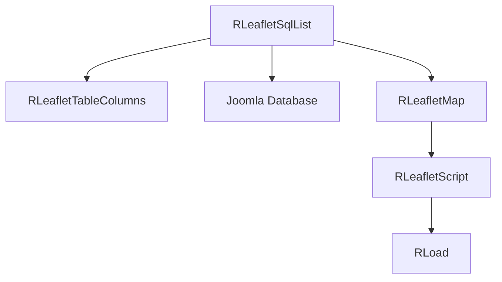

# leaflet/sql Module - High Level Design

## Overview

The `leaflet/sql` module provides SQL query data source integration for Leaflet maps. It executes SQL queries and displays results as map markers.

**Purpose**: SQL data source for Leaflet maps.

**Key Class**: `RLeafletSqlList` extends `RLeafletMap`

## Component Architecture



## Public Interface

### RLeafletSqlList

```php
public function __construct($query)
public function setDisplayOptions($displayOptions)
public function display()
```

## Data Flow

1. Construct with SQL query string.
2. `display()` executes query via Joomla DB, maps columns, and prepares Leaflet command/data.
3. `RLeafletScript` injects assets; client `ra.display.tableList` renders the result.

## Integration Points

### Used By
- **Leaflet presenters** needing SQL-backed table/map outputs → [leaflet HLD](../HLD.md#integration-points).

### Uses
- **Joomla Database** for query execution.
- **RLeafletMap / RLeafletScript** for map setup and asset injection → [leaflet HLD](../HLD.md#joomla-integration).
- **RLeafletTableColumns** for column definitions → [leaflet/table HLD](../table/HLD.md#integration-points).
- **RLoad** to enqueue `/media/leaflet` and `/media/js` assets → [media/js HLD](../../media/js/HLD.md#integration-points).

### Data Sources
- **SQL query results** returned from Joomla DB.

### External Services
- None beyond the database.

### Display Layer
- **Client**: `ra.display.tableList` renders table and markers → [media/leaflet HLD](../../media/leaflet/HLD.md#display-layer).

### Joomla Integration
- **Document pipeline**: Assets and JSON payload emitted via `RLeafletMap::display()` with cache-busting from `RLoad`.

### Vendor Library Integration
- **cvList** for pagination → [media/vendors HLD](../../media/vendors/HLD.md#integration-points).

### Media Asset Relationships
- Server enqueues `/media/leaflet/table/ramblerstable.js` and `/media/js` foundations prior to the bootstrapper.

## Performance Observations
- **Query cost**: Depends on database; limit result sizes for client pagination.
- **Client pagination**: cvList handles moderate datasets; avoid very large result sets.

## Error Handling
- **SQL errors**: Surfaced through Joomla DB error handling; display aborted on failure.
- **Empty result sets**: Render empty table gracefully.

## References

- [leaflet HLD](../HLD.md) - Main map system
- [leaflet/table HLD](../table/HLD.md) - Column mapping
- `leaflet/sql/list.php` - RLeafletSqlList class

