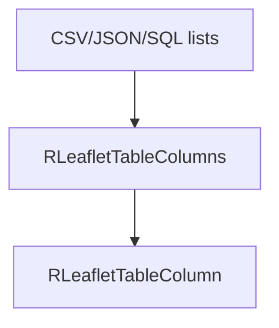

# leaflet/table Module - High Level Design

## Overview

The `leaflet/table` module provides table column definition utilities for Leaflet data source displays. It defines column structures for CSV, JSON, and SQL data sources.

**Purpose**: Table column definitions for data source displays.

**Key Classes**: 
- `RLeafletTableColumns` - Column collection
- `RLeafletTableColumn` - Individual column definition

## Component Architecture



## Public Interface

### RLeafletTableColumns

```php
public function addColumn($column)
public function getColumns()
```

### RLeafletTableColumn

```php
public function __construct($title, $field)
```

## Data Flow

1. Data-source list builds a `RLeafletTableColumns` set.
2. Columns are serialized into the Leaflet data object.
3. Client `ra.display.tableList` renders table headers/rows using the definitions.

## Integration Points

### Used By
- **RLeafletCsvList / RLeafletJsonList / RLeafletSqlList** to describe table columns → [leaflet/csv HLD](../csv/HLD.md#integration-points), [leaflet/json HLD](../json/HLD.md#integration-points), [leaflet/sql HLD](../sql/HLD.md#integration-points).

### Uses
- None beyond simple value storage.

### Data Sources
- **Column metadata** supplied by callers (title/field).

### External Services
- None.

### Display Layer
- **Client**: `ra.display.tableList` consumes column definitions for rendering → [media/leaflet HLD](../../media/leaflet/HLD.md#display-layer).

### Joomla Integration
- None directly; participates in data objects emitted by Leaflet presenters.

### Vendor Library Integration
- **cvList** uses column metadata for pagination headers → [media/vendors HLD](../../media/vendors/HLD.md#integration-points).

### Media Asset Relationships
- None; columns travel as JSON in the Leaflet data payload.

## Performance Observations
- **Lightweight**: Pure metadata; negligible overhead.

## Error Handling
- **Invalid columns**: Callers should validate; unused/empty columns simply render blank.

## References

- [leaflet HLD](../HLD.md) - Main map system
- `leaflet/table/columns.php` - RLeafletTableColumns class
- `leaflet/table/column.php` - RLeafletTableColumn class

