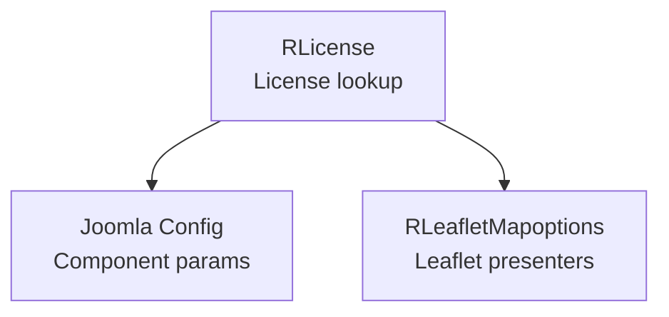
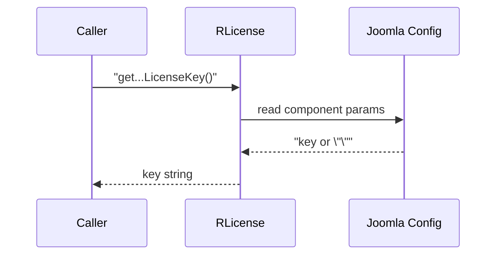

# license Module - High Level Design

## Overview

The `license` module provides license key management for map providers and external services. It retrieves API keys from Joomla configuration.

**Purpose**: License key management for external services.

**Key File**: `license/license.php`

## Component Architecture

## Public Interface

### RLicense
- **Static methods**:
  - `getBingMapKey()`
  - `getESRILicenseKey()`
  - `getOpenRoutingServiceKey()`
  - `getOrdnanceSurveyLicenseKey()`
  - `getMapBoxLicenseKey()`
  - `getThunderForestLicenseKey()`
  - `getW3WLicenseKey()`
- **Behavior**: Each helper reads the corresponding parameter from Joomla component configuration and returns an empty string when unset.

## Data Flow

## Integration Points

### Used By
- **RLeafletMapoptions** and map presenters needing provider credentials → [leaflet HLD](../leaflet/HLD.md#integration-points).

### Uses
- **Joomla configuration**: Reads component parameters to fetch stored keys.

### Data Sources
- **Site configuration**: Stored API/secret keys for map providers.

### Display Layer
- None; values are consumed by other PHP classes for client bootstraps.

### Joomla Integration
- **Component params**: Retrieves keys via `JComponentHelper` (through configuration accessors).

### Vendor Library Integration
- **Map providers**: Keys feed into Leaflet map options for Bing, ESRI, OS, MapBox, ThunderForest, ORS, and W3W integrations.

### Media Asset Relationships
- None directly; keys enable downstream asset/service calls in Leaflet presenters.

## Performance Observations
- **Lightweight**: Simple config lookups; negligible overhead.
- **Caching**: Relies on Joomla config caching; repeated calls are inexpensive.

## Error Handling
- **Missing keys**: Return empty strings, allowing callers to disable related features gracefully.
- **Config access issues**: Fall back to empty string without throwing.

## References

- `license/license.php` - License key management
- [leaflet HLD](../leaflet/HLD.md) - License key usage

