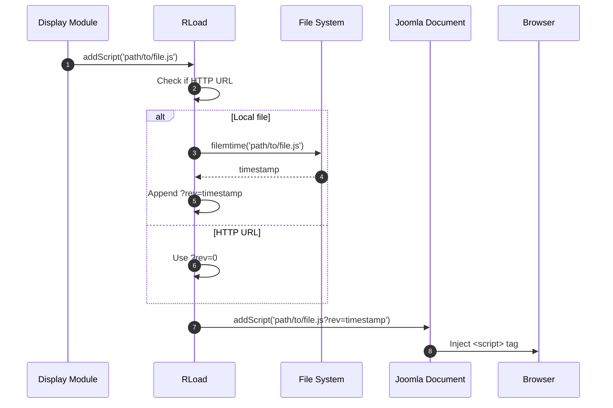

# load Module - High Level Design

## Overview

The `load` module provides asset loading utilities with cache-busting support. It wraps Joomla's document asset loading with automatic versioning based on file modification times. Used by all display modules to enqueue JavaScript and CSS assets.

**Purpose**: Asset loading with cache-busting for JavaScript and CSS.

**Key Responsibilities**:
- Load JavaScript files with versioning
- Load CSS files with versioning
- Generate cache-busting query strings from file mtimes
- Integrate with Joomla document system

## Component Architecture

```mermaid
flowchart TB
    subgraph Load["Load Module"]
        RLoad[RLoad<br/>Static utility class]
    end

    subgraph Functions["Functions"]
        AddScript[addScript<br/>Load JS]
        AddStyleSheet[addStyleSheet<br/>Load CSS]
    end

    subgraph Integration["Integration"]
        JoomlaDoc[Joomla Document<br/>addScript/addStyleSheet]
        DisplayModules[Display Modules<br/>Asset loading]
    end

    subgraph CacheBusting["Cache Busting"]
        FileMtime[filemtime()<br/>Get modification time]
        QueryString[?rev=timestamp<br/>Version query]
    end

    RLoad --> AddScript
    RLoad --> AddStyleSheet
    AddScript --> FileMtime
    AddStyleSheet --> FileMtime
    FileMtime --> QueryString
    AddScript --> JoomlaDoc
    AddStyleSheet --> JoomlaDoc
    DisplayModules --> RLoad
```

## Public Interface

### RLoad

**Static utility class for asset loading.**

#### JavaScript Loading
```php
public static function addScript($path, $type = "text/javascript")
```
- **Parameters**: 
  - `$path` - File path (relative or absolute, local or HTTP URL)
  - `$type` - Script type (default: "text/javascript")
- **Behavior**: 
  - Checks if path is HTTP URL (starts with "http")
  - If local file: gets `filemtime()` for cache-busting
  - If HTTP URL: uses `rev=0` (no cache-busting)
  - Appends `?rev=timestamp` query string
  - Calls `JFactory::getDocument()->addScript()`

#### CSS Loading
```php
public static function addStyleSheet($path, $type = "text/css")
```
- **Parameters**: 
  - `$path` - File path (relative or absolute, local or HTTP URL)
  - `$type` - Stylesheet type (default: "text/css")
- **Behavior**: 
  - Same cache-busting logic as `addScript()`
  - Calls `JFactory::getDocument()->addStyleSheet()`

## Data Flow

### Asset Loading Flow



## Integration Points

### Used By
- **All display modules** to enqueue scripts/styles with cache-busting.
- **RLeafletScript** for Leaflet assets → [leaflet HLD](../leaflet/HLD.md#integration-points).
- **RJsonwalksStdDisplay / RJsonwalksDisplaybase** for walk display assets → [jsonwalks/std HLD](../jsonwalks/std/HLD.md#integration-points), [jsonwalks HLD](../jsonwalks/HLD.md#integration-points).
- **Media modules** (accounts, organisation, jsonwalks, leaflet) to load their entry-point JS → see corresponding `media/*/HLD.md` files.

### Uses
- **Joomla Document** via `JFactory::getDocument()->addScript/addStyleSheet`.
- **Filesystem**: `filemtime()` to derive `rev` query for local files.

### Data Sources
- **Asset paths** supplied by callers; may be local or remote URLs.

### Display Layer
- **Server-side** only; outputs `<script>`/`<link>` tags into the Joomla document.

### Joomla Integration
- **Document pipeline**: Inserts cache-busted URLs respecting Joomla base paths; remote URLs default to `rev=0`.

### Vendor Library Integration
- Indirect; loads vendor bundles referenced by callers (e.g., Leaflet, cvList) but does not own vendor logic.

### Media Asset Relationships
- **Server → Client**: Callers provide asset paths; `RLoad` appends `?rev=<mtime>` for local files before Joomla emits them to the browser.

## Examples

### Example 1: Load JavaScript

```php
RLoad::addScript('media/lib_ramblers/js/ra.js');
// Results in: <script src="media/lib_ramblers/js/ra.js?rev=1234567890"></script>
```

### Example 2: Load CSS

```php
RLoad::addStyleSheet('media/lib_ramblers/css/ramblerslibrary.css');
// Results in: <link rel="stylesheet" href="...?rev=1234567890" />
```

### Example 3: Load External Script (No Cache-Busting)

```php
RLoad::addScript('https://unpkg.com/leaflet@1.9.4/dist/leaflet.js');
// Results in: <script src="https://...?rev=0"></script>
```

### Example 4: Custom Type

```php
RLoad::addScript('media/custom/module.js', 'module');
// Results in: <script type="module" src="...?rev=timestamp"></script>
```

## Performance Observations

### Cache-Busting Performance
- **File System Calls**: `filemtime()` called for each local asset (fast)
- **Query String**: Adds minimal overhead to URL
- **Browser Caching**: Effective cache invalidation on file changes

### Optimization Opportunities
1. **Batch File Checks**: Check multiple files in single operation
2. **Version File**: Use single version file instead of per-file mtimes
3. **Build-Time Versioning**: Embed version at build time

## Error Handling

### File Errors
- **Missing Files**: `filemtime()` returns false, uses `rev=0` (graceful)
- **HTTP URLs**: Always uses `rev=0` (no file system access)

### Joomla Integration
- **Document Errors**: Handled by Joomla (graceful degradation)

## References

### Related HLD Documents
- [jsonwalks HLD](../jsonwalks/HLD.md) - Asset loading usage
- [jsonwalks/std HLD](../jsonwalks/std/HLD.md) - Display asset loading
- [leaflet HLD](../leaflet/HLD.md) - Map asset loading

### Key Source Files
- `load/load.php` - RLoad class

