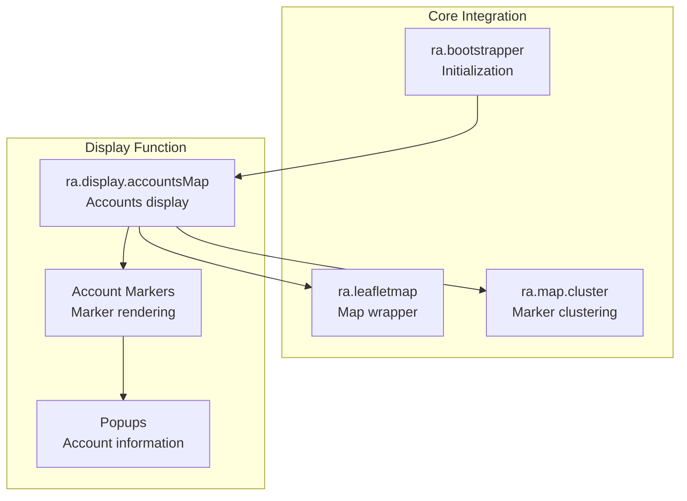
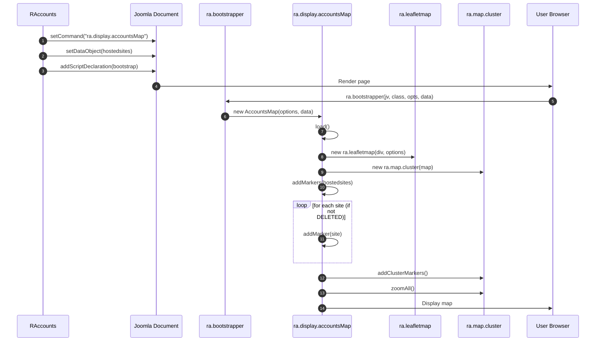

# media/accounts Module - High Level Design

## Overview

The `media/accounts` module provides client-side JavaScript for displaying hosted site account information on Leaflet maps. It renders account markers with status-based styling and popup information.

**Purpose**: Client-side accounts map display with hosted site markers.

**Key Responsibilities**:
- Display hosted site accounts as map markers
- Provide marker clustering for large datasets
- Show account information in popups
- Support status-based marker styling

## Component Architecture



## Public Interface

### ra.display.accountsMap

**Accounts map display function.**

#### Constructor
```javascript
ra.display.accountsMap(options, data)
```
- **Parameters**: 
  - `options` - Map configuration object
  - `data` - Accounts data object with:
    - `hostedsites` - Array of hosted site objects
    - Each site has: `domain`, `code`, `status`, `latitude`, `longitude`, `groupname`, `areaname`

#### Initialization Method
```javascript
this.load()
```
- **Behavior**: 
  - Creates Leaflet map instance
  - Initializes marker clustering
  - Adds account markers (filters out DELETED status)
  - Zooms to fit all markers

#### Marker Methods
```javascript
this.addMarkers(websites) // Add all account markers
this.addMarker(item) // Add individual marker
```

**Marker Styling**:
- **Area markers** (2-character code): Different icon/color
- **Group markers** (longer code): Group icon/color
- **Status filtering**: DELETED accounts not displayed
- **Popups**: Show domain, code, area, group, status

## Data Flow

### Accounts Map Initialization



## Integration Points

### PHP Integration
- **RAccounts**: Provides account data → [accounts HLD](../../accounts/HLD.md)
- **RLeafletMap**: Provides map options → [leaflet HLD](../../leaflet/HLD.md)

### Core JavaScript Integration
- **ra.js**: Core utilities → [media/js HLD](../js/HLD.md)
- **ra.leafletmap.js**: Map wrapper → [media/leaflet HLD](../leaflet/HLD.md)
- **ra.map.cluster**: Marker clustering → [media/leaflet HLD](../leaflet/HLD.md)

## Media Dependencies

### JavaScript File

#### `media/accounts/accounts.js`
- **Purpose**: Accounts map display
- **Dependencies**: `ra.js`, `ra.leafletmap.js`, Leaflet.js
- **Size**: 69+ lines
- **Key Features**: 
  - Account marker rendering
  - Status-based filtering
  - Marker clustering
  - Popup content generation

### CSS Dependencies
- `media/css/ramblerslibrary.css` - Base styles
- `media/leaflet/ramblersleaflet.css` - Leaflet styles

## Examples

### Example 1: Basic Accounts Display

```javascript
// Initialized automatically by PHP
ra.bootstrapper(
    "4.0.0",
    "ra.display.accountsMap",
    '{"divId":"accounts123","cluster":true}',
    '{"hostedsites":[...]}'
);
```

## References

### Related HLD Documents
- [accounts HLD](../../accounts/HLD.md) - PHP accounts integration
- [media/leaflet HLD](../leaflet/HLD.md) - Leaflet JavaScript
- [media/js HLD](../js/HLD.md) - Core JavaScript library

### Key Source Files
- `media/accounts/accounts.js` - Accounts display (69+ lines)


