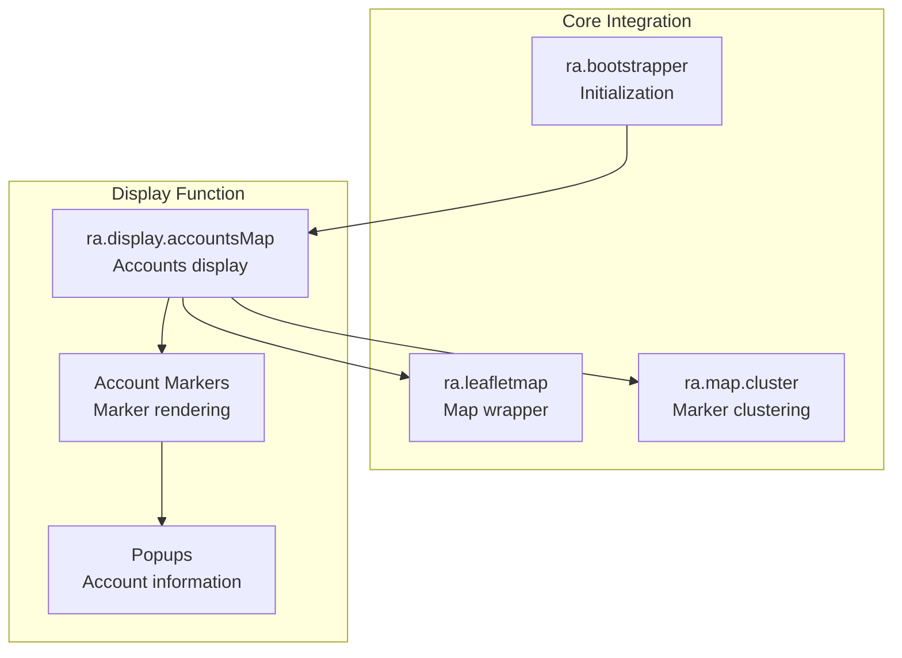
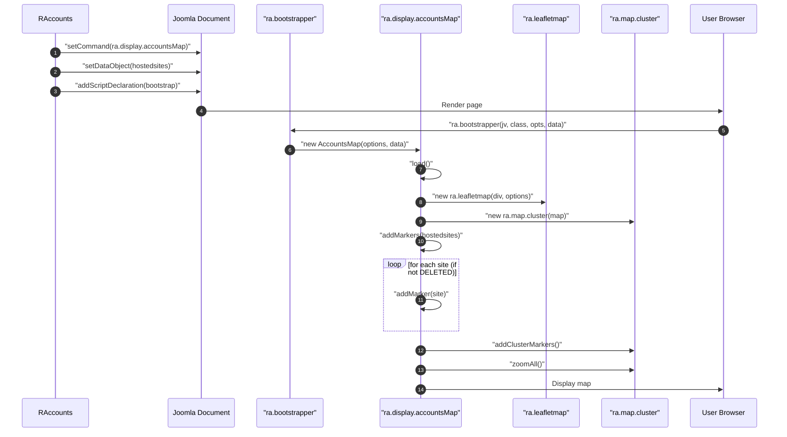
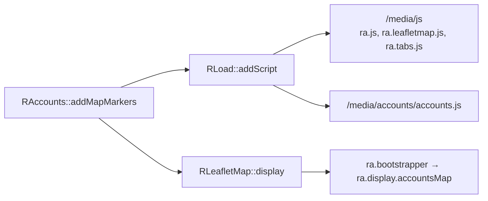

# media/accounts Module - High Level Design

## Overview

The `media/accounts` module provides client-side JavaScript for displaying hosted site account information on Leaflet maps. It renders account markers with status-based styling and popup information.

**Purpose**: Client-side accounts map display with hosted site markers.

**Key Responsibilities**:
- Display hosted site accounts as map markers
- Provide marker clustering for large datasets
- Show account information in popups
- Support status-based marker styling

## Component Architecture



## Public Interface

### ra.display.accountsMap

**Accounts map display function.**

#### Constructor
```javascript
ra.display.accountsMap(options, data)
```
- **Parameters**: 
  - `options` - Map configuration object
  - `data` - Accounts data object with:
    - `hostedsites` - Array of hosted site objects
    - Each site has: `domain`, `code`, `status`, `latitude`, `longitude`, `groupname`, `areaname`

#### Initialization Method
```javascript
this.load()
```
- **Behavior**: 
  - Creates Leaflet map instance
  - Initializes marker clustering
  - Adds account markers (filters out DELETED status)
  - Zooms to fit all markers

#### Marker Methods
```javascript
this.addMarkers(websites) // Add all account markers
this.addMarker(item) // Add individual marker
```

**Marker Styling**:
- **Area markers** (2-character code): Different icon/color
- **Group markers** (longer code): Group icon/color
- **Status filtering**: DELETED accounts not displayed
- **Popups**: Show domain, code, area, group, status

## Data Flow

### Accounts Map Initialization



## Integration Points

### Used By
- **RAccounts::addMapMarkers()**: PHP helper that sets the map command/data and renders the hosted sites map → [accounts HLD](../../accounts/HLD.md#integration-points).

### Uses
- **RLoad**: Enqueues `/media/accounts/accounts.js` plus `/media/js` foundations → [load HLD](../../load/HLD.md#integration-points).
- **RLeafletMap**: Provides map options, command, and JSON payload to the browser → [leaflet HLD](../../leaflet/HLD.md#integration-points).
- **ra.map.cluster**: Clustering helper for marker aggregation → [media/leaflet HLD](../leaflet/HLD.md#integration-points).

### Data Sources
- **Hosted site dataset**: Domain, code, status, group/area names, and coordinates supplied by `RAccounts` → [accounts HLD](../../accounts/HLD.md#data-flow).

### Display Layer
- **Client renderer**: `ra.display.accountsMap` adds markers/popups on `ra.leafletmap` → [media/leaflet HLD](../leaflet/HLD.md#display-layer).

### Joomla Integration
- **Document pipeline**: Assets and bootstrapper injected into `JDocument` through `RLoad` and `RLeafletMap::display()`.

### Vendor Library Integration
- **Leaflet.js** and **Leaflet.markercluster** for mapping and clustering.

### Media Asset Relationships (Server → Client)



`RAccounts::addMapMarkers()` pushes the `/media/js` foundation and `/media/accounts/accounts.js` through `RLoad`. `RLeafletMap::display()` then emits the bootstrapper command so the browser instantiates `ra.display.accountsMap` with the injected JSON data.

### PHP Integration
- **Asset enqueue**: `RAccounts::addMapMarkers()` calls `RLoad::addScript()` for `/media/js/ra.js`, `/media/js/ra.leafletmap.js`, `/media/js/ra.tabs.js`, and `/media/accounts/accounts.js` before delegating to `RLeafletMap::display()`.

### Core JavaScript Integration
- **Entry point**: `ra.display.accountsMap` consumes the JSON payload and map options provided by `RLeafletMap` and uses `ra.leafletmap` plus `ra.map.cluster` for rendering.

### Key Features (`media/accounts/accounts.js`)
- Marker clustering and status-aware styling for hosted sites.
- Popups listing domain, code, area, group, and status from PHP-injected JSON.
- Automatic zoom-to-bounds after rendering the marker set.
- Uses `ra.leafletmap` and `ra.map.cluster` to keep display logic concise.


## Examples

### Example 1: Basic Accounts Display

```javascript
// Initialized automatically by PHP
ra.bootstrapper(
    "4.0.0",
    "ra.display.accountsMap",
    '{"divId":"accounts123","cluster":true}',
    '{"hostedsites":[...]}'
);
```

## Performance Observations
- **Clustering** reduces DOM load for large hosted-site sets and keeps interaction responsive.
- **Data volume** is typically small (one marker per site); performance impact is dominated by Leaflet tile loading.
- **Asset reuse** leverages cached `/media/js` foundations, minimizing load time.

## Error Handling
- **Missing or invalid coordinates**: Entries without coordinates are skipped to avoid map errors.
- **Empty datasets**: The map initializes and displays no markers without failing.
- **Bootstrap issues**: `ra.display.accountsMap` validates required data and surfaces errors if the command or container is missing.

## References

### Related HLD Documents
- [accounts HLD](../../accounts/HLD.md) - PHP accounts integration
- [media/leaflet HLD](../leaflet/HLD.md) - Leaflet JavaScript
- [media/js HLD](../js/HLD.md) - Core JavaScript library

### Key Source Files
- `media/accounts/accounts.js` - Accounts display (69+ lines)
