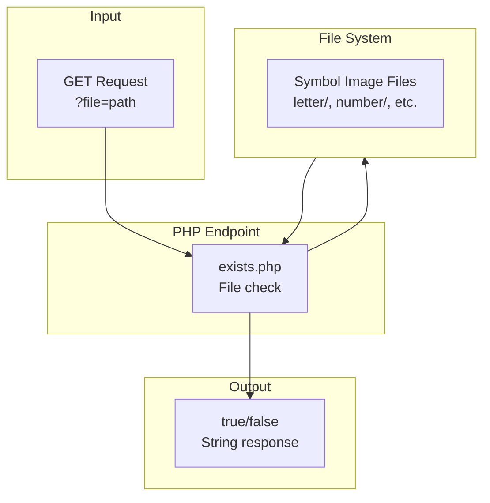
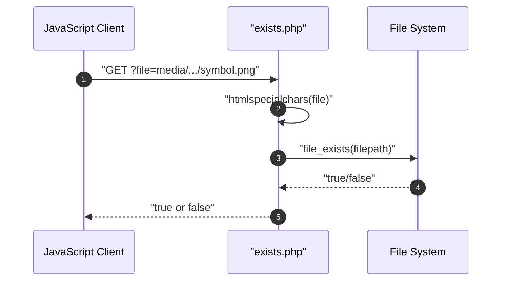
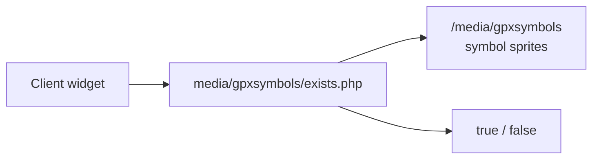

# media/gpxsymbols Module - High Level Design

## Overview

The `media/gpxsymbols` module provides a PHP endpoint for checking GPX symbol file existence. It's used by the GPX symbol display system to verify if symbol image files are available before attempting to display them.

**Purpose**: GPX symbol existence checking endpoint.

**Key Responsibilities**:
- Check if GPX symbol files exist
- Return boolean response (true/false)
- Sanitize file path input
- Provide safe file existence checking

## Component Architecture



## Public Interface

### exists.php

**File existence check endpoint.**

#### Request
```
GET /media/lib_ramblers/gpxsymbols/exists.php?file=<filepath>
```

#### Parameters
- `file` - File path to check (relative or absolute)

#### Response
- `"true"` - File exists
- `"false"` - File does not exist

#### Behavior
1. Receives GET parameter `file`
2. Sanitizes input with `htmlspecialchars()`
3. Checks file existence with `file_exists()`
4. Returns "true" or "false" as plain text

## Data Flow

### Symbol Existence Check Flow



## Integration Points

### Used By
- **GPX renderers and symbol widgets**: Client code that needs to confirm an icon exists before referencing it → [gpxsymbols HLD](../../gpxsymbols/HLD.md#integration-points).

### Uses
- **PHP filesystem**: `file_exists()` for local symbol folders (no additional module dependency).

### Data Sources
- **Query string**: `file` parameter specifying the symbol path to validate (input from client widgets consuming GPX symbols) → [gpxsymbols HLD](../../gpxsymbols/HLD.md#integration-points).

### Display Layer
- **Client callers**: JavaScript or PHP widgets consume the boolean response to decide whether to display a symbol.

### Joomla Integration
- **Direct endpoint**: Runs within Joomla’s PHP runtime without additional dependencies.

### Vendor Library Integration
- None.

### Media Asset Relationships (Server → Client)



`exists.php` responds synchronously with a boolean string so client code can decide whether to reference a given symbol image under `/media/gpxsymbols/*`.

### Key Features (`exists.php`)
- Sanitizes incoming file paths before checking the filesystem.
- Returns plain-text `"true"`/`"false"` for easy consumption by PHP or JavaScript.
- Supports all symbol families under `/media/lib_ramblers/gpxsymbols/*` without code changes.

## Examples

### Example 1: Check Symbol Existence

```javascript
// JavaScript check
fetch('media/lib_ramblers/gpxsymbols/exists.php?file=media/lib_ramblers/gpxsymbols/letter/a.png')
    .then(response => response.text())
    .then(result => {
        if (result === "true") {
            // Symbol exists, display it
        } else {
            // Symbol not found, use default
        }
    });
```

## Performance Observations

### File System Checks
- **Fast**: `file_exists()` is fast for local files
- **No Caching**: Each request checks file system
- **Network Overhead**: Minimal (small response)

### Optimization Opportunities
1. **Response Caching**: Cache existence checks client-side
2. **Batch Checking**: Check multiple symbols in single request
3. **Symbol Manifest**: Pre-generate list of available symbols

## Error Handling

### Input Validation
- **Sanitization**: `htmlspecialchars()` prevents XSS
- **Path Validation**: No path traversal protection (consider adding)

### File System Errors
- **Missing Files**: Returns "false" (graceful)
- **Permission Errors**: May return false or error (depends on PHP config)

## References

### Related HLD Documents
- [gpxsymbols HLD](../../gpxsymbols/HLD.md) - GPX symbols PHP module
- [media/leaflet HLD](../leaflet/HLD.md) - GPX map display

### Key Source Files
- `media/gpxsymbols/exists.php` - Existence check endpoint (18 lines)
