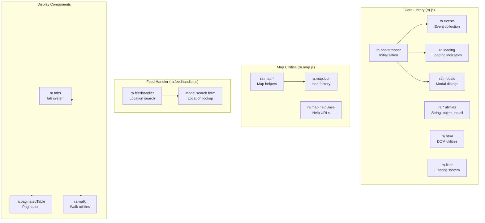
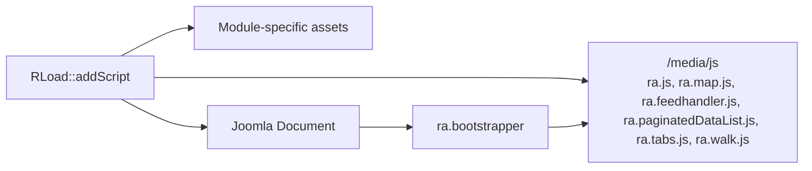
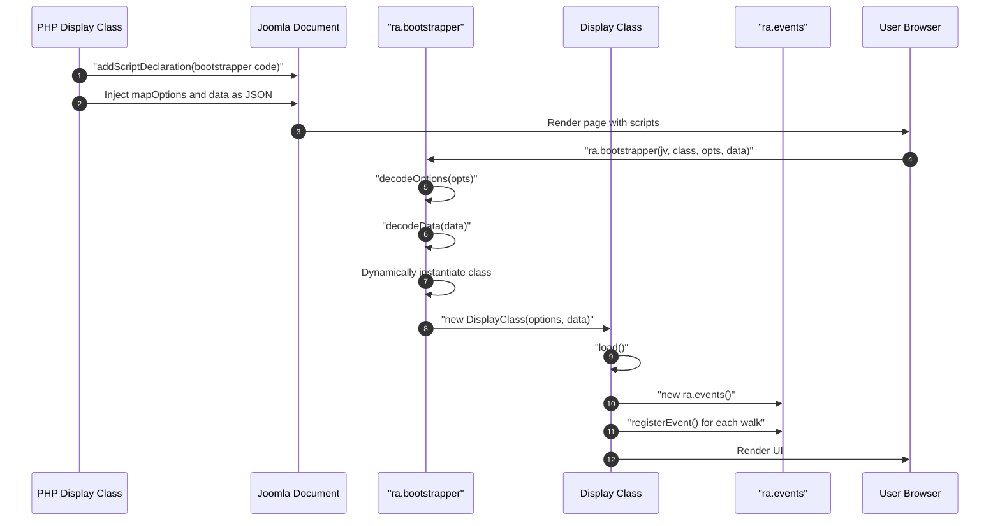
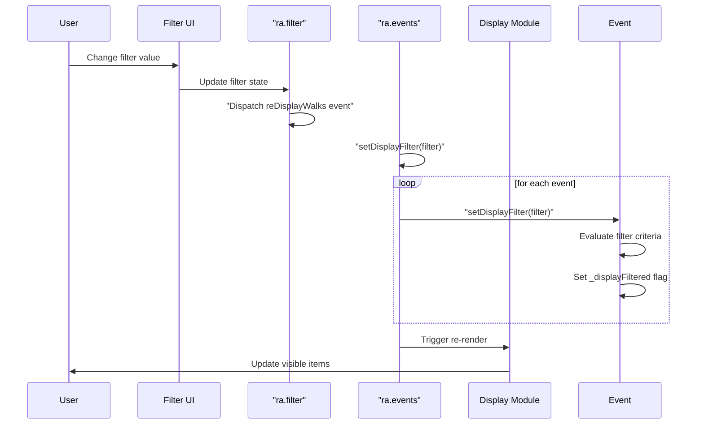

# media/js Module - High Level Design

## Overview

The `media/js` module provides the core JavaScript library (`ra.*` namespace) that serves as the foundation for all client-side functionality in the Ramblers Library. It includes bootstrapping, utility functions, event management, map utilities, feed handling, pagination, tabs, and walk-specific functionality.

**Purpose**: Core JavaScript foundation library providing bootstrapping, utilities, and shared functionality.

**Key Responsibilities**:
- Application bootstrapping and initialization
- Core utility functions (string manipulation, object comparison, email handling)
- Event management system
- Map utilities and icon management
- Feed data handling and location search
- Pagination and tab functionality
- Walk/event domain objects and filtering

## Component Architecture



## Integration Points

## Integration Points

### Used By
- **Display modules**: `RJsonwalksStdDisplay`, `RAccounts`, `ROrganisation`, `RWalkseditor`, Leaflet GPX/table/map presenters, and other PHP helpers enqueue `/media/js` as the shared base library → see module HLDs: [jsonwalks/std HLD](../../jsonwalks/std/HLD.md#integration-points), [accounts HLD](../../accounts/HLD.md#integration-points), [organisation HLD](../../organisation/HLD.md#integration-points), [leaflet HLD](../../leaflet/HLD.md#integration-points), [walkseditor HLD](../../walkseditor/HLD.md#integration-points).

### Uses
- **RLoad**: Publishes the `/media/js` stack (bootstrapper, map helpers, feed handler, pagination, tabs, walk utilities) into `JDocument` → [load HLD](../../load/HLD.md#integration-points).
- **Bootstrapper**: `ra.bootstrapper` instantiates requested display classes (e.g., `ra.display.walksTabs`, `ra.display.accountsMap`) based on PHP-injected command/data.
- **Map utilities**: `ra.leafletmap` and `ra.map.*` are consumed by map-enabled bundles across `/media/*` → [media/leaflet HLD](../leaflet/HLD.md#integration-points).
- **Pagination/Tabs/Walk utilities**: `ra.paginatedDataList`, `ra.tabs`, `ra.walk`, and `ra.feedhandler` are reused by walk displays and the walkseditor → [media/jsonwalks HLD](../jsonwalks/HLD.md#integration-points), [media/walkseditor HLD](../walkseditor/HLD.md#integration-points).

### Data Sources
- **PHP data payloads**: Command/data objects injected by server-side display classes for walks, accounts, organisations, and GPX payloads → [jsonwalks HLD](../../jsonwalks/HLD.md#data-flow), [accounts HLD](../../accounts/HLD.md#data-flow), [organisation HLD](../../organisation/HLD.md#data-flow), [leaflet/gpx HLD](../../leaflet/gpx/HLD.md#data-flow).

### Display Layer
- **Client-side renderers**: All `/media/*` display entry points rely on `ra.*` utilities for bootstrapping, filtering, pagination, and map helpers → see specific module HLDs such as [media/jsonwalks HLD](../jsonwalks/HLD.md#display-layer), [media/accounts HLD](../accounts/HLD.md#display-layer), [media/leaflet HLD](../leaflet/HLD.md#display-layer), [media/walkseditor HLD](../walkseditor/HLD.md#display-layer).

### Joomla Integration
- **Document pipeline**: `RLoad::addScript()` injects cache-busted core scripts into `JDocument` before module-specific assets.

### Vendor Library Integration
- **cvList**: Pagination backbone for `ra.paginatedDataList` → [media/vendors HLD](../vendors/HLD.md#integration-points).
- **FullCalendar**: Calendar view support (consumed by walk displays) → [media/vendors HLD](../vendors/HLD.md#integration-points).
- **Leaflet.js**: Map foundation referenced by `ra.leafletmap` and map helpers → [media/leaflet HLD](../leaflet/HLD.md#integration-points).

## Data Flow

### Server-to-Client Asset Relationship



Server-side modules enqueue the shared `/media/js` stack via `RLoad` alongside their own assets (e.g., `/media/accounts/accounts.js`). `JDocument` emits the bootstrap script that calls `ra.bootstrapper`, which then instantiates the requested display class and consumes the previously enqueued `/media/js` bundles.

## Key Features
- Unified bootstrapper (`ra.bootstrapper`) for all Ramblers client displays.
- Shared utilities for events, loading indicators, modals, filtering, and DOM helpers.
- Map helpers (`ra.map.*`, `ra.leafletmap`) and icon factories consumed across map-enabled modules.
- Pagination and tab primitives reused by walk displays and the walkseditor.

## Public Interface

### ra.js - Core Library

#### Bootstrapping
```javascript
ra.bootstrapper(jversion, displayClass, mapOptions, _data)
```
- **Parameters**: 
  - `jversion` - Joomla version string
  - `displayClass` - JavaScript class name to instantiate (e.g., "ra.display.walksTabs")
  - `mapOptions` - JSON string of map options
  - `_data` - JSON string of data object
- **Behavior**: 
  - Decodes options and data
  - Dynamically instantiates display class
  - Calls `display.load()` method
  - Manages loading indicators

#### Core Utilities
```javascript
ra.baseDirectory() // Returns base directory path
ra.joomlaVersion() // Returns Joomla version
ra.joomlaMajorVersion() // Returns major version number
ra.uniqueID() // Generates unique ID
ra.decodeOptions(value) // Decodes JSON options
ra.decodeData(value) // Decodes JSON data
ra.titleCase(str) // Converts to title case
ra.capitalizeFirstLetter(str) // Capitalizes first letter
ra.contains(items, item) // Checks if array contains equivalent item
ra.isEquivalent(a, b) // Deep object comparison
ra.fetch_mails(text) // Extracts email addresses
ra.convert_mails(text) // Obfuscates emails with image
```

#### Error Handling
```javascript
ra.showMsg(msg) // Shows information modal
ra.showError(msg, title) // Shows error modal
ra.showConfirm(msg) // Shows confirmation dialog
ra.showPrompt(msg) // Shows prompt dialog
ra.checkLoadingErrors() // Checks for failed resource loads
```

#### Event System
```javascript
ra.events() // Event collection manager
  - registerEvent(event) // Register walk/event
  - getEvent(id) // Get event by ID
  - forEachAll(fcn) // Iterate all events
  - forEachFiltered(fcn) // Iterate filtered events
  - setAllWalks() // Show all events
  - setDisplayFilter() // Apply filters
  - setFilters(tag) // Create filter UI
  - filteredEvents() // Get filtered array
  - getNoEventsToDisplay() // Count filtered
  - hasBookings() // Check for bookings
```

#### Loading System
```javascript
ra.loading.start() // Show loading indicator
ra.loading.stop() // Hide loading indicator
```

#### Modal System
```javascript
ra.modals.createModal(content, closable) // Create modal dialog
```

#### HTML Utilities
```javascript
ra.html.generateTags(parent, tags) // Generate DOM structure
ra.html.toggleVisibility(id) // Toggle element visibility
```

#### Filter System
```javascript
ra.filter(document, eventName) // Create filter instance
  - addFilter(name, options) // Add filter field
  - getFilter() // Get current filter state
```

### ra.map.js - Map Utilities

#### Map Helpers
```javascript
ra.map.getMapLink(latitude, longitude, text) // Generate Google Maps link
ra.map.helpBase // Base URL for help pages
ra.map.helpNaismith // Naismith rule help URL
```

#### Icon Factory
```javascript
ra.map.icon.postcode() // Postcode icon
ra.map.icon.postcodeClosest() // Closest postcode icon
ra.map.icon.redmarker() // Red marker icon
ra.map.icon.s0() through ra.map.icon.s4() // Star rating icons
```

### ra.feedhandler.js - Feed Handler

#### Location Search
```javascript
ra.feedhandler() // Feed handler instance
  - modalSearchForm(eventTag) // Create modal search form
  - getSearchTags(eventTag, contentTag) // Build search UI
  - getPossibleMapLocations(data) // Search for locations
  - setUpSelectTagForMapSearch(...) // Display search results
```

**Features**:
- UK-only search option
- Supports OS Grid Reference, postcode, place name, W3W
- Geocoding via external services
- Location selection with event dispatch

### ra.tabs.js - Tab System

```javascript
ra.tabs(tag, options) // Create tab interface
  - display() // Show initial tab
  - getStaticContainer(id) // Get static tab container
  - getDynamicContainer() // Get dynamic container
  - changeTabTitle(tabId, newTitle) // Update tab title
```

**Options**:
- `style.side` - 'left' or 'right'
- `style.vert` - 'above', 'middle', or 'below'
- `style.size` - 'normal', 'medium', or 'small'
- `tabs` - Object defining tabs with titles and containers

### ra.paginatedDataList.js - Pagination

```javascript
ra.paginatedTable(tag, userOptions) // Create paginated table
  - setFormat(format) // Set column format
  - setData(data) // Set table data
  - addFilter(format) // Add filter fields
```

**Features**:
- Client-side pagination
- Configurable items per page
- Filter support
- Top and bottom pagination controls

### ra.walk.js - Walk Utilities

```javascript
ra.walk.registerEvent(event) // Register walk globally
ra.walk.displayUrlWalkPopup() // Handle URL walk parameter
ra.event() // Walk/event object
  - convertPHPWalk(phpwalk) // Convert PHP walk to JS
  - setDisplayFilter(filter) // Apply display filter
  - getWalkValue(option) // Get formatted value
```

## Data Flow

### Initialization Flow



### Event Filtering Flow



## Integration Points

### PHP Integration
- **RLeafletScript**: Injects bootstrapper code and data → [leaflet HLD](../../leaflet/HLD.md)
- **RJsonwalksStdDisplay**: Provides walk data for JavaScript → [jsonwalks/std HLD](../../jsonwalks/std/HLD.md)
- **RLoad**: Loads JavaScript files with cache-busting → [load HLD](../../load/HLD.md)

### JavaScript Module Integration
- **Display Modules**: All display modules extend ra.* namespace
  - `ra.display.walksTabs` → [media/jsonwalks HLD](../jsonwalks/HLD.md)
  - `ra.display.organisationMap` → [media/organisation HLD](../organisation/HLD.md)
  - `ra.display.accountsMap` → [media/accounts HLD](../accounts/HLD.md)
- **Leaflet Integration**: `ra.leafletmap` → [media/leaflet HLD](../leaflet/HLD.md)
- **Vendor Libraries**: Integrates with cvList, FullCalendar, etc.

### Browser APIs
- **Performance API**: `performance.getEntriesByType("resource")` for error checking
- **DOM APIs**: Standard DOM manipulation
- **Fetch API**: Location search (via feedhandler)

## Media Dependencies

### No External Dependencies

The core library is self-contained but integrates with:
- **Vendor Libraries**: cvList (pagination), FullCalendar (calendar view)
- **Leaflet.js**: Map functionality (loaded separately)
- **Joomla jQuery**: May be used by some components

## Examples

### Example 1: Basic Bootstrap

```javascript
// Called automatically by PHP-injected script
ra.bootstrapper(
    "4.0.0",                    // Joomla version
    "ra.display.walksTabs",     // Display class
    '{"divId":"map123",...}',   // Map options JSON
    '{"walks":[...]}'           // Walk data JSON
);
```

### Example 2: Event Registration

```javascript
var events = new ra.events();
var walk = new ra.event();
walk.convertPHPWalk(phpWalkData);
events.registerEvent(walk);
events.setAllWalks();
```

### Example 3: Tab Creation

```javascript
var tabs = new ra.tabs(container, {
    style: {side: 'left', vert: 'above', size: 'normal'},
    tabs: {
        list: {title: "List", staticContainer: true},
        map: {title: "Map", staticContainer: true}
    }
});
tabs.display();
```

### Example 4: Location Search

```javascript
var feedhandler = new ra.feedhandler();
feedhandler.modalSearchForm(eventTag);
eventTag.addEventListener("locationfound", function(e) {
    var location = e.raData.item;
    // Use location coordinates
});
```

## Performance Observations

### Initialization
- **Bootstrapper**: Fast dynamic class instantiation
- **Data Decoding**: JSON.parse for options and data (may be large)
- **Event Registration**: Linear O(n) for walk registration

### Filtering
- **Client-Side**: All filtering done in browser (fast for <1000 items)
- **No Server Round-Trip**: Instant filter response
- **Memory**: All events held in memory

### Optimization Opportunities
1. **Lazy Loading**: Load display modules on-demand
2. **Virtual Scrolling**: For large event lists
3. **Web Workers**: Move heavy filtering to worker thread
4. **Data Compression**: Compress JSON payloads

## Error Handling

### Bootstrap Errors
- **Missing Class**: Shows error modal, stops initialization
- **Invalid Data**: JSON parse errors caught, shows error
- **Missing Container**: Checks for divId, shows error if missing

### Resource Loading Errors
- **Failed Assets**: `checkLoadingErrors()` detects 4xx/5xx responses
- **Error Reporting**: Sends errors to server via `ra.errors.toServer()`

### User Errors
- **Invalid Input**: Validated by filter system
- **Location Search Failures**: Handled gracefully with error messages

## References

### Related HLD Documents
- [jsonwalks/std HLD](../../jsonwalks/std/HLD.md) - Display integration
- [media/jsonwalks HLD](../jsonwalks/HLD.md) - Display JavaScript
- [media/leaflet HLD](../leaflet/HLD.md) - Leaflet JavaScript
- [leaflet HLD](../../leaflet/HLD.md) - PHP Leaflet integration
- [load HLD](../../load/HLD.md) - Asset loading

### Key Source Files
- `media/js/ra.js` - Core library (2835+ lines)
- `media/js/ra.map.js` - Map utilities (587+ lines)
- `media/js/ra.feedhandler.js` - Feed handler (455+ lines)
- `media/js/ra.walk.js` - Walk utilities (2286+ lines)
- `media/js/ra.tabs.js` - Tab system (140+ lines)
- `media/js/ra.paginatedDataList.js` - Pagination (336+ lines)
