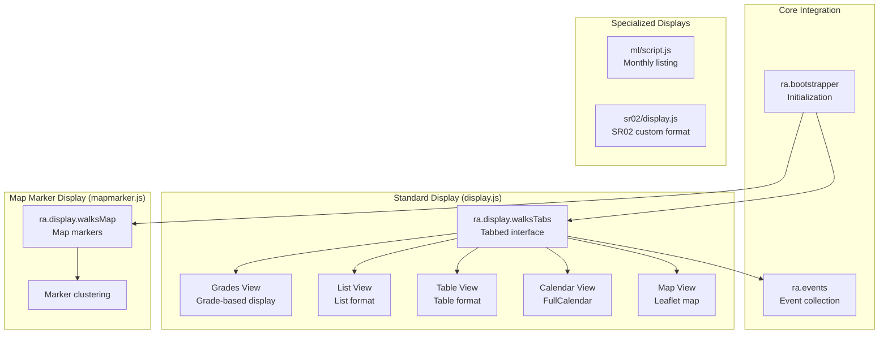
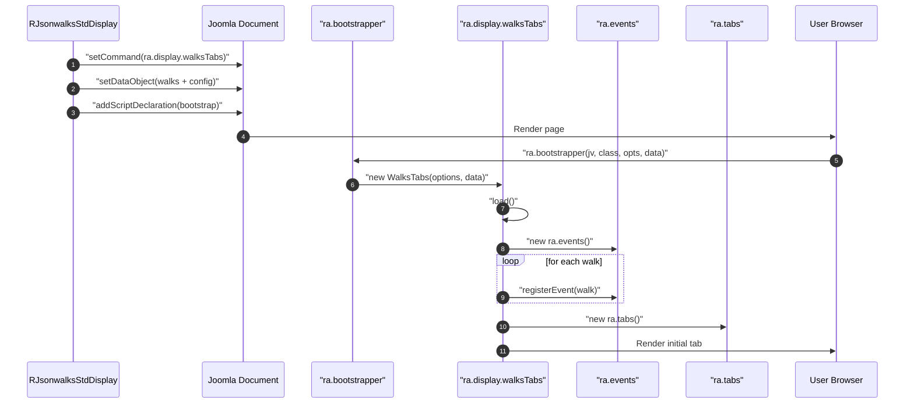
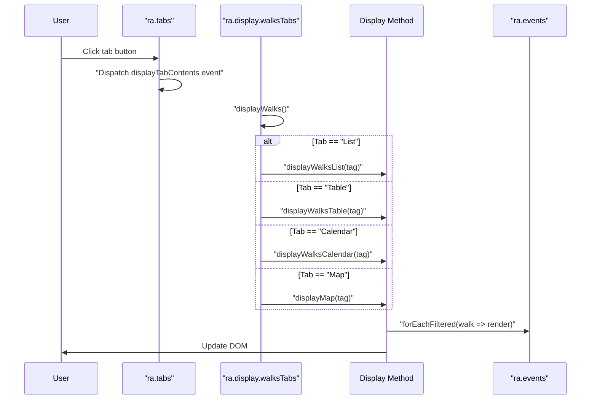
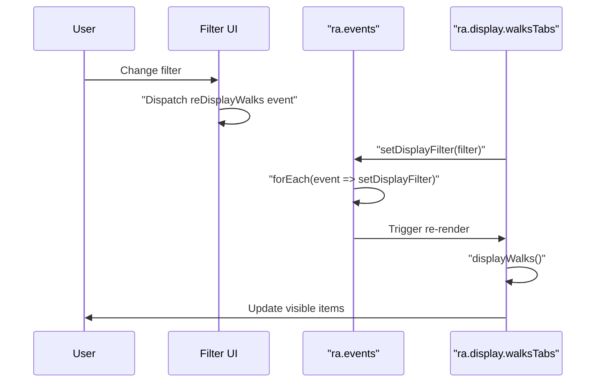
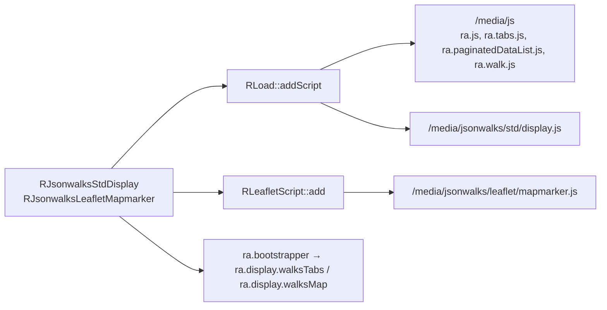

# media/jsonwalks Module - High Level Design

## Overview

The `media/jsonwalks` module provides client-side JavaScript for rendering walk displays. It includes the standard tabbed display system, map marker display, monthly listings, and specialized regional displays (SR02). These JavaScript modules work in conjunction with PHP display classes to provide interactive walk presentations.

**Purpose**: Client-side walk display rendering and interaction.

**Key Responsibilities**:
- Render walk data in multiple formats (List, Table, Calendar, Map, Grades)
- Provide tabbed interface for switching between views
- Handle walk filtering and pagination
- Display walk markers on maps
- Support specialized regional display formats

## Component Architecture



## Public Interface

### ra.display.walksTabs (display.js)

**Main tabbed display system for walks.**

#### Constructor
```javascript
ra.display.walksTabs(mapOptions, data)
```
- **Parameters**: 
  - `mapOptions` - Map configuration object
  - `data` - Walk data object with properties:
    - `walks` - Array of walk objects
    - `customTabOrder` - Tab order override
    - `customListFormat` - List format override
    - `customTableFormat` - Table format override
    - `customGradesFormat` - Grades format override
    - `customCalendarFormat` - Calendar format override
    - `legendposition` - Legend position
    - `displayClass` - CSS class for details view
    - `displayBookingsTable` - Show bookings table

#### Initialization Method
```javascript
this.load()
```
- **Behavior**: 
  - Creates DOM structure (filters, tabs, bookings)
  - Registers all walks as events
  - Sets up filter UI
  - Initializes tabs
  - Displays bookings table if enabled

#### Display Methods
```javascript
this.displayWalks() // Renders current tab view
this.displayWalksGrades(tag) // Grades view
this.displayWalksList(tag) // List view
this.displayWalksTable(tag) // Table view
this.displayWalksCalendar(tag) // Calendar view
this.displayMap(tag) // Map view
this.displayContacts(tag) // Contacts view
```

#### Configuration Properties
```javascript
this.settings = {
    walkClass: "walk",
    displayClass: "detailsView",
    displayStartTime: true,
    displayStartDescription: true,
    displayDetailsPrompt: true,
    tabOrder: ["Grades", "Table", "List", "Calendar", "Map"],
    tableFormat: [...],
    listFormat: [...],
    gradesFormat: [...],
    calendarFormat: [...],
    itemsPerPage: 20,
    displayBookingsTable: false
}
```

### ra.display.walksMap (mapmarker.js)

**Map marker display for walks.**

#### Constructor
```javascript
ra.display.walksMap(mapOptions, data)
```
- **Parameters**: 
  - `mapOptions` - Map configuration
  - `data` - Object with `walks` array and `legendposition`

#### Initialization Method
```javascript
this.load()
```
- **Behavior**: 
  - Creates map container and legend
  - Initializes Leaflet map
  - Creates marker cluster
  - Registers walks as events
  - Displays walk markers

#### Display Method
```javascript
this.displayWalks(walks)
```
- **Parameters**: `walks` - `ra.events` instance
- **Behavior**: 
  - Removes existing markers
  - Adds walk markers to cluster
  - Zooms to fit all markers

### ml/script.js - Monthly Listing

**Monthly listing display with print functionality.**

#### Functions
```javascript
mlSetButtons(id) // Sets up print and view toggle buttons
addPrintButton(tag) // Adds print button
```

**Features**:
- Toggle between "All walks" and "5 weeks" views
- Print functionality for walk listings
- CSS class-based show/hide (`ml-allwalks`, `ml-fivewalks`)

### sr02/display.js - SR02 Custom Display

**Specialized display format for SR02 region.**

#### Custom Format Functions
```javascript
displayCustomValues(option, walk) // Custom field rendering
  - {xdowddmm} - Date format
  - {xSymbol} - Picnic/Pub icon
  - {xNationalGrade} - Grade text
  - {xContact} - Contact name
  - {xGradeImg} - Grade image

gradeImage(nationalGrade) // Grade image URL
displayGradesRowClass(walk) // Row class for grades view
displayListRowClass(walk) // Row class for list view
displayTableRowClass(walk) // Row class for table view
```

**Features**:
- Custom field formats starting with `x`
- Picnic/Pub icon detection from notes
- Grade-based row styling
- Special styling for Linear Wednesday walks

## Data Flow

### Standard Display Initialization



### Tab Switching Flow



### Filtering Flow



## Integration Points

### Used By
- **RJsonwalksStdDisplay**: Provides walk data/config and enqueues `/media/jsonwalks/std/display.js` plus `/media/js` foundations via `RLoad::addScript()` → [jsonwalks/std HLD](../../jsonwalks/std/HLD.md#integration-points).
- **RJsonwalksLeafletMapmarker**: Provides marker data and loads `/media/jsonwalks/leaflet/mapmarker.js` alongside Leaflet via `RLeafletScript::add()` → [jsonwalks/leaflet HLD](../../jsonwalks/leaflet/HLD.md#integration-points).

### Uses
- **RLeafletScript**: Injects Leaflet core/plugins and the `ra.bootstrapper` declaration → [leaflet HLD](../../leaflet/HLD.md#integration-points).
- **RLoad**: Enqueues `/media/js` foundations (`ra.js`, `ra.tabs.js`, `ra.paginatedDataList.js`, `ra.walk.js`) before module scripts → [load HLD](../../load/HLD.md#integration-points).
- **ra.leafletmap + ra.map.cluster**: Map utilities consumed by `mapmarker.js` → [media/leaflet HLD](../leaflet/HLD.md#integration-points).

### Data Sources
- **Walk JSON payloads** from PHP presenters, including tab/list configuration and legend options → [jsonwalks/std HLD](../../jsonwalks/std/HLD.md#data-flow).
- **Map options** for clustering, bounds, and legend positioning provided by Leaflet presenters → [leaflet HLD](../../leaflet/HLD.md#data-flow).

### Display Layer
- **Client entry points**: `ra.display.walksTabs`, `ra.display.walksMap`, and mapmarker-specific displays → [media/js HLD](../js/HLD.md#public-interface).
- **Shared primitives**: `ra.events` filtering, `ra.tabs` layout, `cvList` pagination → [media/js HLD](../js/HLD.md#integration-points), [media/vendors HLD](../vendors/HLD.md#integration-points).

### Joomla Integration
- **Document pipeline**: PHP presenters set command/data on `JDocument`; `ra.bootstrapper` instantiates display classes with the injected JSON.

### Vendor Library Integration
- **FullCalendar** (`/media/vendors/fullcalendar-6.1.9/`) for calendar view.
- **cvList** (`/media/vendors/cvList/`) for pagination.
- **Leaflet.js** via `RLeafletScript` for map rendering.

### Media Asset Relationships (Server → Client)

### Server-to-Client Asset Relationship



`RJsonwalksStdDisplay` adds the shared `/media/js` stack and `/media/jsonwalks/std/display.js` through `RLoad`, while map presenters call `RLeafletScript::add()` to load Leaflet and `/media/jsonwalks/leaflet/mapmarker.js`. The emitted bootstrapper instantiates `ra.display.walksTabs` or `ra.display.walksMap` with the walk data payload.

### JavaScript Entry Points
- **Standard display**: `/media/jsonwalks/std/display.js` (`ra.display.walksTabs`)
- **Map display**: `/media/jsonwalks/leaflet/mapmarker.js` (`ra.display.walksMap`)
- **Monthly listing**: `/media/jsonwalks/ml/script.js`
- **SR02 display**: `/media/jsonwalks/sr02/display.js`
- **Key Features (shared)**: 
  - Print functionality and tabbed view toggling (All walks / 5 weeks)
  - Reuses `ra.events` for filtering and booking awareness
  - Consumes Leaflet and FullCalendar when those views are enabled

#### `media/jsonwalks/sr02/display.js`
- **Purpose**: SR02 custom display format
- **Dependencies**: `ra.js`, `ra.walk.js`
- **Size**: 95 lines
- **Key Features**: 
  - Custom field formats
  - Grade-based styling
  - Picnic/Pub icon detection

#### `media/jsonwalks/std/display.js`
- **Purpose**: Standard tabbed walk display
- **Dependencies**: `ra.js`, `ra.tabs.js`, `ra.paginatedDataList.js`, `ra.walk.js`, FullCalendar, cvList
- **Key Features**:
  - Tabbed Grades/Table/List/Calendar/Map views
  - Client-side filtering with `ra.events`
  - Pagination via cvList and optional bookings table rendering

#### `media/jsonwalks/leaflet/mapmarker.js`
- **Purpose**: Map marker display for walks
- **Dependencies**: `ra.js`, `ra.leafletmap.js`, Leaflet.js
- **Key Features**:
  - Clustered marker rendering with legend support
  - Zoom-to-bounds across all walk markers
  - Integrates with `ra.events` to keep filters in sync

#### `media/jsonwalks/ml/script.js`
- **Purpose**: Monthly listing with print controls
- **Dependencies**: `ra.js`, `ra.html`
- **Key Features**:
  - Adds print button/behavior for monthly views
  - Simple toggle between condensed and expanded layouts

## Examples

### Example 1: Standard Tabbed Display

```javascript
// Initialized automatically by PHP
ra.bootstrapper(
    "4.0.0",
    "ra.display.walksTabs",
    '{"divId":"walks123","cluster":true,"calendar":true}',
    '{"walks":[...],"customTabOrder":["List","Map"],"customListFormat":[...]}'
);
```

### Example 2: Map Marker Display

```javascript
// Initialized automatically by PHP
ra.bootstrapper(
    "4.0.0",
    "ra.display.walksMap",
    '{"divId":"map123","cluster":true}',
    '{"walks":[...],"legendposition":"top"}'
);
```

### Example 3: Custom Format (SR02)

```javascript
// Custom field rendering
var result = displayCustomValues("{xSymbol}", walk);
// Returns: '' if picnic detected
```

## Performance Observations

### Client-Side Rendering
- **Initial Load**: All walk data sent as JSON (can be large for 100+ walks)
- **Tab Switching**: Instant (no server round-trip)
- **Filtering**: Client-side (fast for <1000 walks)
- **Pagination**: Client-side (cvList library)

### Calendar View
- **FullCalendar**: Renders calendar with events (may be slow for 500+ events)
- **Event Rendering**: Each walk becomes calendar event

### Map Rendering
- **Marker Clustering**: Reduces DOM elements for large datasets
- **Zoom Performance**: Leaflet handles efficiently

### Optimization Opportunities
1. **Lazy Tab Loading**: Load tab content only when activated
2. **Virtual Scrolling**: For very large walk lists
3. **Data Compression**: Compress JSON payloads
4. **Incremental Loading**: Load walks in batches

## Error Handling

### Initialization Errors
- **Missing Container**: Bootstrap checks for divId, shows error if missing
- **Invalid Data**: JSON parse errors caught, shows error modal
- **Missing Display Class**: Shows error if class not found

### Display Errors
- **No Walks**: Shows "Sorry there are no walks at the moment"
- **No Filtered Walks**: Shows "Sorry, but no walks meet your filter search"
- **Calendar Errors**: FullCalendar handles gracefully

### User Errors
- **Invalid Filters**: Filter system validates input
- **Print Errors**: Shows error if print content not available

## References

### Related HLD Documents
- [jsonwalks/std HLD](../../jsonwalks/std/HLD.md) - PHP display integration
- [jsonwalks/leaflet HLD](../../jsonwalks/leaflet/HLD.md) - PHP map marker integration
- [media/js HLD](../js/HLD.md) - Core JavaScript library
- [media/leaflet HLD](../leaflet/HLD.md) - Leaflet JavaScript
- [leaflet HLD](../../leaflet/HLD.md) - PHP Leaflet integration

### Key Source Files
- `media/jsonwalks/std/display.js` - Standard display (493 lines)
- `media/jsonwalks/leaflet/mapmarker.js` - Map markers (75 lines)
- `media/jsonwalks/ml/script.js` - Monthly listing (69 lines)
- `media/jsonwalks/sr02/display.js` - SR02 display (95 lines)

### Related Media Files
- `media/jsonwalks/bu51/bu51style.css` - BU51 stylesheet
- `media/jsonwalks/sr02/style.css` - SR02 stylesheet
- `media/jsonwalks/ml/style.css` - Monthly listing stylesheet
- `media/jsonwalks/sr02/images/` - SR02 images
