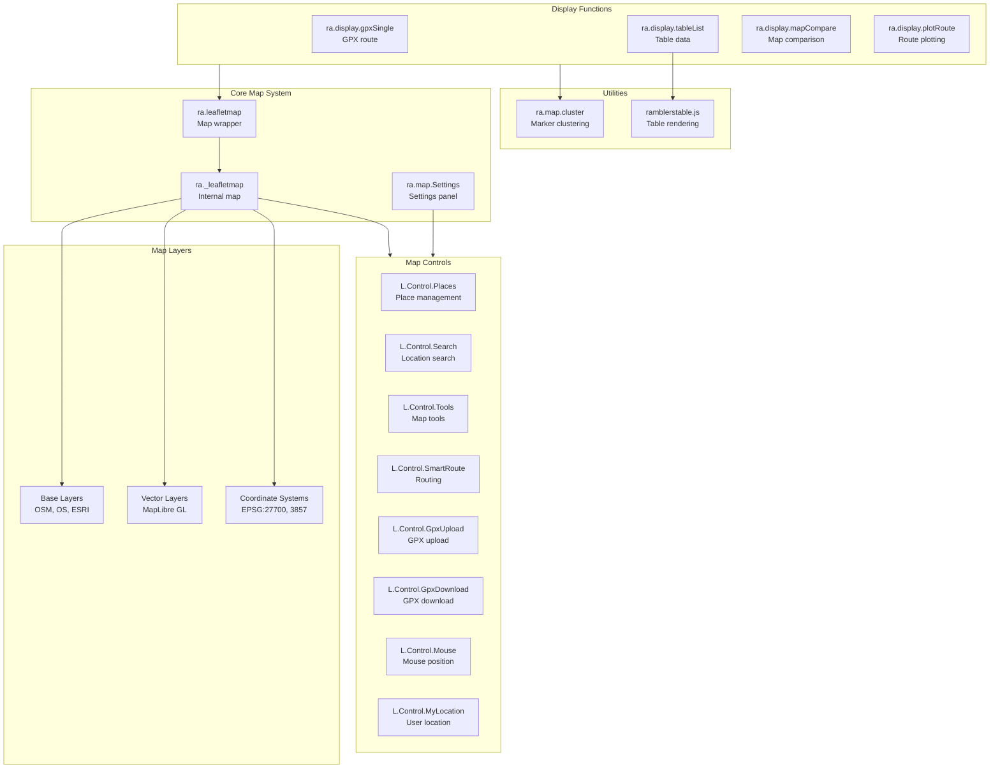
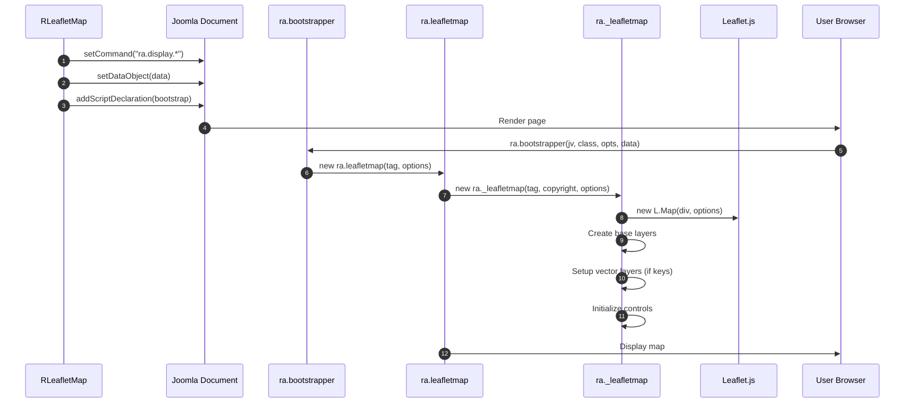
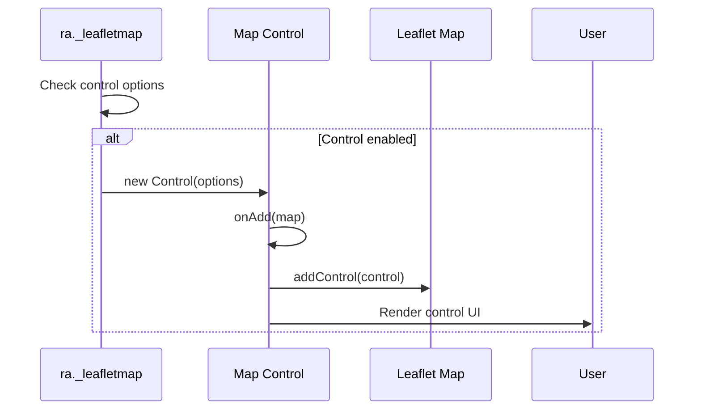
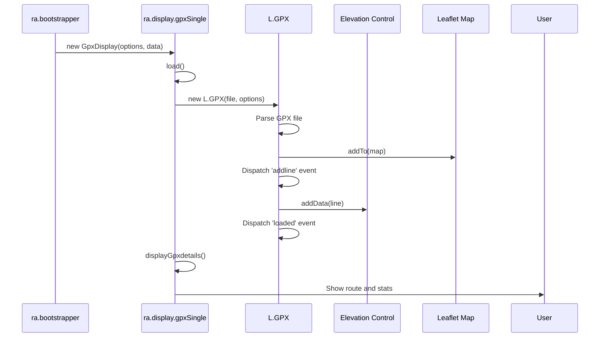

# media/leaflet Module - High Level Design

## Overview

The `media/leaflet` module provides comprehensive Leaflet.js integration for interactive maps. It includes map initialization, layer management, control systems, GPX handling, place management, route plotting, and table rendering. This JavaScript layer works with the PHP `leaflet` module to provide complete mapping functionality.

**Purpose**: Client-side Leaflet.js map system with controls, layers, and data source integration.

**Key Responsibilities**:
- Leaflet map initialization and management
- Map layer management (OSM, OS, ESRI, etc.)
- Control system (zoom, fullscreen, search, routing, etc.)
- GPX route display with elevation profiles
- Place management and display
- Route plotting and comparison
- Table-based data source rendering

## Component Architecture



## Public Interface

### ra.leafletmap - Map Wrapper

**High-level map wrapper with tabbed interface.**

#### Constructor
```javascript
ra.leafletmap(tag, options)
```
- **Parameters**: 
  - `tag` - Container element
  - `options` - Map options object
- **Behavior**: 
  - Creates tabbed interface (Map, Help, Settings)
  - Initializes internal map
  - Sets up help and settings panels

#### Methods
```javascript
this.display() // Display map and tabs
this.map() // Get Leaflet map instance
this.plotControl() // Get route plotting control
this.layersControl() // Get layers control
this.zoomControl() // Get zoom control
this.mylocationControl() // Get my location control
this.elevationControl() // Get elevation control
this.fullscreenControl() // Get fullscreen control
this.printControl() // Get print control
this.mouseControl() // Get mouse position control
this.rightclickControl() // Get right-click control
```

### ra._leafletmap - Internal Map

**Low-level Leaflet map instance.**

#### Constructor
```javascript
ra._leafletmap(tag, copyrightTag, options)
```
- **Behavior**: 
  - Creates Leaflet map instance
  - Sets up base layers (OSM, OS, ESRI)
  - Configures coordinate systems (EPSG:27700 for OS)
  - Initializes vector tile layers (MapLibre GL)
  - Sets up map controls

#### Map Layers
- **Open Street Map**: Default OSM tiles
- **Open Topo Map**: Topographic tiles
- **Aerial View (ESRI)**: Satellite imagery (if key provided)
- **OS Explorer/Landranger**: Ordnance Survey raster (if key provided)
- **Ordnance Survey**: Vector tiles via MapLibre GL (if key provided)
- **OS Test Styles**: Test vector tile styles

#### Coordinate Systems
- **EPSG:3857**: Web Mercator (default)
- **EPSG:27700**: British National Grid (for OS maps)

### ra.map.Settings - Settings Panel

**Map settings and control configuration.**

#### Methods
```javascript
ra.map.Settings()
  - add(tag, leafletMap) // Add settings panel
  - _saveSettings() // Save settings to cookie
```

**Features**:
- Tabbed settings interface
- Control-specific settings (route, mouse, right-click, location)
- Save/reset settings
- Cookie-based persistence

### Map Controls

#### L.Control.Places
**Place management and display control.**

```javascript
L.Control.Places(options)
  - options.cluster // Enable clustering
  - options.position // Control position
```

**Features**:
- Displays meeting/starting locations from walks
- Groups places by frequency (1-5+ uses)
- Clustering support
- Progress bar for large datasets
- Integration with places.walkinginfo.co.uk API

#### L.Control.Search
**Location search control.**

- Geocoding support
- OS Grid Reference lookup
- Postcode search
- Place name search
- W3W (What3Words) support

#### L.Control.SmartRoute
**Smart routing control.**

- Route calculation
- Multiple routing providers
- Route optimization

#### L.Control.GpxUpload / GpxDownload
**GPX file handling.**

- Upload GPX files
- Download GPX routes
- File validation

#### L.Control.Mouse
**Mouse position display.**

- Shows coordinates on mouse move
- Multiple coordinate systems (lat/lon, OS Grid Ref)
- Configurable display format

#### L.Control.MyLocation
**User location control.**

- Geolocation API integration
- Center map on user location
- Location accuracy display

### Display Functions

#### ra.display.gpxSingle

**Single GPX route display with elevation.**

```javascript
ra.display.gpxSingle(options, data)
  - data.gpxfile // GPX file path
  - data.linecolour // Route line color
  - data.imperial // Use imperial units
  - data.detailsDivId // Details container ID
```

**Features**:
- GPX file parsing and display
- Elevation profile
- Start/end markers
- Waypoint markers with symbols
- Route statistics (distance, ascent, time)

#### ra.display.tableList

**Table-based data source display.**

```javascript
ra.display.tableList(options, data)
  - data.list.items // Array of data items
```

**Features**:
- Tabbed interface (Map/List)
- Paginated table
- Map markers from table data
- Filtering and sorting

#### ra.display.mapCompare

**Map comparison display.**

- Side-by-side map comparison
- Synchronized pan/zoom

#### ra.display.plotRoute

**Route plotting functionality.**

- Interactive route drawing
- Route editing
- Distance calculation

### Utilities

#### ra.map.cluster

**Marker clustering system.**

```javascript
ra.map.cluster(map)
  - addClusterMarkers() // Add clustered markers
  - removeClusterMarkers() // Remove markers
  - zoomAll() // Zoom to fit all markers
```

#### ramblerstable.js

**Table rendering for map data sources.**

- Column definitions
- Data formatting
- Map marker integration

## Data Flow

### Map Initialization Flow



### Control Initialization Flow



### GPX Display Flow



## Integration Points

### PHP Integration
- **RLeafletMap**: Provides map options and data → [leaflet HLD](../../leaflet/HLD.md)
- **RLeafletScript**: Injects bootstrap code → [leaflet HLD](../../leaflet/HLD.md)
- **RLeafletGpxMap**: Provides GPX file path → [leaflet/gpx HLD](../../leaflet/gpx/HLD.md)

### Core JavaScript Integration
- **ra.js**: Core utilities, bootstrapper → [media/js HLD](../js/HLD.md)
- **ra.map.js**: Map utilities, icons → [media/js HLD](../js/HLD.md)
- **ra.tabs.js**: Tab system → [media/js HLD](../js/HLD.md)

### Vendor Library Integration
- **Leaflet.js**: Core mapping library (CDN)
- **Leaflet.markercluster**: Marker clustering
- **Leaflet-gpx**: GPX file parsing
- **Leaflet.Elevation**: Elevation profiles
- **Leaflet.draw**: Drawing tools
- **Leaflet.fullscreen**: Fullscreen control
- **MapLibre GL**: Vector tiles
- **Proj4js**: Coordinate projection

### External Services
- **places.walkinginfo.co.uk**: Place data API
- **OpenStreetMap**: Geocoding, routing
- **Ordnance Survey API**: OS maps and tiles
- **ESRI**: Aerial imagery

## Media Dependencies

### JavaScript Files

#### Core Map Files
- `ra.leafletmap.js` - Map wrapper (395+ lines)
- `ra.map.settings.js` - Settings panel (114+ lines)
- `ra.display.plotRoute.js` - Route plotting
- `ra-display-places.js` - Place display
- `ra.display.mapCompare.js` - Map comparison

#### Control Files (10+ files)
- `L.Control.Places.js` - Place management (510+ lines)
- `L.Control.Search.js` - Location search
- `L.Control.Tools.js` - Map tools
- `L.Control.SmartRoute.js` - Smart routing
- `L.Control.ReverseRoute.js` - Reverse routing
- `L.Control.GpxUpload.js` - GPX upload
- `L.Control.GpxDownload.js` - GPX download
- `L.Control.GpxSimplify.js` - GPX simplification
- `L.Control.Mouse.js` - Mouse position
- `L.Control.MyLocation.js` - User location
- `L.Control.RAContainer.js` - Container control

#### Display Files
- `gpx/maplist.js` - GPX list display (495+ lines)
- `table/ramblerstable.js` - Table rendering (358+ lines)

### CSS Dependencies
- `media/leaflet/ramblersleaflet.css` - Base Leaflet styles
- `media/leaflet/L.Control.Mouse.css` - Mouse control styles
- `media/leaflet/ra-gpx-tools.css` - GPX tool styles

### Image Dependencies
- `media/leaflet/images/` - Map icons and markers (58 files)
  - `postcode-icon.png`, `redmarker.png`, `route-start.png`, etc.

### Map Style Files
- `media/leaflet/mapStyles/osRamblersStyle.json` - OS Ramblers style
- `media/leaflet/mapStyles/osTestStyle.json` - OS test style
- `media/leaflet/mapStyles/osmliberty.json` - OSM Liberty style

## Examples

### Example 1: Basic Map Initialization

```javascript
// Initialized automatically by PHP
ra.bootstrapper(
    "4.0.0",
    "ra.display.walksMap",
    '{"divId":"map123","cluster":true,"fullscreen":true}',
    '{"walks":[...]}'
);
```

### Example 2: GPX Route Display

```javascript
// Initialized automatically by PHP
ra.bootstrapper(
    "4.0.0",
    "ra.display.gpxSingle",
    '{"divId":"gpx123","displayElevation":true}',
    '{"gpxfile":"media/gpx/walk.gpx","linecolour":"#782327","imperial":false}'
);
```

### Example 3: Table Data Display

```javascript
// Initialized automatically by PHP
ra.bootstrapper(
    "4.0.0",
    "ra.display.tableList",
    '{"divId":"table123"}',
    '{"list":{"items":[...]}}'
);
```

## Performance Notes

### Map Rendering
- **Tile Loading**: Lazy loading of map tiles (Leaflet handles)
- **Marker Clustering**: Reduces DOM elements for large datasets
- **Vector Tiles**: Efficient rendering via MapLibre GL

### GPX Processing
- **Async Loading**: GPX files loaded asynchronously
- **Large Files**: May be slow for very large GPX files (1000+ points)
- **Elevation Calculation**: Done during GPX parsing

### Place Management
- **API Calls**: Fetches place data from external API
- **Progress Bar**: Shows progress for large place datasets
- **Caching**: Place data may be cached

### Optimization Opportunities
1. **Tile Caching**: Browser caches tiles automatically
2. **Marker Virtualization**: Render only visible markers
3. **Lazy Control Loading**: Load controls only when needed
4. **GPX Simplification**: Simplify GPX tracks for display

## Error Handling

### Map Initialization Errors
- **Missing Container**: Checks for divId, shows error if missing
- **Invalid Options**: Validates options, uses defaults for invalid values
- **Missing License Keys**: Disables features requiring keys (graceful)

### GPX Errors
- **File Not Found**: Shows error message
- **Invalid GPX**: GPX library handles parsing errors
- **Missing Elevation Data**: Elevation control handles gracefully

### Control Errors
- **API Failures**: External API errors logged, features disabled
- **Geolocation Denied**: My Location control handles permission denial

## References

### Related HLD Documents
- [leaflet HLD](../../leaflet/HLD.md) - PHP Leaflet integration
- [media/js HLD](../js/HLD.md) - Core JavaScript library
- [media/jsonwalks HLD](../jsonwalks/HLD.md) - Walk display integration
- [leaflet/gpx HLD](../../leaflet/gpx/HLD.md) - GPX PHP integration

### Key Source Files
- `media/leaflet/ra.leafletmap.js` - Map wrapper (395+ lines)
- `media/leaflet/ra.map.settings.js` - Settings (114+ lines)
- `media/leaflet/L.Control.Places.js` - Places control (510+ lines)
- `media/leaflet/gpx/maplist.js` - GPX display (495+ lines)
- `media/leaflet/table/ramblerstable.js` - Table rendering (358+ lines)
- `media/leaflet/L.Control.*.js` - Control files (10+ files)

### Related Media Files
- `media/leaflet/ramblersleaflet.css` - Stylesheet
- `media/leaflet/images/` - Map icons (58 files)
- `media/leaflet/mapStyles/` - Map style JSON files


