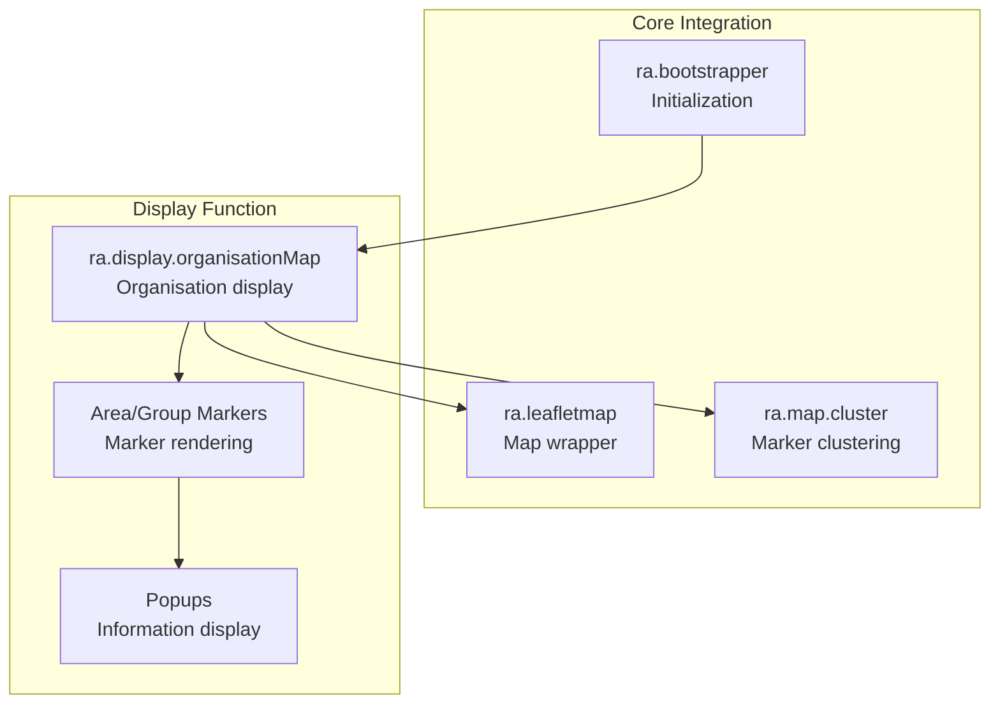
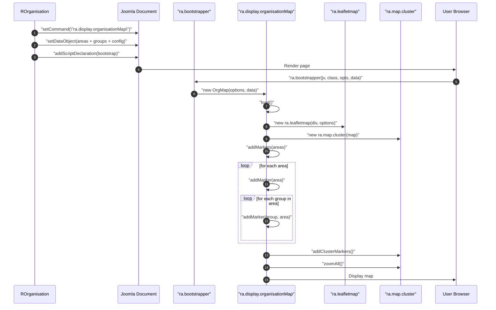
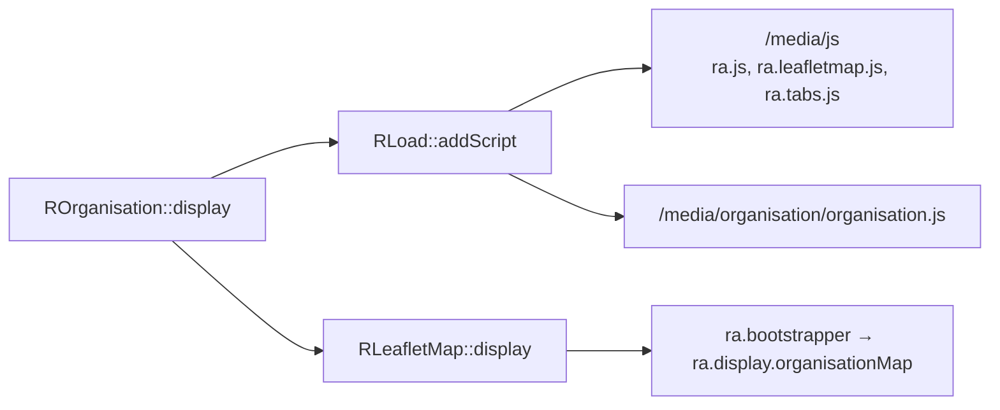

# media/organisation Module - High Level Design

## Overview

The `media/organisation` module provides client-side JavaScript for displaying organisation data (areas and groups) on Leaflet maps. It renders area and group markers with clustering, popups, and interactive features.

**Purpose**: Client-side organisation map display with area and group markers.

**Key Responsibilities**:
- Display organisation areas and groups as map markers
- Provide marker clustering for large datasets
- Show area/group information in popups
- Support custom styling and filtering

## Component Architecture



## Public Interface

### ra.display.organisationMap

**Organisation map display function.**

#### Constructor
```javascript
ra.display.organisationMap(options, data)
```
- **Parameters**: 
  - `options` - Map configuration object
  - `data` - Organisation data object with:
    - `areas` - Object of area objects
    - `groups` - Object of group objects (nested in areas)
    - `showLinks` - Show links flag
    - `showCodes` - Show codes flag
    - `colourMyGroup` - Color for user's group
    - `colourMyArea` - Color for user's area
    - `colourOtherGroups` - Color for other groups

#### Initialization Method
```javascript
this.load()
```
- **Behavior**: 
  - Creates Leaflet map instance
  - Initializes marker clustering
  - Adds area markers
  - Adds group markers (nested in areas)
  - Zooms to fit all markers

#### Marker Methods
```javascript
this.addMarkers(areas) // Add all area/group markers
this.addMarker(item, area) // Add individual marker
```

**Marker Styling**:
- **Area markers**: Different icon/color based on scope
- **Group markers**: Color-coded (my group, my area, other)
- **Popups**: Show name, code, description, website

## Data Flow

### Organisation Map Initialization



## Integration Points

### Used By
- **ROrganisation::display()**: PHP entry point that sets the command/data on `RLeafletMap` and renders the organisation map → [organisation HLD](../../organisation/HLD.md#integration-points).

### Uses
- **RLoad**: Enqueues `/media/js` foundations and `/media/organisation/organisation.js` → [load HLD](../../load/HLD.md#integration-points).
- **RLeafletMap**: Hosts the map container and passes map options and organisation data → [leaflet HLD](../../leaflet/HLD.md#integration-points).
- **ra.map.cluster**: Provides clustering helpers for markers → [media/leaflet HLD](../leaflet/HLD.md#integration-points).

### Data Sources
- **Organisation data**: Areas and groups JSON payload built by `ROrganisation` → [organisation HLD](../../organisation/HLD.md#data-flow).

### Display Layer
- **Client renderer**: `ra.display.organisationMap` builds markers/popups on `ra.leafletmap` → [media/leaflet HLD](../leaflet/HLD.md#display-layer).

### Joomla Integration
- **Document pipeline**: Assets and bootstrapper are injected into `JDocument` via `RLoad` and `RLeafletMap::display()`.

### Vendor Library Integration
- **Leaflet.js** and **Leaflet.markercluster** for map rendering and clustering.

### Media Asset Relationships (Server → Client)



`ROrganisation::display()` queues the `/media/js` foundation and `/media/organisation/organisation.js` through `RLoad`. `RLeafletMap::display()` then emits the bootstrapper so the browser instantiates `ra.display.organisationMap` with the JSON data provided by PHP.

### Key Features (`media/organisation/organisation.js`)
- Renders clustered area and group markers with configurable colours.
- Popups include codes, descriptions, and optional links from server data.
- Supports centring on a preferred group and toggling code/link visibility.

## Examples

### Example 1: Basic Organisation Display

```javascript
// Initialized automatically by PHP
ra.bootstrapper(
    "4.0.0",
    "ra.display.organisationMap",
    '{"divId":"org123","cluster":true}',
    '{"areas":{...},"showLinks":true,"showCodes":true}'
);
```

## Performance Observations
- **Marker clustering** keeps rendering performant for large area/group sets; zoom-to-bounds runs after marker creation.
- **Asset loading** leverages cached `/media/js` foundations; the organisation bundle is small and loads quickly.
- **Map initialization** cost scales primarily with marker count; filtering at the PHP level reduces client work.

## Error Handling
- **Missing containers/options**: `ra.display.organisationMap` validates inputs and shows an error when required data is absent.
- **Empty datasets**: Renders an empty map gracefully without markers.
- **Leaflet failures**: Relies on Leaflet to surface map errors; clustering guards against null coordinates when adding markers.

## References

### Related HLD Documents
- [organisation HLD](../../organisation/HLD.md) - PHP organisation integration
- [media/leaflet HLD](../leaflet/HLD.md) - Leaflet JavaScript
- [media/js HLD](../js/HLD.md) - Core JavaScript library

### Key Source Files
- `media/organisation/organisation.js` - Organisation display (297+ lines)
