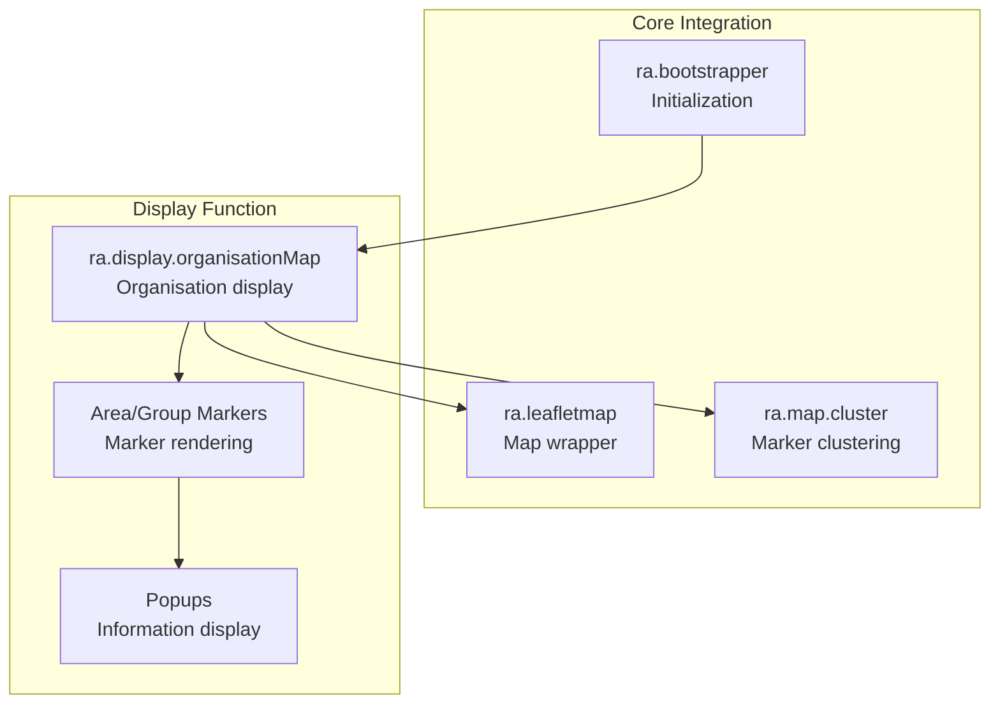
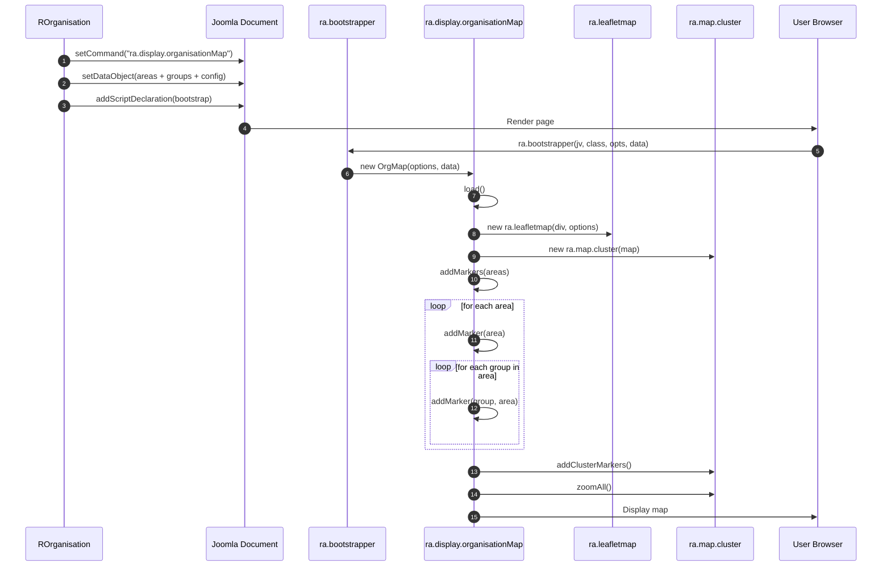

# media/organisation Module - High Level Design

## Overview

The `media/organisation` module provides client-side JavaScript for displaying organisation data (areas and groups) on Leaflet maps. It renders area and group markers with clustering, popups, and interactive features.

**Purpose**: Client-side organisation map display with area and group markers.

**Key Responsibilities**:
- Display organisation areas and groups as map markers
- Provide marker clustering for large datasets
- Show area/group information in popups
- Support custom styling and filtering

## Component Architecture



## Public Interface

### ra.display.organisationMap

**Organisation map display function.**

#### Constructor
```javascript
ra.display.organisationMap(options, data)
```
- **Parameters**: 
  - `options` - Map configuration object
  - `data` - Organisation data object with:
    - `areas` - Object of area objects
    - `groups` - Object of group objects (nested in areas)
    - `showLinks` - Show links flag
    - `showCodes` - Show codes flag
    - `colourMyGroup` - Color for user's group
    - `colourMyArea` - Color for user's area
    - `colourOtherGroups` - Color for other groups

#### Initialization Method
```javascript
this.load()
```
- **Behavior**: 
  - Creates Leaflet map instance
  - Initializes marker clustering
  - Adds area markers
  - Adds group markers (nested in areas)
  - Zooms to fit all markers

#### Marker Methods
```javascript
this.addMarkers(areas) // Add all area/group markers
this.addMarker(item, area) // Add individual marker
```

**Marker Styling**:
- **Area markers**: Different icon/color based on scope
- **Group markers**: Color-coded (my group, my area, other)
- **Popups**: Show name, code, description, website

## Data Flow

### Organisation Map Initialization



## Integration Points

### PHP Integration
- **ROrganisation**: Supplies organisation data and enqueues `/media/organisation/organisation.js` plus shared `/media/js` assets via `RLoad::addScript()` → [organisation HLD](../../organisation/HLD.md)
- **RLeafletMap**: Provides map options, command (`ra.display.organisationMap`), and JSON payload to the browser → [leaflet HLD](../../leaflet/HLD.md)

### Core JavaScript Integration
- **ra.js**: Core utilities/bootstrapper → [media/js HLD](../js/HLD.md)
- **ra.leafletmap.js**: Map wrapper → [media/leaflet HLD](../leaflet/HLD.md)
- **ra.map.cluster**: Marker clustering → [media/leaflet HLD](../leaflet/HLD.md)

## Media Integration

### Server-to-Client Asset Relationship

```mermaid
flowchart LR
    PHP[ROrganisation::display]
    Loader[RLoad::addScript]
    Map[RLeafletMap::display]
    BaseJS[/media/js<br/>ra.js, ra.leafletmap.js, ra.tabs.js]
    OrgJS[/media/organisation/organisation.js]
    Bootstrap[ra.bootstrapper → ra.display.organisationMap]

    PHP --> Loader
    Loader --> BaseJS
    Loader --> OrgJS
    PHP --> Map
    Map --> Bootstrap
```

`ROrganisation::display()` queues the `/media/js` foundation and `/media/organisation/organisation.js` through `RLoad`. `RLeafletMap::display()` then emits the bootstrapper so the browser instantiates `ra.display.organisationMap` with the JSON data provided by PHP.

### PHP Integration
- **Asset enqueue**: `RLoad::addScript()` loads `/media/js/ra.js`, `/media/js/ra.leafletmap.js`, `/media/js/ra.tabs.js`, and `/media/organisation/organisation.js` before outputting the map container.

### Core JavaScript Integration
- **Entry point**: `ra.display.organisationMap` consumes the injected JSON and uses `ra.leafletmap` plus `ra.map.cluster` to render markers and popups.

### Key Features (`media/organisation/organisation.js`)
- Renders clustered area and group markers with configurable colours.
- Popups include codes, descriptions, and optional links from server data.
- Supports centring on a preferred group and toggling code/link visibility.

## Examples

### Example 1: Basic Organisation Display

```javascript
// Initialized automatically by PHP
ra.bootstrapper(
    "4.0.0",
    "ra.display.organisationMap",
    '{"divId":"org123","cluster":true}',
    '{"areas":{...},"showLinks":true,"showCodes":true}'
);
```

## References

### Related HLD Documents
- [organisation HLD](../../organisation/HLD.md) - PHP organisation integration
- [media/leaflet HLD](../leaflet/HLD.md) - Leaflet JavaScript
- [media/js HLD](../js/HLD.md) - Core JavaScript library

### Key Source Files
- `media/organisation/organisation.js` - Organisation display (297+ lines)
