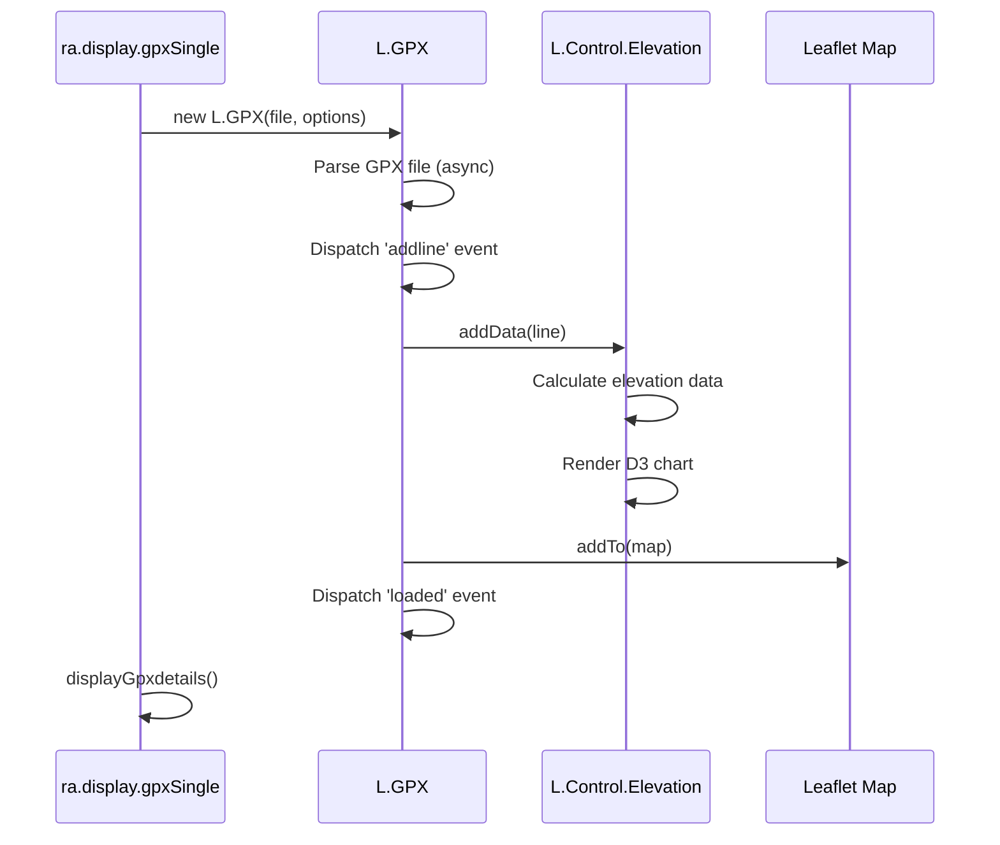

# media/vendors Module - High Level Design

## Overview

The `media/vendors` module contains third-party vendor libraries that are either customized for Ramblers Library use or heavily integrated into the system. This document covers only those vendor libraries that have been modified or are deeply integrated, not standard unmodified third-party libraries.

**Purpose**: Document customized and heavily integrated vendor libraries.

**Key Responsibilities**:
- Provide pagination functionality (cvList)
- Display elevation profiles for GPX routes (Leaflet.Elevation)
- Parse and display GPX files (leaflet-gpx)
- Convert between coordinate systems (geodesy)

## Component Architecture


## Public Interface

### cvList - Pagination Library

**Client-side pagination for lists and tables.**

#### Constructor
```javascript
cvList(displayTag)
```

#### Methods
```javascript
this.addItem(element, nonPaginatedItem) // Add item to list
this.display() // Display paginated list
this.createField(title, type) // Create filterable field
this.createPagination(userOptions) // Create pagination controls
this.getNumberItems() // Get total item count
this.appendPrintItems(tag) // Append items for printing
```

#### Features
- Client-side pagination
- Configurable items per page
- Field-based filtering
- Sorting support
- Print-friendly output
- Event-driven updates

**Customization**: Used extensively by `ra.paginatedTable` and `ra.paginatedList` in core library.

### Leaflet.Elevation - Elevation Profiles

**Elevation profile display for GPX routes (customized version).**

#### Constructor
```javascript
L.Control.Elevation(options)
```

#### Options
```javascript
{
    position: "topright",
    theme: "lime-theme",
    width: 600,
    height: 175,
    imperial: false,
    useHeightIndicator: true,
    interpolation: "linear"
}
```

#### Methods
```javascript
this.addData(line) // Add GPX line data
this._update() // Update elevation chart
```

**Customization**: 
- Custom theme: "steelblue-theme" (Ramblers-specific)
- Integrated with GPX display system
- D3.js-based charting

### leaflet-gpx - GPX File Parser

**GPX file parsing and Leaflet integration.**

#### Constructor
```javascript
L.GPX(gpx, options)
```

#### Options
```javascript
{
    async: true,
    polyline_options: {color: 'blue'},
    marker_options: {
        startIconUrl: '...',
        endIconUrl: '...',
        wptIconUrls: {...}
    }
}
```

#### Events
```javascript
gpx.on('loaded', function(e) {...}) // GPX loaded
gpx.on('addline', function(e) {...}) // Line added
gpx.on('addpoint', function(e) {...}) // Point added
```

#### Properties
```javascript
gpx._info // GPX metadata
  - name
  - length
  - elevation {gain, loss, max, min}
  - duration {start, end, moving, total}
```

**Integration**: Heavily integrated with `ra.display.gpxSingle` and elevation control.

### geodesy - Coordinate Conversion

**Coordinate system conversion library.**

#### OsGridRef - OS Grid Reference

```javascript
OsGridRef(easting, northing) // Create grid ref
OsGridRef.latLonToOsGrid(point) // Convert lat/lon to OS Grid
OsGridRef.osGridToLatLon(grid, datum) // Convert OS Grid to lat/lon
grid.toString() // Format as string (e.g., "TG 51409 13177")
```

#### LatLon - Latitude/Longitude

```javascript
LatLon(lat, lon, datum) // Create lat/lon point
point.distanceTo(other) // Calculate distance
point.bearingTo(other) // Calculate bearing
point.convertDatum(datum) // Convert datum
```

**Integration**: Used extensively in map controls for coordinate display and conversion.

## Data Flow

### Pagination Flow


### GPX Processing Flow



## Integration Points

### Used By
- **RJsonwalksStdDisplay / RWalkseditorProgramme**: PHP callers that enqueue pagination vendors → [jsonwalks/std HLD](../../jsonwalks/std/HLD.md#integration-points), [walkseditor HLD](../../walkseditor/HLD.md#integration-points).
- **RLeafletGpxMap / RLeafletMapdraw**: PHP map helpers that pull in GPX/elevation/draw vendors → [leaflet/gpx HLD](../../leaflet/gpx/HLD.md#integration-points), [leaflet HLD](../../leaflet/HLD.md#integration-points).
- **Leaflet controls**: Coordinate-aware controls importing `geodesy` helpers → [media/leaflet HLD](../leaflet/HLD.md#integration-points).

### Uses
- **RLoad**: Adds vendor bundles from `/media/vendors/*` with cache-busting → [load HLD](../../load/HLD.md#integration-points).
- **RLeafletScript**: Delegates loading of Leaflet-adjacent vendor scripts when map features require them → [leaflet HLD](../../leaflet/HLD.md#integration-points).
- **cvList**, **Leaflet.Elevation**, **leaflet-gpx**, **geodesy** libraries → [media/js HLD](../js/HLD.md#integration-points) for pagination usage, [media/leaflet HLD](../leaflet/HLD.md#integration-points) for mapping usage.

### Data Sources
- **GPX files**: Consumed by `leaflet-gpx` and elevation controls → [leaflet/gpx HLD](../../leaflet/gpx/HLD.md#data-flow).
- **List/table datasets**: Paged by `cvList` within display modules → [media/js HLD](../js/HLD.md#integration-points).
- **Coordinate inputs**: Converted by `geodesy` helpers for map controls → [media/leaflet HLD](../leaflet/HLD.md#integration-points).

### Display Layer
- **Client widgets**: Pagination UIs, elevation charts, GPX overlays, and coordinate-aware map controls → [media/jsonwalks HLD](../jsonwalks/HLD.md#display-layer), [media/leaflet HLD](../leaflet/HLD.md#display-layer), [media/js HLD](../js/HLD.md#display-layer).

### Joomla Integration
- **Document pipeline**: Vendor scripts/styles injected via `RLoad` inside PHP presenters before bootstrap scripts run.

### Vendor Library Integration
- This module is the vendor collection itself; other modules integrate with these libraries as dependencies (see [media/leaflet HLD](../leaflet/HLD.md#vendor-library-integration) and [media/js HLD](../js/HLD.md#vendor-library-integration)).

### Media Asset Relationships (Server → Client)

```mermaid
flowchart LR
    PHP[RJsonwalksStdDisplay<br/>RWalkseditorProgramme<br/>RLeafletScript]
    Loader[RLoad::addScript]
    Vendors[/media/vendors<br/>cvList, Leaflet.Elevation, leaflet-gpx, geodesy]
    BaseJS[/media/js foundation]
    Bootstrap[ra.bootstrapper + map bootstraps]

    PHP --> Loader
    Loader --> Vendors
    Loader --> BaseJS
    PHP --> Bootstrap
```

Server-side modules call `RLoad` to enqueue vendor bundles from `/media/vendors` alongside the shared `/media/js` foundation. The emitted bootstrap scripts (from `RJsonwalksStdDisplay`, `RWalkseditorProgramme`, or `RLeafletScript`) then initialize pagination widgets, elevation controls, or GPX parsers in the browser.

### Key Features (Vendor Bundles)
- **cvList**: Pagination and sorting utilities wrapped by `ra.paginatedTable`/`ra.paginatedList`.
- **Leaflet.Elevation**: Charting support for GPX elevation with Ramblers-specific styling hooks.
- **leaflet-gpx**: GPX parsing with event hooks used by elevation and map displays.
- **geodesy**: OS grid conversions consumed by Leaflet controls (search, mouse position).

## Examples

### Example 1: Using cvList for Pagination

```javascript
var list = new cvList(container);
list.addItem(item1);
list.addItem(item2);
// ... add more items
var pagination = list.createPagination({
    pagination: {
        "10 per page": 10,
        "20 per page": 20,
        "View all": 0
    },
    itemsPerPage: 20
});
list.display();
```

### Example 2: GPX with Elevation

```javascript
var gpx = new L.GPX(file, {
    async: true,
    polyline_options: {color: '#782327'}
});
var elevation = map.elevationControl();
gpx.on('addline', function(e) {
    elevation.addData(e.line);
});
gpx.addTo(map);
```

### Example 3: Coordinate Conversion

```javascript
var point = new LatLon(51.5074, -0.1278);
var grid = OsGridRef.latLonToOsGrid(point);
console.log(grid.toString()); // "TQ 315804 180324"
```

## Performance Observations

### cvList Performance
- **Client-Side**: All pagination done in browser (fast)
- **Large Lists**: May be slow for 10,000+ items
- **Filtering**: Linear search through items

### GPX Processing
- **Async Loading**: GPX files loaded asynchronously
- **Large Files**: May be slow for very large GPX files (10,000+ points)
- **Elevation Calculation**: Done during parsing

### Coordinate Conversion
- **Fast**: Mathematical calculations (O(1))
- **No Caching**: Calculations done on-demand

## Error Handling

### cvList Errors
- **Empty Lists**: Handles gracefully, shows "No information found"
- **Invalid Options**: Uses defaults for invalid values

### GPX Errors
- **File Not Found**: GPX library handles gracefully
- **Invalid GPX**: Parsing errors caught, shows error message
- **Missing Elevation Data**: Elevation control handles gracefully

### Coordinate Conversion Errors
- **Invalid Input**: Throws TypeError for invalid coordinates
- **Datum Conversion**: Handles datum conversion errors

## References

### Related HLD Documents
- [media/js HLD](../js/HLD.md) - Core library using cvList
- [media/jsonwalks HLD](../jsonwalks/HLD.md) - Display using cvList
- [media/leaflet HLD](../leaflet/HLD.md) - GPX and elevation integration
- [leaflet/gpx HLD](../../leaflet/gpx/HLD.md) - GPX PHP integration

### Key Source Files
- `media/vendors/cvList/cvList.js` - Pagination library (954+ lines)
- `media/vendors/Leaflet.Elevation-0.0.4-ra/leaflet.elevation-0.0.4.src.js` - Elevation (695+ lines)
- `media/vendors/leaflet-gpx-1.3.1/gpx.js` - GPX parser (543+ lines)
- `media/vendors/geodesy/osgridref.js` - OS Grid Reference (331+ lines)
- `media/vendors/geodesy/latlon-ellipsoidal.js` - Lat/Lon calculations

### Vendor Information
- **cvList**: Custom pagination library
- **Leaflet.Elevation**: Customized version 0.0.4 with Ramblers theme
- **leaflet-gpx**: Version 1.3.1, integrated with elevation
- **geodesy**: Coordinate conversion library by Chris Veness
