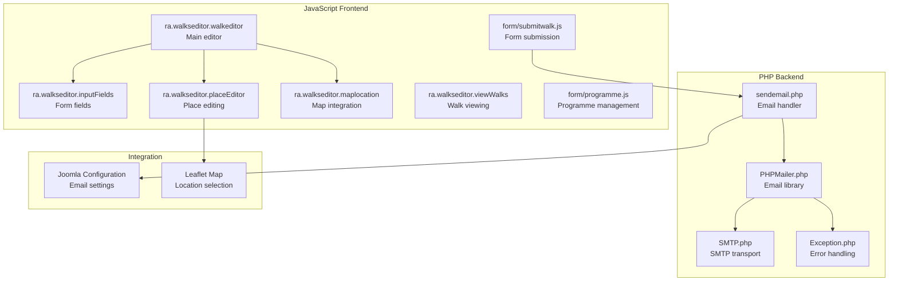
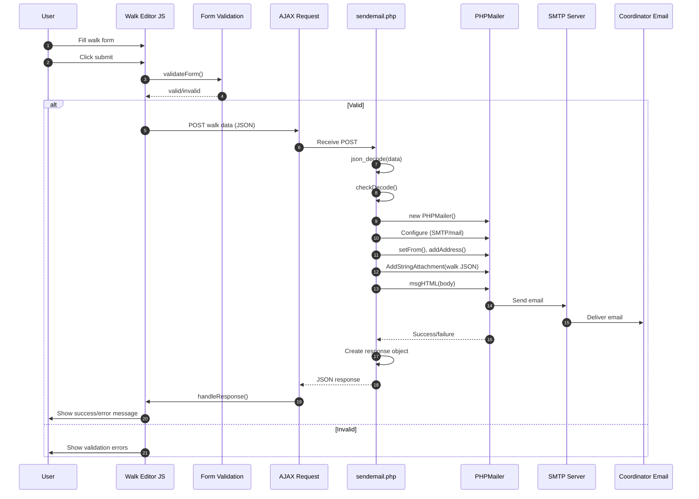
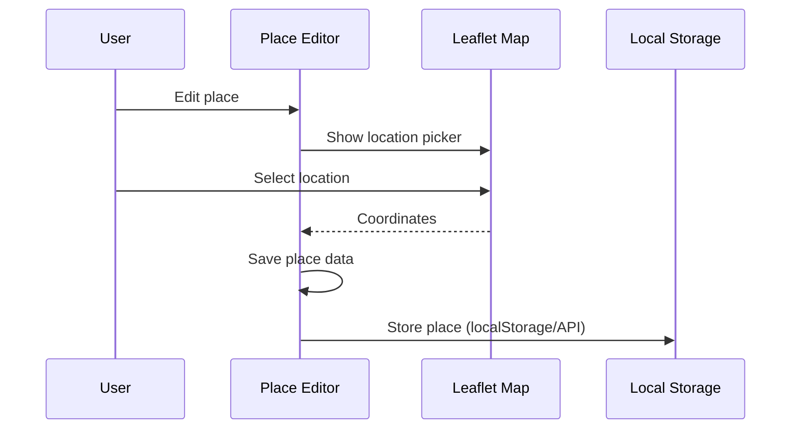

# media/walkseditor Module - High Level Design

## Overview

The `media/walkseditor` module provides a complete walk editing interface with both PHP backend (email submission) and JavaScript frontend (form editing, validation, place management). It enables users to create and submit walk data via a web-based form that sends structured walk data via email.

**Purpose**: Walk editing and submission system with email delivery.

**Key Responsibilities**:
- Provide interactive walk editing form
- Validate walk data
- Manage place/location data
- Handle form submission via AJAX
- Send walk data via email using PHPMailer
- Support programme management

## Component Architecture



## Public Interface

### JavaScript Components

#### ra.walkseditor.walkeditor

**Main walk editor interface.**

```javascript
ra.walkseditor.walkeditor()
  - load(editDiv, walk, formmode) // Load editor form
  - addBasics(div) // Add basic details section
  - addWalk() // Add walk item
  - addMeetingType(div) // Add meeting section
  - addStartType(div) // Add start section
  - addFinish(div) // Add finish section
  - addContact(div) // Add contact section
  - addFacilities(div) // Add facilities section
```

**Form Sections**:
- Basic Details (title, date, description)
- Walk (distance, grade, shape, pace)
- Meeting (location, time)
- Start (location, time)
- Finish (location, time)
- Contact (name, email, phone)
- Facilities (accessibility, transport)
- Editor's Notes

#### ra.walkseditor.inputFields

**Form field utilities.**

```javascript
ra.walkseditor.inputFields()
  - addHeader(div, tag, title, help) // Add section header
  - addInputField() // Add input field
  - addSelectField() // Add select field
  - addTextareaField() // Add textarea field
```

#### ra.walkseditor.placeEditor

**Place/location editing.**

```javascript
ra.walkseditor.placeEditor()
  - editPlace(place) // Edit place
  - savePlace() // Save place
  - deletePlace() // Delete place
```

#### ra.walkseditor.maplocation

**Map-based location selection.**

- Integrates with Leaflet maps
- Location picker
- Coordinate display

#### form/submitwalk.js

**Form submission handler.**

```javascript
// Handles form submission
  - validateForm() // Validate walk data
  - submitWalk() // Submit via AJAX
  - handleResponse() // Handle server response
```

#### form/programme.js

**Programme management.**

- Programme view/editing
- Walk list management

### PHP Components

#### sendemail.php

**Email submission endpoint.**

```php
// Receives POST request with walk data
// Validates JSON
// Sends email via PHPMailer
// Returns JSON response
```

**Request Format**:
```json
{
  "walk": {...},
  "walkbody": "<html>...</html>",
  "email": {"name": "...", "email": "...", "message": "..."},
  "fromSite": "https://...",
  "subject": "Walk Submission",
  "coords": {"email@example.com": "Name"}
}
```

**Response Format**:
```json
{
  "error": false,
  "message": "MESSAGE HAS BEEN SENT",
  "sent": true
}
```

#### PHPMailer.php

**Email library class.**

- Full PHPMailer implementation
- HTML email support
- Attachment support
- SMTP and mail() transport

#### SMTP.php

**SMTP transport class.**

- SMTP connection handling
- Authentication support
- TLS/SSL support

#### Exception.php

**Exception handling.**

- PHPMailer exception classes
- Error reporting

## Data Flow

### Walk Submission Flow



### Place Editing Flow



## Integration Points

### PHP Integration
- **Joomla Configuration**: Reads email settings from `configuration.php`
- **PHPMailer Library**: Uses PHPMailer for email sending
- **JSON Processing**: Receives and validates JSON walk data

### JavaScript Integration
- **ra.js**: Core utilities → [media/js HLD](../js/HLD.md)
- **Leaflet Maps**: Location selection → [media/leaflet HLD](../leaflet/HLD.md)
- **AJAX**: Form submission to PHP endpoint

### External Services
- **SMTP Server**: Email delivery (via Joomla configuration)
- **Email Recipients**: Programme coordinators (from form data)

## Media Dependencies

### JavaScript Files (13 files in `js/` subfolder)

#### Core Editor Files
- `walkeditor.js` - Main editor (779+ lines)
- `walk.js` - Walk object handling
- `viewWalks.js` - Walk viewing interface
- `inputfields.js` - Form field utilities
- `loader.js` - Asset loading

#### Place Management
- `placeEditor.js` - Place editing
- `maplocation.js` - Map location selection
- `comp/places.js` - Places component
- `comp/viewAllPlaces.js` - Places list view

#### Form Handling
- `form/submitwalk.js` - Walk submission
- `form/programme.js` - Programme management

#### Component Views
- `comp/viewAllWalks.js` - Walks list view

#### Utilities
- `walksEditorHelps.js` - Help system

### PHP Files

#### Email Handling
- `sendemail.php` - Email submission handler (105 lines)
- `PHPMailer.php` - PHPMailer library (5253+ lines)
- `SMTP.php` - SMTP transport
- `Exception.php` - Exception classes

### CSS Dependencies
- `media/walkseditor/css/*.css` - Editor stylesheets (5 files)
- `media/walkseditor/css/styleemail.css` - Email template styles

### Image Dependencies
- `media/walkseditor/css/*.png` - Editor icons (6 files)

## Examples

### Example 1: Form Submission

```javascript
// JavaScript form submission
var walkData = {
    walk: {...walkObject...},
    walkbody: "<html>...</html>",
    email: {name: "John", email: "john@example.com", message: "..."},
    fromSite: window.location.href,
    subject: "Walk Submission",
    coords: {"coord@example.com": "Coordinator Name"}
};

fetch('media/lib_ramblers/walkseditor/sendemail.php', {
    method: 'POST',
    body: formData // FormData with walk file
})
.then(response => response.json())
.then(data => {
    if (data.sent) {
        // Show success message
    } else {
        // Show error message
    }
});
```

### Example 2: Editor Initialization

```javascript
var editor = new ra.walkseditor.walkeditor();
editor.load(editDiv, walkObject, false);
```

## Performance Notes

### Form Rendering
- **Dynamic Form**: Form generated client-side (fast)
- **Large Forms**: May be slow for complex walks with many items
- **Map Integration**: Leaflet map adds overhead

### Email Sending
- **SMTP Connection**: Connection time adds latency
- **Large Attachments**: Walk JSON files typically small (<100KB)
- **Multiple Recipients**: Sends to all coordinators

### Optimization Opportunities
1. **Form Caching**: Cache form structure
2. **Lazy Map Loading**: Load map only when needed
3. **Progressive Validation**: Validate fields as user types

## Error Handling

### JavaScript Errors
- **Validation Errors**: Shown inline on form fields
- **Submission Errors**: Displayed via error modal
- **AJAX Failures**: Network errors caught and displayed

### PHP Errors
- **JSON Decode Errors**: Caught, error response returned
- **Email Send Failures**: PHPMailer errors caught, error response returned
- **Missing Configuration**: Uses defaults, logs errors

### User Feedback
- **Success**: Shows success message
- **Errors**: Shows error message with details
- **Validation**: Highlights invalid fields

## References

### Related HLD Documents
- [walkseditor HLD](../../walkseditor/HLD.md) - PHP walkseditor integration
- [media/js HLD](../js/HLD.md) - Core JavaScript library
- [media/leaflet HLD](../leaflet/HLD.md) - Leaflet map integration

### Key Source Files
- `media/walkseditor/js/walkeditor.js` - Main editor (779+ lines)
- `media/walkseditor/js/walk.js` - Walk object
- `media/walkseditor/js/placeEditor.js` - Place editor
- `media/walkseditor/js/form/submitwalk.js` - Form submission
- `media/walkseditor/sendemail.php` - Email handler (105 lines)
- `media/walkseditor/PHPMailer.php` - Email library (5253+ lines)

### Related Media Files
- `media/walkseditor/css/` - Editor stylesheets (5 CSS files)
- `media/walkseditor/css/*.png` - Editor icons (6 PNG files)


