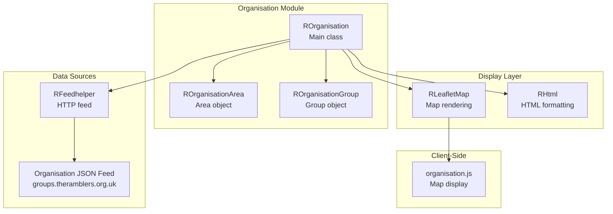
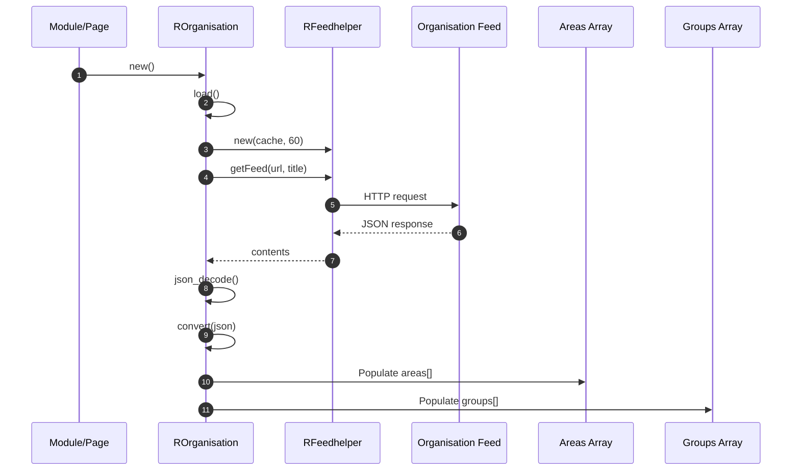

# organisation Module - High Level Design

## Overview

The `organisation` module manages Ramblers organisation data (areas and groups) by fetching JSON feeds, converting to internal structures, and displaying on maps. It provides geographic visualization of the Ramblers organisational structure.

**Purpose**: Organisation data management and geographic visualization.

**Key Responsibilities**:
- Fetch organisation JSON feed from ramblers.org.uk
- Convert JSON to internal area/group structures
- Display organisation hierarchy on Leaflet maps
- Provide area and group listing functionality
- Support custom styling and filtering

## Component Architecture



## Public Interface

### ROrganisation

**Main organisation data manager.**

#### Constructor
```php
public function __construct()
```
- **Behavior**: Automatically calls `load()` to fetch and process organisation data

#### Data Loading Method
```php
public function load()
```
- **Behavior**: 
  - Creates `RFeedhelper` with 60-minute cache
  - Fetches organisation feed from `https://groups.theramblers.org.uk/`
  - Converts JSON to internal area/group structures
  - Populates `$areas` and `$groups` arrays

#### Display Methods
```php
public function listAreas()
```
- **Returns**: Array of area objects
- **Behavior**: Returns all areas

```php
public function display($map)
```
- **Parameters**: `$map` - `RLeafletMap` instance
- **Behavior**: 
  - Configures map options
  - Sets command to `"ra.display.organisationMap"`
  - Injects area/group data as JSON
  - Loads `organisation.js` script

```php
public function myGroup($myGroup, $zoom)
```
- **Parameters**: 
  - `$myGroup` - Group code to highlight
  - `$zoom` - Map zoom level
- **Behavior**: Centers map on specified group

#### Public Properties
```php
public $groups = [];      // Array of group objects
public $areas = [];       // Array of area objects
public $showLinks = true;
public $showCodes = true;
public $showGroups = true;
public $colourMyGroup = '#ff0000';
public $colourMyArea = '#00ff00';
public $colourOtherGroups = '#0000ff';
public $centreGroup = "";
public $mapZoom = -1;
```

## Data Flow

### Organisation Loading Flow



## Integration Points

### Data Sources
- **RFeedhelper**: HTTP feed retrieval → [feedhelper HLD](../feedhelper/HLD.md)
- **Organisation Feed**: `https://groups.theramblers.org.uk/` JSON endpoint

### Display Layer
- **RLeafletMap**: Map rendering → [leaflet HLD](../leaflet/HLD.md)
- **RHtml**: HTML formatting → [html HLD](../html/HLD.md)

### Used By
- **RAccounts**: Organisation data for account updates → [accounts HLD](../accounts/HLD.md)

### Key Features (`ROrganisation`)
- Fetches, caches, and converts the organisation feed into area/group domain objects.
- Provides display configuration flags (links, codes, colours) consumable by client scripts.
- Emits map-ready JSON and bootstrap commands for `ra.display.organisationMap`.

## Media Integration

### Server-to-Client Asset Relationship

```mermaid
flowchart LR
    Org[ROrganisation::display]
    Loader[RLoad::addScript]
    Map[RLeafletMap::display]
    BaseJS[/media/js<br/>ra.js, ra.map.js, ra.tabs.js]
    OrgJS[/media/organisation/organisation.js]
    Bootstrap[ra.bootstrapper → ra.display.organisationMap]

    Org --> Loader
    Loader --> BaseJS
    Loader --> OrgJS
    Org --> Map
    Map --> Bootstrap
```

`ROrganisation::display()` enqueues `/media/organisation/organisation.js` plus the shared `/media/js` stack through `RLoad`; `RLeafletMap::display()` then injects the bootstrapper, so the browser spins up `ra.display.organisationMap` with the JSON data from PHP.

### Media Asset Loading
- **JavaScript entry point**: `/media/organisation/organisation.js` (instantiates `ra.display.organisationMap`).
- **Server-to-client flow**: PHP sets the command/data on `RLeafletMap`, leverages `RLoad` to add `/media` assets, and relies on `RLeafletScript::add()` for Leaflet dependencies before the client bootstrap runs.

### Key Features (`organisation.js`)
- Renders area and group markers with scope-aware colours and clustering.
- Popups surface names, codes, descriptions, and links when configured.
- Supports centring/highlighting a specific group and toggling visibility flags supplied by PHP.

## Examples

### Example 1: Basic Organisation Display

```php
$org = new ROrganisation();
$map = new RLeafletMap();
$org->display($map);
```

### Example 2: Highlight Specific Group

```php
$org = new ROrganisation();
$org->myGroup('BU51', 10);
$map = new RLeafletMap();
$org->display($map);
```

### Example 3: Custom Styling

```php
$org = new ROrganisation();
$org->colourMyGroup = '#ff0000';
$org->colourMyArea = '#00ff00';
$org->showCodes = false;
$map = new RLeafletMap();
$org->display($map);
```

### Asset Inclusion Example

```php
$org = new ROrganisation();
$map = new RLeafletMap();
$org->display($map);
// RLoad enqueues media/js/ra.js and media/organisation/organisation.js
// RLeafletScript adds Leaflet + controls before ra.display.organisationMap runs
```

## Performance Notes

### Data Loading
- **Caching**: 60-minute TTL via `RFeedhelper`
- **JSON Parsing**: Fast for typical organisation size (<1000 groups)
- **Memory**: All areas/groups loaded into memory

### Map Rendering
- **Marker Clustering**: Used for large datasets
- **Client-Side**: Map rendering handled by JavaScript

## Error Handling

### Feed Errors
- **Read Failures**: Shows warning, uses empty array
- **Invalid JSON**: Shows error message
- **Missing Properties**: Validated via `checkJsonProperties()`

### Display Errors
- **Missing Data**: Map shows empty (graceful)
- **Invalid Coordinates**: Markers skipped (logged)

## References

### Related HLD Documents
- [feedhelper HLD](../feedhelper/HLD.md) - Feed retrieval
- [leaflet HLD](../leaflet/HLD.md) - Map rendering
- [html HLD](../html/HLD.md) - HTML formatting
- [accounts HLD](../accounts/HLD.md) - Account integration

### Key Source Files
- `organisation/organisation.php` - ROrganisation class
- `organisation/area.php` - ROrganisationArea class (if exists)
- `organisation/group.php` - ROrganisationGroup class (if exists)

### Related Media Files
- `media/organisation/organisation.js` - Client-side map display
