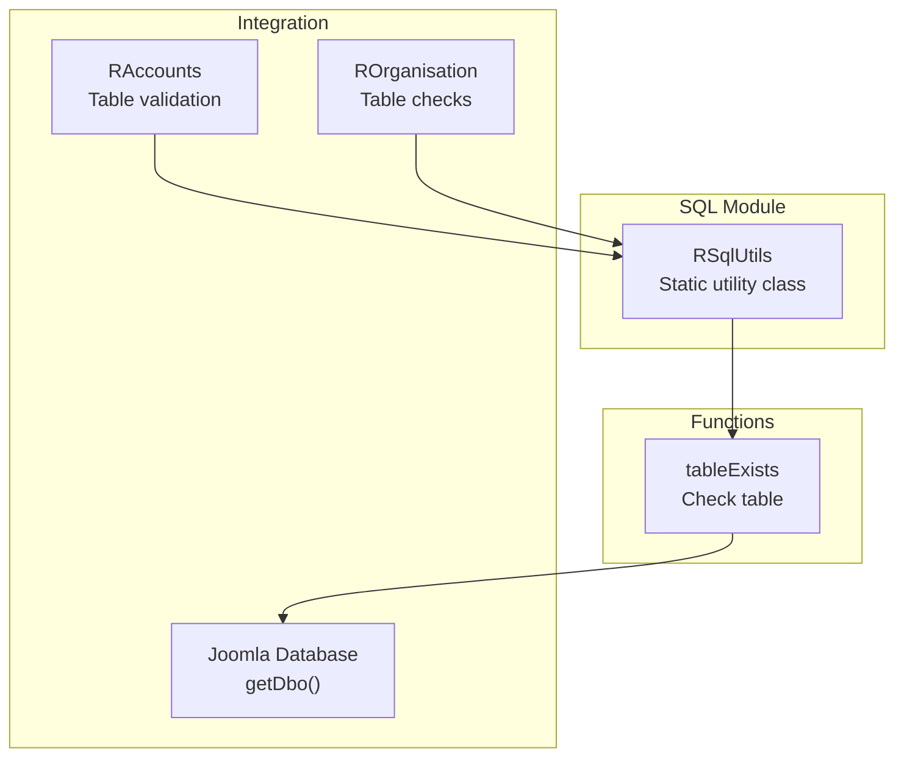
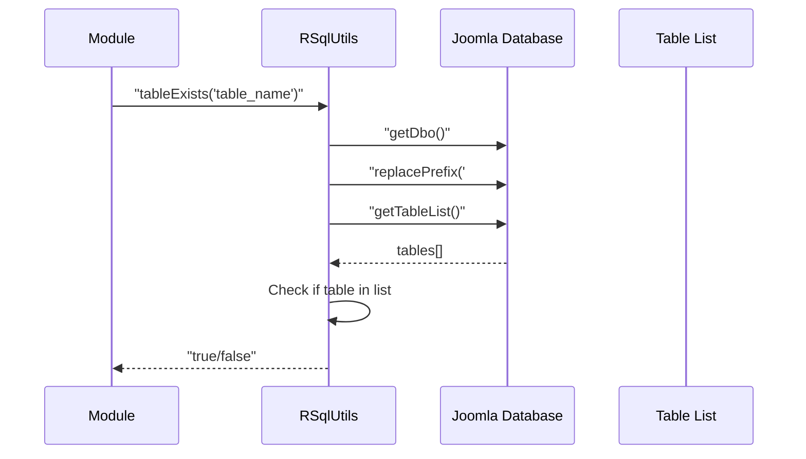

# sql Module - High Level Design

## Overview

The `sql` module provides database utility functions for Joomla database operations. Currently provides table existence checking functionality. Used by accounts and organisation modules for database validation.

**Purpose**: Database utility functions for Joomla.

**Key Responsibilities**:
- Check if database tables exist
- Handle Joomla table prefix replacement
- Provide database query utilities

## Component Architecture



## Public Interface

### RSqlUtils

**Static utility class for database operations.**

#### Table Existence Check
```php
public static function tableExists($table)
```
- **Parameters**: `$table` - Table name (with or without `#__` prefix)
- **Returns**: Boolean (true if table exists)
- **Behavior**: 
  - Gets Joomla database instance
  - Replaces `#__` prefix with actual Joomla prefix
  - Gets list of all tables
  - Checks if table exists in list

## Data Flow

### Table Existence Check Flow



## Integration Points

### Used By
- **RAccounts**: Validates database tables before operations → [accounts HLD](../accounts/HLD.md)
- **ROrganisation**: Checks for required tables → [organisation HLD](../organisation/HLD.md)

### Dependencies
- **Joomla Database**: `JFactory::getDbo()` for database access

## Media Dependencies

### No Media Files

The sql module is server-side only with no JavaScript or CSS dependencies.

## Examples

### Example 1: Check Table Exists

```php
if (RSqlUtils::tableExists('#__ra_accounts')) {
    // Table exists, proceed with operations
} else {
    // Table doesn't exist, create it or show error
}
```

### Example 2: Without Prefix

```php
$exists = RSqlUtils::tableExists('ra_accounts');
// Automatically handles #__ prefix replacement
```

## Performance Notes

### Query Performance
- **Table List**: Gets all tables (may be slow on large databases)
- **No Caching**: Table list fetched each call
- **Linear Search**: O(n) where n = number of tables

### Optimization Opportunities
1. **Cache Results**: Cache table existence for request duration
2. **Direct Query**: Use `SHOW TABLES LIKE` for faster check
3. **Schema Caching**: Cache database schema information

## Error Handling

### Database Errors
- **Connection Failures**: Joomla database handles gracefully
- **Invalid Table Names**: Returns false (safe)

### Edge Cases
- **Empty Database**: Returns false (correct)
- **Special Characters**: Handled by Joomla prefix replacement

## References

### Related HLD Documents
- [accounts HLD](../accounts/HLD.md) - Database table usage
- [organisation HLD](../organisation/HLD.md) - Database operations

### Key Source Files
- `sql/utils.php` - RSqlUtils class


