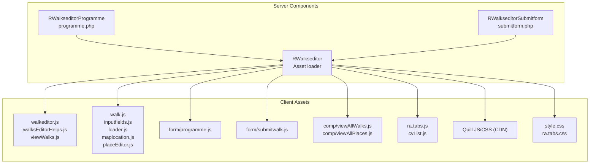
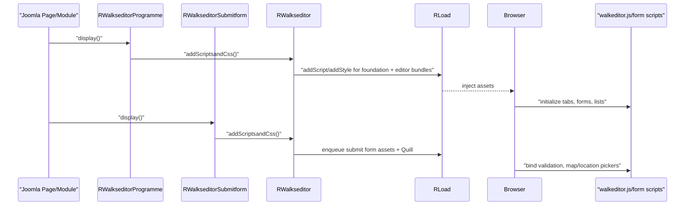

# walkseditor Module - High Level Design

## Overview

The `walkseditor` module provides the walk editing interface for creating and managing walks. It includes form handling, programme management, and email submission, and wires server-side PHP classes to a bundle of JavaScript helpers that render the editor UI, tabs, and list views.

**Purpose**: Walk editing and submission interface.

**Key Features**:
- Programme management view with tabbed lists and pagination
- Walk submission form with validation and place editor
- Shared asset loader that injects JS/CSS and Quill rich-text editor

## Component Architecture



## Public Interface

### RWalkseditor (asset loader)
```php
public static function addScriptsandCss()
```
- Adds shared JS/CSS (tabs, pagination) and module scripts (editor, forms, programme, submit) plus Quill assets.

### RWalkseditorProgramme
```php
public function display()
```
- Renders programme management UI and calls `addScriptsandCss()`.

### RWalkseditorSubmitform
```php
public function display()
```
- Renders submission form UI and calls `addScriptsandCss()`.

## Data Flow



## Integration Points

### Used By
- **Joomla pages/modules** embedding the walk editor UI → [accounts HLD](../accounts/HLD.md#integration-points) for hosted site admin context.
- **jsonwalks feed consumers** that ingest edited walks once submitted → [jsonwalks HLD](../jsonwalks/HLD.md#integration-points).

### Uses
- **RLoad** for asset injection → [load HLD](../load/HLD.md#integration-points).
- **Quill** rich-text editor (CDN) for description fields.
- **Ramblers JS foundation** (`ra.tabs.js`, `cvList.js`) for tabs/pagination → [media/js HLD](../media/js/HLD.md#integration-points).
- **maplocation/placeEditor helpers** rely on Leaflet scripts already present on pages using maps → [leaflet HLD](../leaflet/HLD.md#integration-points).

### Data Sources
- **Walk data** entered by users; submitted via form handlers to backend processing (outside this module’s HLD scope).

### External Services
- **Quill CDN** for editor JS/CSS.

### Display Layer
- **Server**: PHP views emit HTML for forms and lists, enqueue assets via `RWalkseditor::addScriptsandCss()`.
- **Client**: `walkeditor.js`, `viewWalks.js`, and form scripts render tabs, lists, validation, and map/location pickers → [media/walkseditor HLD](../media/walkseditor/HLD.md#display-layer).

### Joomla Integration
- Assets injected into the Joomla document via `RLoad` with cache-busting.
- Uses Joomla module/page context for rendering forms and processing submissions.

### Vendor Library Integration
- **cvList** pagination from `/media/vendors/cvList`.
- **Quill** editor from CDN.

### Media Asset Relationships
- Server loads shared `/media/js` foundation (tabs, pagination) first, then module-specific `/media/walkseditor/js/*` bundles and `/media/walkseditor/css/style.css`, followed by Quill JS/CSS from CDN before client initialization.

## Media Dependencies

### JavaScript Files
- `media/walkseditor/js/walkeditor.js` - Main editor bootstrap and event wiring.
- `media/walkseditor/js/walksEditorHelps.js` - Helper pop-ups and guidance.
- `media/walkseditor/js/viewWalks.js` - Shared view renderer for lists and tabs.
- `media/walkseditor/js/comp/viewAllWalks.js` / `comp/viewAllPlaces.js` - Component renderers for list tabs.
- `media/walkseditor/js/walk.js`, `inputfields.js`, `loader.js` - Form model, validation, and loading overlay helpers.
- `media/walkseditor/js/maplocation.js`, `placeEditor.js` - Location picker and place editing utilities.
- `media/walkseditor/js/form/programme.js` - Programme form logic (loaded by `programme.php`).
- `media/walkseditor/js/form/submitwalk.js` - Submission form logic (loaded by `submitform.php`).
- `media/js/ra.tabs.js` - Shared tab UI; `media/vendors/cvList/cvList.js` - pagination widget used by tabbed lists.
- CDN: `https://cdn.jsdelivr.net/npm/quill@2.0.2/dist/quill.js` for rich-text editing.

### CSS Files
- `media/walkseditor/css/style.css` - Editor styling.
- `media/lib_ramblers/css/ra.tabs.css` - Shared tab styling.
- CDN: `https://cdn.jsdelivr.net/npm/quill@2.0.2/dist/quill.snow.css` for Quill skin.

## Performance Observations

- **Asset weight**: Multiple JS bundles plus Quill; benefit from browser caching via `RLoad` versioning.
- **Client workload**: Tabbed list rendering and Quill initialization add startup time; pagination mitigates large lists.
- **Map/location helpers**: Require Leaflet on pages that need map pickers; avoid initializing when coordinates are not in use.

## Error Handling

- **Missing assets**: If Quill or foundation scripts fail to load, forms fall back to plain inputs; tab UI may degrade gracefully.
- **Form validation**: Client scripts validate required fields; server-side validation expected in controllers.
- **Data load errors**: List rendering scripts handle empty datasets by showing empty states rather than crashing.

## Examples

### Example 1: Load Editor Assets for Programme View

```php
// Inside a Joomla view/controller
$programme = new RWalkseditorProgramme();
$programme->display(); // Calls addScriptsandCss via parent display()
// RLoad enqueues media/js/ra.tabs.js, media/vendors/cvList/cvList.js,
// and media/walkseditor/js/form/programme.js plus the core editor bundle.
```

### Example 2: Submit Form with Rich Text Support

```php
$submit = new RWalkseditorSubmitform();
$submit->display(); // Adds Quill assets and media/walkseditor/js/form/submitwalk.js
// Client-side JS extends the form with field validation, place picker, and tabs.
```

### Example 3: Direct Asset Injection

```php
RWalkseditor::addScriptsandCss(); // Standalone enqueue
// Includes media/walkseditor/js/viewWalks.js to extend the display list,
// media/walkseditor/js/walkeditor.js for page wiring,
// and media/walkseditor/css/style.css for layout.
```

## References

- [accounts HLD](../accounts/HLD.md) - Hosted site context
- [jsonwalks HLD](../jsonwalks/HLD.md) - Feed consumers of edited walks
- [media/walkseditor HLD](../media/walkseditor/HLD.md) - Client bundle details
- [load HLD](../load/HLD.md) - Asset injection
- [leaflet HLD](../leaflet/HLD.md) - Map utilities leveraged by location pickers
